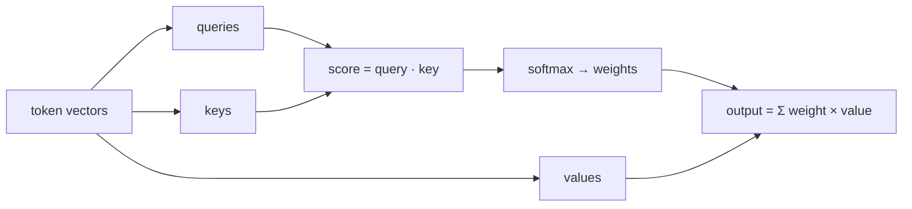

# Attention, conceptually

> Concept note. ~9 min. Builds on [tokens and embeddings](./tokens-and-embeddings.md). Math sketch: [`math-foundations/01`](../../math-foundations/01-embeddings-and-similarity.md).

Once tokens are vectors, the model needs a way for them to influence each other — "bank" should mean different things in "river bank" and "savings bank." The mechanism that does this, and the one that defines the transformer architecture behind essentially every modern LLM, is **attention**.

## The idea: a weighted lookup

Attention lets every token build a new representation of itself by pulling in information from the other tokens, weighted by relevance. Each token emits three vectors derived from its embedding:

- a **query** (what am I looking for?),
- a **key** (what do I offer?),
- a **value** (what do I contribute if chosen?).

A token's query is compared against every token's key by a dot product; the scores are normalized with a softmax into weights that sum to one; the output is the weighted sum of the values. So each token's new vector is a blend of the values of the tokens it found relevant. Self-attention runs this with all three derived from the same sequence, so the sequence re-mixes itself.

Two refinements matter for intuition. **Multi-head** attention runs several of these in parallel, each free to attend to a different kind of relationship (syntax, coreference, position), then concatenates the results. **Position** information is added separately, because the dot-product mix is otherwise order-blind — without it, "dog bites man" and "man bites dog" would look identical.

## Why it replaced fixed windows

Earlier sequence models passed information step by step, which made long-range links hard to learn and hard to parallelize. Attention connects any two positions in one step, regardless of distance, and the whole operation is a few large matrix multiplications — which is exactly what modern accelerators are built for. That combination, long-range mixing plus parallel hardware, is what made training on internet-scale text practical.

The cost is that attention compares every token with every other token, so compute grows with the square of the sequence length. That quadratic cost is the structural reason a [context window](./context-window.md) is finite and why long contexts are expensive — a thread that runs through the rest of this path.

## What to remember

- Attention is a learned, weighted lookup: queries match keys, softmax turns matches into weights, the output blends values.
- Multi-head attention captures several relationship types at once; position is injected separately.
- It connects distant tokens in one parallelizable step, at a compute cost quadratic in length — the root of context limits.

## References

- Vaswani, A., et al. (2017). *Attention Is All You Need.* arXiv:1706.03762. See [`../../references/references.md`](../../references/references.md).
