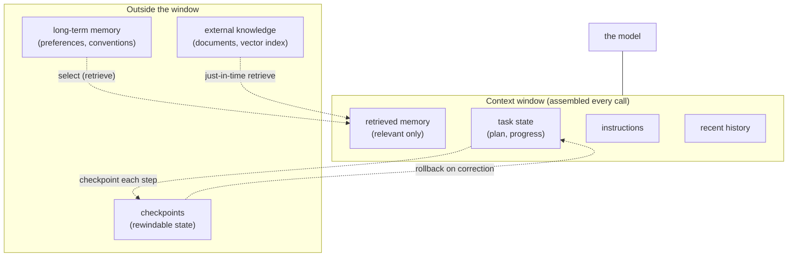

# Diagram: agent state, memory, and the context window

How a long-running agent assembles each call, and where state and memory sit relative to the context window. Reused by [state vs. memory](../concepts/memory/state-vs-memory.md), [memory types](../concepts/memory/memory-types.md), and [context engineering](../concepts/context/context-engineering.md).

The window holds only what the current call needs; everything durable lives outside it. Two flows carry the lessons of the batch. State is checkpointed out and rolled back in on a correction, so a mid-task change re-runs only the affected steps. Long-term and external memory are *selected* into the window by relevance — just-in-time — rather than front-loaded, keeping the window small enough to avoid [context rot](../concepts/context/context-rot-and-failure-modes.md). The model only ever sees the assembled window; the engineering is in deciding what enters it.
