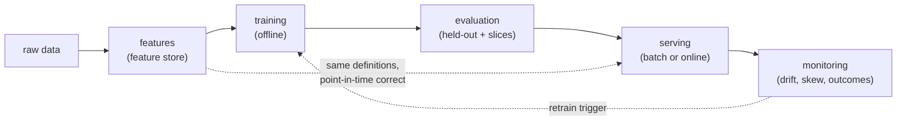

# Diagram: the ML lifecycle

The loop a machine-learning system runs, from raw data to a served prediction and back. Reused by [the ML lifecycle](../concepts/ml-system-design/ml-lifecycle.md), [feature stores](../concepts/ml-system-design/feature-stores.md), and [monitoring and drift](../concepts/ml-system-design/monitoring-and-drift.md).

Two edges carry the lessons of the area. The dashed **retrain** edge from monitoring back to training is the loop that keeps a model current as the world drifts. The dashed edge from features to serving is the discipline that prevents **training/serving skew**: the live path must use the same feature definitions, computed point-in-time correctly, that training used. Everything else is the straight-through path from data to a prediction.
