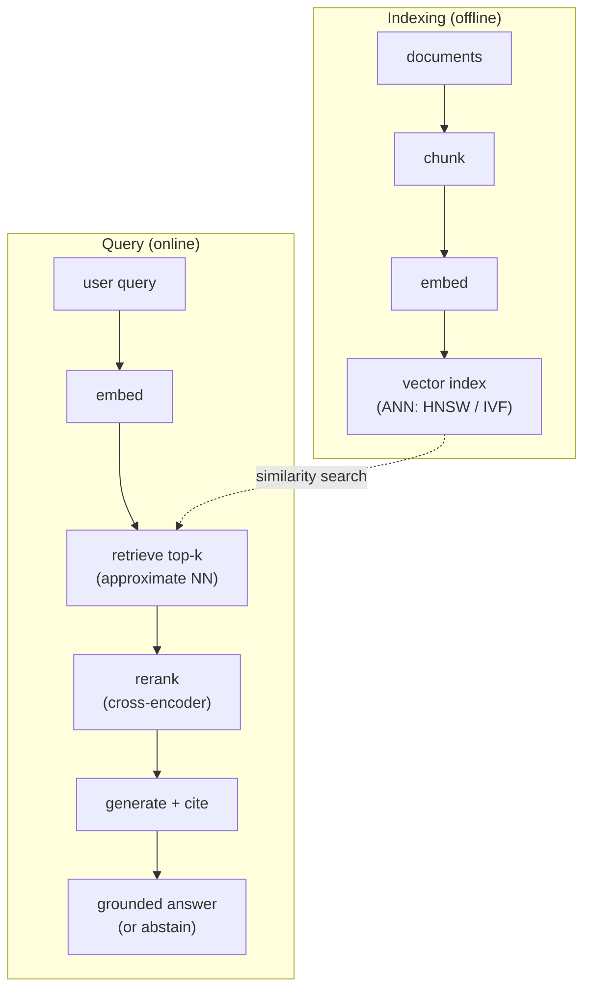

# Diagram: the RAG pipeline

The two phases of retrieval-augmented generation — building the index offline, and answering a query online. Reused by [RAG end-to-end](../concepts/rag/rag-end-to-end.md), [chunking and retrieval](../concepts/rag/chunking-and-retrieval.md), and [reranking and citation](../concepts/rag/reranking-and-citation.md).

The dashed edge is the join between the phases: the query embedding is compared against the index built offline. Two design points live on this path — chunking and the retrieval method decide what *can* be found ([chunking and retrieval](../concepts/rag/chunking-and-retrieval.md)), and reranking plus citation decide how *trustworthy* the final answer is ([reranking and citation](../concepts/rag/reranking-and-citation.md)). The "or abstain" exit is what keeps the system from answering when retrieval found nothing relevant.
