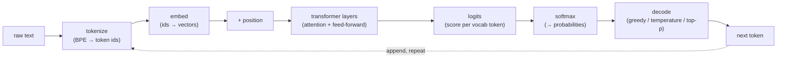

# Diagram: from text to a next-token prediction

The path a request takes through a language model, end to end. Reused by [tokens and embeddings](../concepts/llm/tokens-and-embeddings.md), [attention](../concepts/llm/attention.md), and [decoding and sampling](../concepts/llm/decoding-and-sampling.md).

Each stage maps to a concept note: tokenization and embedding ([tokens and embeddings](../concepts/llm/tokens-and-embeddings.md)), the transformer layers ([attention](../concepts/llm/attention.md)), and turning logits into a chosen token ([decoding and sampling](../concepts/llm/decoding-and-sampling.md)). The loop at the bottom is autoregression: the chosen token is appended and the whole process repeats for the next one, which is why everything in the [context window](../concepts/llm/context-window.md) is re-read at every step.
