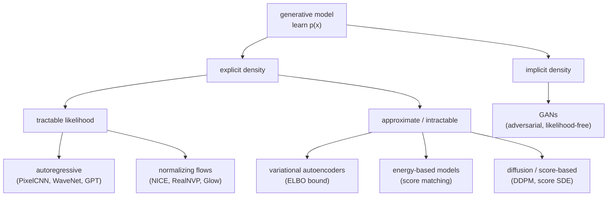

# Diagram: the deep generative model families

A taxonomy of the families by how they treat the density $p(x)$, with the tradeoff each accepts. Reused by [foundations](../concepts/foundations.md) and the family notes.

Reading the tree: **explicit** families write a form for $p(x)$; among them, autoregressive models and flows give *tractable, exact* likelihood, while VAEs (a bound), energy-based models (an unnormalized form), and diffusion (a learned score) settle for *approximate or implicit* likelihood. **Implicit** models — GANs — never express $p(x)$ at all. Each leaf is a different corner of the [generative trilemma](../concepts/foundations.md): autoregressive and flows favor exact likelihood, GANs favor sharp samples, diffusion favors quality at the cost of slow sampling, and VAEs favor fast inference and representations.
