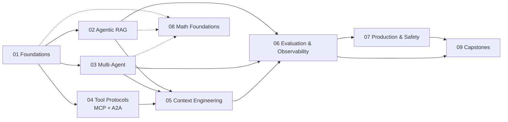
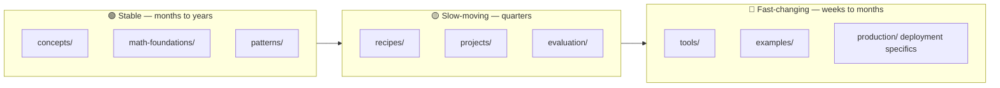

# Agentic AI Engineer

> An open, community-built learning hub for engineers who want to design, build, evaluate, and ship real agentic AI systems — not just prompts.

<p>
  
  
  
  
  
</p>

---

## Mission

Build a **practical, technically deep, community-maintained reference** for agentic AI engineering — covering the stable concepts and math that will still matter in five years, and the fast-moving tooling (LangGraph, MCP, A2A, LangSmith, ADK, vector DBs) that ships every month.

Most agentic-AI material online falls into one of two buckets: shallow tutorials that go stale in a quarter, or research papers that don't help you ship anything. This repo aims for the gap in the middle: the stuff a working engineer actually needs.

The structure separates **stable fundamentals** from **volatile tooling** so updates don't break the curriculum, and so a learner can return six months later and still trust the concept pages.

---

## Who this is for

- **Software engineers** moving from chatbots to real agentic systems with tools, memory, and orchestration.
- **ML/AI practitioners** who know the modeling side and want a structured map of agent patterns, protocols, and production concerns.
- **Advanced learners** who already understand transformers, embeddings, and Python at a working level and want to go from notebook prototypes to evaluated, observable, deployable agents.

If you've never written Python or used an LLM API, this isn't the right starting point — try a foundational LLM course first, then come back.

---

## What you'll build

Working through the labs and projects, you'll end up with code you actually keep:

- A **ReAct-style agent from scratch**, no framework, so you understand the loop before you abstract it away.
- **RAG systems** including agentic RAG where retrieval is a tool, not a pipeline.
- **Multi-agent topologies**: supervisor, hierarchical, swarm — and a clear sense of when each is wrong for the job.
- **MCP servers and clients** wired to real data sources.
- **A2A** agents that discover and delegate to each other.
- **Evaluated agents** with traces, golden datasets, and judge-based scorers.
- **Production-ready** patterns for cost, latency, streaming, human-in-the-loop, and safety.

---

## Why this exists

Three problems this resource is trying to fix:

1. **Tutorials go stale fast.** A LangGraph blog post from a year ago is mostly wrong today. We version every tool page with a *verified-as-of* date and a link to the official changelog.
2. **Concepts and tools get tangled.** Most courses teach "LangGraph" when they mean "agent state machines." We separate the two: concepts and math live in their own folders and don't change when the framework does.
3. **The math is usually skipped or overdone.** Agentic AI rests on real math — autoregressive generation, embeddings, MDPs, policies, retrieval theory — but most engineers don't need a textbook. We include the equations that change how you debug a system, and skip the rest.

---

## Quickstart

Get a working agent running locally in a few minutes.

```bash
# 1. Clone
git clone https://github.com/MHHamdan/Agentic-AI-Engineer.git
cd Agentic-AI-Engineer

# 2. Set up the environment (uv recommended; pip works too)
uv sync                  # or: python -m venv .venv && pip install -r requirements.txt

# 3. Add your API keys
cp .env.example .env     # then edit .env

# 4. Run the first lab
uv run jupyter lab labs/01-first-agent-from-scratch/lab.ipynb
```

Full setup details — including Docker, local-model fallbacks via Ollama, and troubleshooting — are in [`setup/`](./setup/).

---

## Start here

New to the repo? Open these in order:

1. [`docs/start-here.md`](./docs/start-here.md) — 5-minute tour of the repo and how to use it.
2. [`labs/01-first-agent-from-scratch/`](./labs/01-first-agent-from-scratch/) — build a working agent before reading any theory.
3. [`concepts/agents/what-is-an-agent.md`](./concepts/agents/what-is-an-agent.md) — the vocabulary the rest of the repo uses.
4. [`learning-paths/`](./learning-paths/) — pick a curated path based on your goal.

---

## Choose your path

Skip the linear reading order and jump to what you actually need:

| If you want to... | Start here | Status |
|---|---|---|
| Build your first real agent | [Foundations Path](./learning-paths/01-foundations/) | ✅ Content shipped |
| Build retrieval-augmented agents | [Agentic RAG Path](./learning-paths/02-agentic-rag/) | ✅ Content shipped |
| Orchestrate multiple cooperating agents | [Multi-Agent Systems Path](./learning-paths/03-multi-agent-systems/) | ✅ v1 + v2 patterns shipped |
| Wire agents to tools, data, and other agents | [Tool Protocols (MCP + A2A) Path](./learning-paths/04-tool-protocols-mcp-a2a/) | 🚧 Modules 1+2+3 shipped (Batch 46) |
| Get more out of the context window | [Context Engineering Path](./learning-paths/05-context-engineering/) | 📋 Scaffold (modules planned) |
| Add tracing, evals, and observability | [Evaluation & Observability Path](./learning-paths/06-evaluation-observability/) | ✅ v1 + v2 complete |
| Ship to production safely | [Production & Safety Path](./learning-paths/07-production-and-safety/) | 📋 Scaffold (modules planned) |
| Understand the math behind it all | [Mathematical Foundations Path](./learning-paths/08-mathematical-foundations/) | 📋 Scaffold (4 of 13 pages authored) |
| Build something portfolio-worthy | [Capstone Projects Path](./learning-paths/09-capstones/) | 📋 Scaffold (8 projects catalogued) |

Each path is a curated reading list across the rest of the repo — concepts, labs, recipes, patterns — not a duplicate folder of content. ✅ paths have substantial authored content; 📋 paths are scaffolds whose READMEs document the planned structure and link to the existing repo artifacts (concept pages, labs, `production/`, `security/`, `math-foundations/`, `patterns/`, `projects/`) each path will build on. Every link in this table resolves to a real, authored README.

---

## Repository structure

```
agentic-ai-engineer/
├── docs/              Start-here pages, FAQ, community pages
├── learning-paths/    Curated journeys (links into the rest of the repo)
├── concepts/          Short explainers — what something is and when to use it
├── math-foundations/  Engineer-useful math with citations
├── labs/              Hands-on guided exercises (notebooks + READMEs)
├── recipes/           Copy-paste solutions to common problems
├── patterns/          Architecture patterns with diagrams and tradeoffs
├── projects/          Build Challenges and Capstone Projects
├── examples/          Minimal reference implementations
├── tools/             Versioned snapshots of fast-moving frameworks
├── evaluation/        Eval frameworks, datasets, scorers
├── production/        Deployment, cost, latency, streaming, concurrency
├── security/          Threats, defenses, red-teaming
├── diagrams/          Mermaid sources + rendered images
├── references/        Papers, books, talks, community resources
├── glossary/          A–Z terminology
├── setup/             Environment setup
└── assets/            Working artifacts (not user-facing curriculum)
```

A more detailed walkthrough of every folder lives in [`docs/how-to-use-this-repo.md`](./docs/how-to-use-this-repo.md).

---

## Learning paths

Nine paths, each curating content across the rest of the repo. They overlap deliberately: the *Multi-Agent* path reuses concept pages from *Foundations*, the *Production* path leans on *Evaluation*, and so on.



| # | Path | Focus | Difficulty |
|---|---|---|---|
| 01 | Foundations | Agent loop, ReAct, tools, memory, first frameworks | 🟢 Beginner-friendly |
| 02 | Agentic RAG | Retrieval as a tool, hybrid search, RAG failure modes | 🟡 Intermediate |
| 03 | Multi-Agent Systems | Supervisor, hierarchical, swarm topologies | 🟡 Intermediate |
| 04 | Tool Protocols (MCP + A2A) | Standardized integration with tools and other agents | 🟡 Intermediate |
| 05 | Context Engineering | Token budgets, compression, selection strategies | 🟡 Intermediate |
| 06 | Evaluation & Observability | Tracing, golden datasets, LLM-as-judge, RAG eval | 🔴 Advanced |
| 07 | Production & Safety | Cost, latency, guardrails, deployment, red-teaming | 🔴 Advanced |
| 08 | Mathematical Foundations | LM probability, embeddings, MDPs, policies, eval metrics | 🟢 → 🔴 |
| 09 | Capstones | End-to-end build challenges that combine everything | 🔴 Advanced |

---

## How the content is organized

Five content types, each doing one job well:

| Type | What it answers | Length | Where it lives |
|---|---|---|---|
| 📖 **Concept** | *What is this and when do I use it?* | ~10-min read | [`concepts/`](./concepts/) |
| 🧪 **Lab** | *Walk me through building this hands-on.* | 30–120 min, notebook + README | [`labs/`](./labs/) |
| 🧰 **Recipe** | *I have this specific problem — what's the fix?* | Copy-paste, 5-min read | [`recipes/`](./recipes/) |
| 🏛 **Pattern** | *Which architecture should I use, and why?* | Diagram + tradeoffs | [`patterns/`](./patterns/) |
| 🚀 **Project** | *Let me build something substantial.* | Hours to days | [`projects/`](./projects/) |

Two conventions used in this repo for non-tutorial work: **Build Challenges** are smaller, time-boxed builds living inside paths or labs, and **Projects** are larger end-to-end builds in [`projects/`](./projects/). Neither is called "homework" — this is a public resource, not a classroom.

---

## Mathematical foundations

The math is here because it makes you a better engineer, not because it's a textbook. Every page in [`math-foundations/`](./math-foundations/) follows the same template:

1. **The equation.**
2. **Intuition** — what it means in plain language.
3. **Why it matters for engineers** — how it shows up in decisions you make.
4. **Where you'll see it in the code** — links into specific labs and notebooks.
5. **Sources** — papers and references, no invented math.

What's covered:

- Autoregressive LM probability: $p(x_t \mid x_{<t})$ and what sampling actually does.
- Embeddings and vector similarity — cosine, dot product, nearest-neighbor retrieval.
- RAG as marginalization over retrieved context: $p(y \mid x) = \sum_z p(y \mid x, z)\, p(z \mid x)$.
- Agents as policies: $\pi_\theta(a_t \mid s_t)$.
- MDP and POMDP intuition — what state, observation, and belief mean for an agent.
- The ReAct reasoning loop, formalized.
- Tool selection as function selection.
- Planning and search basics — tree search, decomposition.
- Memory models: short-term, long-term, retrieval memory.
- Multi-agent coordination as directed graphs.
- Evaluation metrics: precision, recall, faithfulness, answer relevance, latency, cost.
- Uncertainty, calibration, hallucination as out-of-support generation.
- Context-window optimization as constrained selection.

Math pages are cross-linked from the concept pages, so you can read either track first. None of them require more than undergraduate-level probability and linear algebra.

---

## Stable vs. fast-changing content

Agentic AI moves fast. The shape of this repo reflects that.



| Tier | Update cadence | What lives here |
|---|---|---|
| 🟢 Stable | Years | The ReAct loop, RAG marginalization, supervisor vs. swarm, eval metric definitions, safety theory |
| 🟡 Slow-moving | 6–12 months | Architecture patterns, agentic-RAG strategies, eval workflows |
| 🔴 Fast-changing | Weeks to months | LangGraph APIs, LangSmith UI, MCP spec revisions, A2A SDKs, vector-DB pricing, model names |

Anything in 🔴 territory carries a verification badge — see below.

---

## Tool-version verification policy

Every page in [`tools/`](./tools/) and every code snippet that depends on a specific library version carries a header like this:

```
> 🔴 Tool snapshot — <tool> <version>, verified <YYYY-MM-DD>
> Source: <official docs / changelog / spec link>
```

Concrete examples of how this policy is applied (verified at the time of writing this README):

| Tool / Spec | Status | Source |
|---|---|---|
| **MCP specification** | Current stable: **2025-11-25**. A release candidate dated **2026-07-28** was announced on May 21, 2026. | [modelcontextprotocol.io/specification/2025-11-25](https://modelcontextprotocol.io/specification/2025-11-25), [MCP blog](https://blog.modelcontextprotocol.io/posts/2026-07-28-release-candidate/) |
| **A2A protocol** | **v1.0** released; protocol donated to the Linux Foundation in June 2025. | [a2a-protocol.org/latest/](https://a2a-protocol.org/latest/), [a2a-protocol.org/latest/announcing-1.0/](https://a2a-protocol.org/latest/announcing-1.0/) |
| **LangGraph** | **1.0 GA** (Oct 2025) — first stable major release. `langgraph.prebuilt` is deprecated in favor of `langchain.agents`. | [LangChain changelog](https://changelog.langchain.com/announcements/langgraph-1-0-is-now-generally-available) |
| **LangChain** | **1.0 GA** (Oct 2025) — `create_agent` abstraction, middleware system. | [LangChain changelog](https://changelog.langchain.com/announcements/langchain-1-0-now-generally-available) |
| **LangSmith, Google ADK, CrewAI, AutoGen, vector DBs** | Each carries its own *verified-as-of* date in [`tools/`](./tools/). | Linked per page. |

Verified-as-of dates are refreshed during routine maintenance sweeps (tracked in [`CHANGELOG.md`](./CHANGELOG.md)). If you spot stale information, please open an issue with the `stale-tool-version` label.

---

## Diagrams

Architecture and concept diagrams are written as Mermaid in [`diagrams/`](./diagrams/) with rendered SVG/PNG committed alongside the source. Inline Mermaid blocks (like the ones in this README) render natively on GitHub. The full list of diagrams currently in the repo, with descriptions, lives in [`diagrams/README.md`](./diagrams/README.md).

---

## Community and contributions

This is built to be a community resource, not a one-author site. Useful contributions include:

- New recipes for problems you've actually hit in production.
- New patterns or comparison tables.
- Updating a `tools/` page when a framework ships a breaking change.
- Translating a concept page.
- Filing issues when something is unclear, wrong, or stale.
- Adding your project to the [showcase](./docs/community/showcase.md).

The contribution workflow, templates for each content type, and the style guide are in [`CONTRIBUTING.md`](./CONTRIBUTING.md). Good first issues are labeled [`good-first-issue`](https://github.com/MHHamdan/Agentic-AI-Engineer/issues?q=is%3Aissue+is%3Aopen+label%3A%22good+first+issue%22).

We follow a [Code of Conduct](./CODE_OF_CONDUCT.md) — please read it before posting.

---

## References and further reading

Curated reading lives in [`references/`](./references/), organized by type:

- [`references/papers.md`](./references/papers.md) — foundational papers (ReAct, RAG, Toolformer, Reflexion, and so on) with citations.
- [`references/books.md`](./references/books.md) — books that have aged well.
- [`references/talks.md`](./references/talks.md) — conference talks worth your time.
- [`references/community.md`](./references/community.md) — blogs, repos, and people worth following.

External references cited in this README:

- **Model Context Protocol** — [modelcontextprotocol.io](https://modelcontextprotocol.io/), [blog.modelcontextprotocol.io](https://blog.modelcontextprotocol.io/)
- **Agent2Agent (A2A) Protocol** — [a2a-protocol.org](https://a2a-protocol.org/latest/)
- **LangGraph & LangChain changelog** — [changelog.langchain.com](https://changelog.langchain.com/)
- **LangChain docs** — [docs.langchain.com](https://docs.langchain.com/)

---

## Citation

If you use this material in research or teaching, please cite the repo via the [`CITATION.cff`](./CITATION.cff) file. A BibTeX snippet is also provided there.

---

## License

This repository uses a dual license:

- **Code** (Python, notebooks, scripts, configs) is licensed under [Apache License 2.0](./LICENSE). You can use it commercially, modify it, and distribute it, with attribution and a patent grant.
- **Educational prose, diagrams, and other written content** are licensed under [Creative Commons Attribution 4.0 (CC-BY-4.0)](./LICENSE-CC-BY-4.0). You can reuse and adapt them with attribution.

When in doubt, attribute. When attributing, link back to this repo.

---

> Built in the open. Maintained by the community. PRs, issues, and "this is wrong" comments all welcome.
