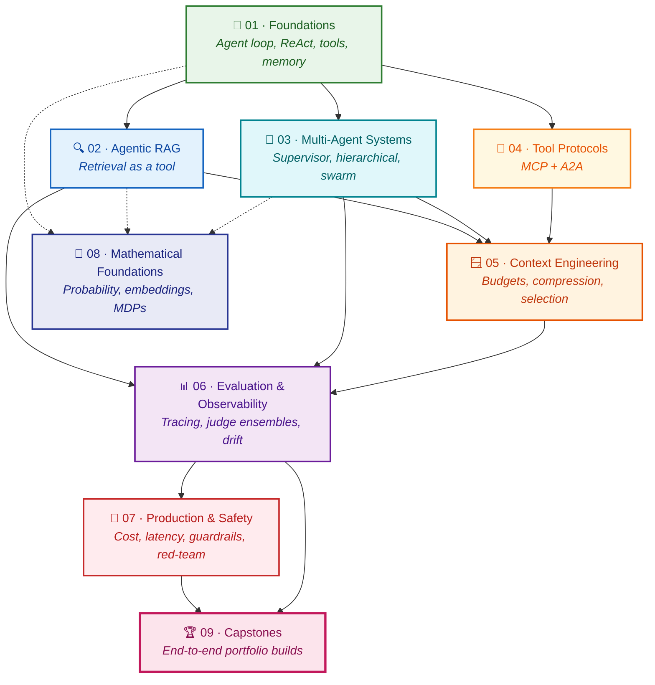
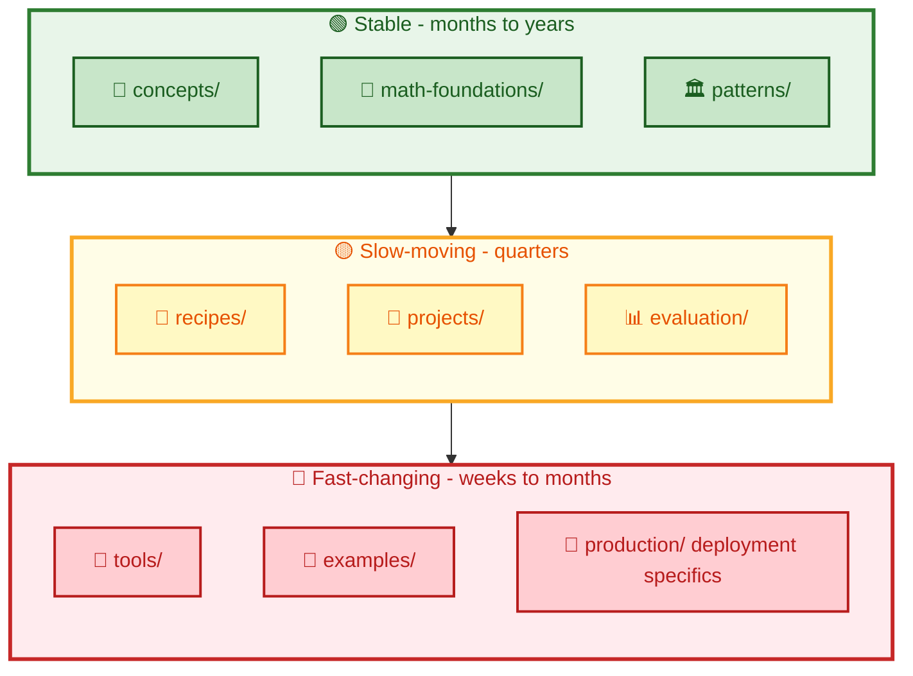

# Agentic AI Engineer

> An open, community-built learning hub for engineers who design, build, evaluate, and ship real agentic AI systems &mdash; not just prompts.

<p>
  
  
  
  
  
</p>

---

## 🚀 At a glance

<table>
<tr>
<td align="center"><b>9</b><br><sub>Learning paths<br>(all substantial)</sub></td>
<td align="center"><b>63</b><br><sub>Hands-on labs<br>(notebooks)</sub></td>
<td align="center"><b>8</b><br><sub>Capstone<br>projects</sub></td>
<td align="center"><b>18</b><br><sub>Math foundations<br>(with code)</sub></td>
</tr>
<tr>
<td align="center"><b>12</b><br><sub>Architecture<br>patterns</sub></td>
<td align="center"><b>9</b><br><sub>Frameworks<br>compared</sub></td>
<td align="center"><b>65+</b><br><sub>Glossary<br>entries</sub></td>
<td align="center"><b>71+</b><br><sub>Concept<br>pages</sub></td>
</tr>
</table>

**Stack covered:** LangGraph 1.0 &middot; LangChain 1.0 &middot; MCP 2025-11-25 &middot; A2A v1.0 &middot; CrewAI &middot; AutoGen &middot; Pydantic AI &middot; OpenAI Agents SDK &middot; LlamaIndex &middot; Haystack &middot; LangSmith &middot; Google ADK

---

## 🎯 Why this exists

Three problems this repository fixes.

> **Tutorials go stale fast.** A LangGraph blog post from a year ago is mostly wrong today. Every tool page here carries a *verified-as-of* date and a link to the official changelog.

> **Concepts and tools get tangled.** Most courses teach &quot;LangGraph&quot; when they mean &quot;agent state machines.&quot; This repo keeps them apart &mdash; concepts and math live in their own folders and don't change when the framework does.

> **The math is usually skipped or overdone.** Agentic AI rests on real math &mdash; autoregressive generation, embeddings, MDPs, policies, retrieval theory &mdash; but most engineers don't need a textbook. The math pages here include the equations that change how you debug a system, with executable Python next to each. Nothing else.

The result: a practical, technically deep, community-maintained reference that separates **stable fundamentals** (still right in five years) from **fast-moving tooling** (LangGraph, MCP, A2A, vector DBs, eval platforms). Updates to fast-moving tools don't break the curriculum. Six months from now, the concept pages still work.

---

## 👤 Who this is for

- 🛠️ **Software engineers** moving from chatbots to real agentic systems with tools, memory, and orchestration.
- 🧪 **ML/AI practitioners** who know the modeling side and want a structured map of agent patterns, protocols, and production concerns.
- 🎓 **Advanced learners** who already understand transformers, embeddings, and Python at a working level and want to go from notebook prototypes to evaluated, observable, deployable agents.

If you've never written Python or used an LLM API, this isn't the right starting point. Try a foundational LLM course first, then come back.

---

## 🧰 What you'll build

Working through the labs and projects, you'll end up with code worth keeping:

- 🤖 A **ReAct-style agent from scratch**, no framework, so you understand the loop before you abstract it away.
- 🔍 **RAG systems** including agentic RAG where retrieval is a tool, not a fixed pipeline.
- 👥 **Multi-agent topologies** &mdash; supervisor, hierarchical, swarm &mdash; and a clear sense of when each one is wrong for the job.
- 🔌 **MCP servers and clients** wired to real data sources.
- 🤝 **A2A agents** that discover and delegate to each other.
- 📊 **Evaluated agents** with traces, golden datasets, and judge-based scorers.
- 🚢 **Production-shaped systems** with cost engineering, latency budgets, streaming, human-in-the-loop, and safety guardrails.

---

## ⚡ Quickstart

Get a working agent running locally in a few minutes.

```bash
# 1. Clone
git clone https://github.com/MHHamdan/Agentic-AI-Engineer.git
cd Agentic-AI-Engineer

# 2. Set up the environment (uv recommended; pip works too)
uv sync                  # or: python -m venv .venv && pip install -r requirements.txt

# 3. Add your API keys
cp .env.example .env     # then edit .env

# 4. Run the first lab
uv run jupyter lab labs/01-first-agent-from-scratch/lab.ipynb
```

Full setup details &mdash; Docker, local-model fallbacks via Ollama, troubleshooting &mdash; live in [`setup/`](./setup/).

---

## 🧭 Start here

New to the repo? Open these in order.

1. 🗺️ [`docs/start-here.md`](./docs/start-here.md) &mdash; 5-minute tour of the repo and how to use it.
2. 🤖 [`labs/01-first-agent-from-scratch/`](./labs/01-first-agent-from-scratch/) &mdash; build a working agent before reading any theory.
3. 📖 [`concepts/agents/what-is-an-agent.md`](./concepts/agents/what-is-an-agent.md) &mdash; the vocabulary the rest of the repo uses.
4. 🎯 [`learning-paths/`](./learning-paths/) &mdash; pick a curated path based on your goal.

---

## 🎯 Choose your path

Skip the linear reading order and jump to what you actually need.

| If you want to&hellip; | Start here | Status |
|---|---|---|
| 🤖 Build your first real agent | [01 &mdash; Foundations](./learning-paths/01-foundations/) | ✅ Complete |
| 🔍 Build retrieval-augmented agents | [02 &mdash; Agentic RAG](./learning-paths/02-agentic-rag/) | ✅ v1 + v2 |
| 👥 Orchestrate multiple cooperating agents | [03 &mdash; Multi-Agent Systems](./learning-paths/03-multi-agent-systems/) | ✅ v1 + v2 + v3 + frameworks page |
| 🔌 Wire agents to tools, data, and other agents | [04 &mdash; Tool Protocols (MCP + A2A)](./learning-paths/04-tool-protocols-mcp-a2a/) | ✅ Complete &mdash; all 7 modules |
| 🪟 Get more out of the context window | [05 &mdash; Context Engineering](./learning-paths/05-context-engineering/) | ✅ v1 complete &mdash; 6/6 modules |
| 📊 Add tracing, evals, and observability | [06 &mdash; Evaluation &amp; Observability](./learning-paths/06-evaluation-observability/) | ✅ v1 + v2 |
| 🚢 Ship to production safely | [07 &mdash; Production &amp; Safety](./learning-paths/07-production-and-safety/) | ✅ v1 complete &mdash; 8/8 modules |
| 🧮 Understand the math behind it all | [08 &mdash; Mathematical Foundations](./learning-paths/08-mathematical-foundations/) | ✅ v1 complete &mdash; 13/13 pages (refreshed with code examples) |
| 🏆 Build something portfolio-worthy | [09 &mdash; Capstones](./learning-paths/09-capstones/) | ✅ v1 complete &mdash; 8 project briefs |

Each path is a curated reading list across the rest of the repo &mdash; concepts, labs, recipes, patterns &mdash; not a duplicate folder of content. Every link in this table resolves to a real, authored README.

---

## 🗂️ Repository structure

```
agentic-ai-engineer/
├── 📚 docs/              Start-here pages, FAQ, community pages
├── 🎯 learning-paths/    Curated journeys (links into the rest of the repo)
├── 📖 concepts/          Short explainers - what something is and when to use it
├── 🧮 math-foundations/  Engineer-useful math with citations and Python code
├── 🧪 labs/              Hands-on guided exercises (notebooks + READMEs)
├── 🧰 recipes/           Copy-paste solutions to common problems
├── 🏛 patterns/          Architecture patterns with diagrams and tradeoffs
├── 🚀 projects/          Build Challenges and Capstone Projects
├── 💎 examples/          Minimal reference implementations
├── 🔧 tools/             Versioned snapshots of fast-moving frameworks
├── 📊 evaluation/        Eval frameworks, datasets, scorers
├── 🚢 production/        Deployment, cost, latency, streaming, concurrency
├── 🛡 security/          Threats, defenses, red-teaming
├── 🎨 diagrams/          Mermaid sources + rendered images
├── 📚 references/        Papers, books, talks, community resources
├── 🔤 glossary/          A-to-Z terminology
├── ⚙️ setup/             Environment setup
└── 📁 assets/            Working artifacts (not user-facing curriculum)
```

A more detailed walkthrough of every folder lives in [`docs/how-to-use-this-repo.md`](./docs/how-to-use-this-repo.md).

---

## 🛤️ Learning paths

Nine paths, each curating content across the rest of the repo. They overlap deliberately: the **Multi-Agent** path reuses concept pages from **Foundations**, the **Production** path leans on **Evaluation**, and so on.



| # | Path | Focus | Difficulty |
|---|---|---|---|
| 01 | Foundations | Agent loop, ReAct, tools, memory, first frameworks | 🟢 Beginner-friendly |
| 02 | Agentic RAG | Retrieval as a tool, hybrid search, RAG failure modes | 🟡 Intermediate |
| 03 | Multi-Agent Systems | Supervisor, hierarchical, swarm topologies | 🟡 Intermediate |
| 04 | Tool Protocols (MCP + A2A) | Standardized integration with tools and other agents | 🟡 Intermediate |
| 05 | Context Engineering | Token budgets, compression, selection strategies | 🟡 Intermediate |
| 06 | Evaluation &amp; Observability | Tracing, golden datasets, LLM-as-judge, RAG eval | 🔴 Advanced |
| 07 | Production &amp; Safety | Cost, latency, guardrails, deployment, red-teaming | 🔴 Advanced |
| 08 | Mathematical Foundations | LM probability, embeddings, MDPs, policies, eval metrics | 🟢 → 🔴 |
| 09 | Capstones | End-to-end build challenges that combine everything | 🔴 Advanced |

---

## 📐 How the content is organized

Five content types, each doing one job well.

| Type | What it answers | Length | Where it lives |
|---|---|---|---|
| 📖 **Concept** | *What is this and when do I use it?* | ~10-min read | [`concepts/`](./concepts/) |
| 🧪 **Lab** | *Walk me through building this hands-on.* | 30 to 120 min, notebook + README | [`labs/`](./labs/) |
| 🧰 **Recipe** | *I have this specific problem &mdash; what's the fix?* | Copy-paste, 5-min read | [`recipes/`](./recipes/) |
| 🏛 **Pattern** | *Which architecture should I use, and why?* | Diagram + tradeoffs | [`patterns/`](./patterns/) |
| 🚀 **Project** | *Let me build something substantial.* | Hours to days | [`projects/`](./projects/) |

Two conventions used in this repo for non-tutorial work: **Build Challenges** are smaller, time-boxed builds living inside paths or labs, and **Projects** are larger end-to-end builds in [`projects/`](./projects/). Neither is called &quot;homework&quot; &mdash; this is a public resource, not a classroom.

---

## 🧮 Mathematical foundations

The math is here because it makes you a better engineer, not because it's a textbook. **All 13 pages are authored, refreshed, and ready to read.** Every page follows the same template:

1. ✨ **Why this matters for agentic AI** &mdash; the engineering motivation in two or three sentences.
2. 📐 **The equation** &mdash; clean GitHub-rendered LaTeX, every symbol defined immediately below.
3. 🗣️ **How to read this equation** &mdash; a plain-language walkthrough.
4. 💡 **Mathematical intuition** &mdash; the underlying ideas.
5. 🔧 **Where this appears in agentic systems** &mdash; specific connections to repo content.
6. 🐍 **Code example** &mdash; a minimal, executable Python snippet.
7. ⚠️ **Common mistakes** &mdash; failure modes engineers actually run into.
8. 🔗 **Repo cross-references** &mdash; direct links into concepts, labs, and patterns.
9. 🧭 **Related pages** &mdash; what to read next.
10. 📚 **References** &mdash; papers and textbooks with one-sentence relevance notes.

What's covered (all 13 ✅):

| # | Page | Equation anchor |
|---|---|---|
| 01 | [Language model probability](./math-foundations/01-language-model-probability.md) | $p(x_t \mid x_{<t}; \theta)$ |
| 02 | [Embeddings and vector similarity](./math-foundations/02-embeddings-vector-similarity.md) | $\cos(\mathbf{u}, \mathbf{v})$ |
| 03 | [RAG formulation as marginalization](./math-foundations/03-rag-formulation.md) | $p(y \mid x) = \sum_z p(y \mid x, z) \, p(z \mid x)$ |
| 04 | [Agents as policies](./math-foundations/04-agents-as-policies.md) | $\pi_\theta(a_t \mid s_t)$ |
| 05 | [MDP / POMDP intuition](./math-foundations/05-mdp-pomdp.md) | $(\mathcal{S}, \mathcal{A}, P, R, \gamma)$ |
| 06 | [The ReAct loop, formalized](./math-foundations/06-react-formalization.md) | $(\tau_t, a_t, \text{stop}_t) \sim \pi_\theta$ |
| 07 | [Tool selection as function selection](./math-foundations/07-tool-selection.md) | $a_t \sim \pi_\theta$ over $\mathcal{A}$ |
| 08 | [Planning and search](./math-foundations/08-planning-search.md) | BFS / A* / MCTS |
| 09 | [Memory models](./math-foundations/09-memory-models.md) | $M = M_s \cup M_w \cup M_l$ |
| 10 | [Multi-agent coordination graphs](./math-foundations/10-multi-agent-coordination.md) | $G = (V, E)$ |
| 11 | [Evaluation metrics](./math-foundations/11-evaluation-metrics.md) | P, R, F1, faithfulness, ECE |
| 12 | [Uncertainty and safety](./math-foundations/12-uncertainty-safety.md) | $H(p)$, calibration, abstention |
| 13 | [Context-window optimization](./math-foundations/13-context-window-optimization.md) | $\max \sum v_i x_i \text{ s.t. } \sum c_i x_i \leq B$ |

A symbol-and-notation cheat sheet is at [`math-foundations/notation.md`](./math-foundations/notation.md) &mdash; one source of truth for $\pi$, $s$, $a$, $\theta$, $z$, and friends.

Math pages are cross-linked from the concept pages, so you can read either track first. None require more than undergraduate probability and linear algebra. The full landing page with reading approaches is at [`math-foundations/README.md`](./math-foundations/README.md).

---

## 🌳 Stable vs. fast-changing content

Agentic AI moves fast. The shape of this repo reflects that.



| Tier | Update cadence | What lives here |
|---|---|---|
| 🟢 Stable | Years | The ReAct loop, RAG marginalization, supervisor vs swarm, eval metric definitions, safety theory |
| 🟡 Slow-moving | 6 to 12 months | Architecture patterns, agentic-RAG strategies, eval workflows |
| 🔴 Fast-changing | Weeks to months | LangGraph APIs, LangSmith UI, MCP spec revisions, A2A SDKs, vector-DB pricing, model names |

Anything in 🔴 territory carries a verification badge &mdash; see below.

---

## ✅ Tool-version verification policy

Every page in [`tools/`](./tools/) and every code snippet that depends on a specific library version carries a header like this:

```
> 🔴 Tool snapshot — <tool> <version>, verified <YYYY-MM-DD>
> Source: <official docs / changelog / spec link>
```

Concrete examples of how this policy is applied (verified at the time of writing):

| Tool / Spec | Status | Source |
|---|---|---|
| 🔌 **MCP specification** | Current stable: **2025-11-25**. A release candidate dated **2026-07-28** was announced on May 21, 2026. | [modelcontextprotocol.io/specification/2025-11-25](https://modelcontextprotocol.io/specification/2025-11-25), [MCP blog](https://blog.modelcontextprotocol.io/posts/2026-07-28-release-candidate/) |
| 🤝 **A2A protocol** | **v1.0** released; protocol donated to the Linux Foundation in June 2025. | [a2a-protocol.org/latest/](https://a2a-protocol.org/latest/), [announcing-1.0](https://a2a-protocol.org/latest/announcing-1.0/) |
| 🔗 **LangGraph** | **1.0 GA** (Oct 2025) &mdash; first stable major release. `langgraph.prebuilt` is deprecated in favor of `langchain.agents`. | [LangChain changelog](https://changelog.langchain.com/announcements/langgraph-1-0-is-now-generally-available) |
| 🦜 **LangChain** | **1.0 GA** (Oct 2025) &mdash; `create_agent` abstraction, middleware system. | [LangChain changelog](https://changelog.langchain.com/announcements/langchain-1-0-now-generally-available) |
| 📊 **LangSmith, Google ADK, CrewAI, AutoGen, vector DBs** | Each carries its own *verified-as-of* date in [`tools/`](./tools/). | Linked per page. |

Verified-as-of dates are refreshed during routine maintenance sweeps (tracked in [`CHANGELOG.md`](./CHANGELOG.md)). If you spot stale information, please open an issue with the `stale-tool-version` label.

---

## 📊 Current state

🎉 **Repo v1 phase is structurally complete.** All nine paths have substantial content; six are fully complete at v1; three have multiple revisions (v1, v2, v3) plus extended materials.

**Substantial-content paths (nine of nine)**:

- ✅ **Path 01 &mdash; Foundations**: complete
- ✅ **Path 02 &mdash; Agentic RAG**: v1 + v2 shipped
- ✅ **Path 03 &mdash; Multi-Agent Systems**: v1 + v2 (6 patterns) + v3 (3 capstones) + frameworks comparison page (9 frameworks)
- ✅ **Path 04 &mdash; Tool Protocols (MCP + A2A)**: all 7 modules complete
- ✅ **Path 05 &mdash; Context Engineering**: v1 complete, 6 of 6 modules
- ✅ **Path 06 &mdash; Evaluation &amp; Observability**: v1 + v2 complete
- ✅ **Path 07 &mdash; Production &amp; Safety**: v1 complete, 8 of 8 modules
- ✅ **Path 08 &mdash; Mathematical Foundations**: v1 complete, all 13 pages authored and refreshed with Python code examples
- ✅ **Path 09 &mdash; Capstones**: v1 complete, all 8 project briefs

Future work is continuous improvement (depth, breadth, examples, recipes, references), not gap-filling.

**Supporting infrastructure**:

- 🧪 50 lab notebooks (all pre-executed; outputs visible on GitHub)
- 🏛 12 of 12 top-level architecture patterns authored
- 📖 [`concepts/`](./concepts/) (~71 files): `agents/`, `context/`, `evaluation/`, `memory/`, `multi-agent/`, `rag/`, `tools/` &mdash; multiple subdirs complete
- 🚢 [`production/`](./production/) (cost engineering, latency, streaming) &mdash; 5 deep pages
- 🛡 [`security/`](./security/) (prompt injection, tool abuse, data exfiltration, safety policy, red-teaming) &mdash; 5 deep pages
- 🔤 [`glossary/terms.md`](./glossary/terms.md) &mdash; 65+ A-to-Z entries cross-linked to canonical sources

**Currently scaffold-state &mdash; community contribution welcomed**:

- 💎 `examples/` &mdash; minimal reference implementations (placeholder)
- 🧰 `recipes/` &mdash; copy-paste solutions to specific problems (placeholder)
- 📚 `references/` &mdash; curated reading lists (placeholder; concept-page inline citations cover the gap)
- 📊 `evaluation/` &mdash; eval frameworks/datasets/scorers (the conceptual side is already in [`concepts/evaluation/`](./concepts/evaluation/))
- 📝 `quizzes/` &mdash; knowledge checks across the curriculum (31 files; partial coverage)

For each scaffold-state folder, the folder's own README documents what's planned and where related content currently lives. The curriculum is usable now; the supporting folders deepen it over time.

Full release history with verification fingerprints lives in [`CHANGELOG.md`](./CHANGELOG.md).

---

## 🎨 Diagrams

Architecture and concept diagrams are written as Mermaid in [`diagrams/`](./diagrams/) with rendered SVG/PNG committed alongside the source. Inline Mermaid blocks (like the two above) render natively on GitHub. The full list of diagrams currently in the repo, with descriptions, lives in [`diagrams/README.md`](./diagrams/README.md).

---

## 🤝 Community and contributions

This is built to be a community resource, not a one-author site. Useful contributions include:

- 🧰 **New recipes** for problems you've actually hit in production.
- 🏛 **New patterns or comparison tables.**
- 🔧 **Updating a `tools/` page** when a framework ships a breaking change.
- 🌐 **Translating a concept page.**
- 🐛 **Filing issues** when something is unclear, wrong, or stale.
- 🏆 **Adding your project** to the community showcase (planned `docs/community/showcase.md`).

The contribution workflow, templates for each content type, and the style guide are in [`CONTRIBUTING.md`](./CONTRIBUTING.md). Good first issues are labeled [`good-first-issue`](https://github.com/MHHamdan/Agentic-AI-Engineer/issues?q=is%3Aissue+is%3Aopen+label%3A%22good+first+issue%22).

We follow a [Code of Conduct](./CODE_OF_CONDUCT.md) &mdash; please read it before posting.

---

## 📚 References and further reading

Curated reading lives in [`references/`](./references/), organized by type. The folder currently scaffolds four planned pages:

- 📄 `references/papers.md` &mdash; foundational papers (ReAct, RAG, Toolformer, Reflexion, and so on) with citations (planned)
- 📖 `references/books.md` &mdash; books that have aged well (planned)
- 🎤 `references/talks.md` &mdash; conference talks worth your time (planned)
- 👥 `references/community.md` &mdash; blogs, repos, and people worth following (planned)

In the interim, every concept and pattern page cites its sources inline. The `references/` folder is where those citations will be consolidated into curated reading lists.

External references cited in this README:

- 🔌 **Model Context Protocol** &mdash; [modelcontextprotocol.io](https://modelcontextprotocol.io/), [blog.modelcontextprotocol.io](https://blog.modelcontextprotocol.io/)
- 🤝 **Agent2Agent (A2A) Protocol** &mdash; [a2a-protocol.org](https://a2a-protocol.org/latest/)
- 🦜 **LangGraph &amp; LangChain changelog** &mdash; [changelog.langchain.com](https://changelog.langchain.com/)
- 📘 **LangChain docs** &mdash; [docs.langchain.com](https://docs.langchain.com/)

---

## 📝 Citation

If you use this material in research or teaching, please cite the repo via the [`CITATION.cff`](./CITATION.cff) file. A BibTeX snippet is also provided there.

---

## ⚖️ License

This repository uses a dual license.

- 💻 **Code** (Python, notebooks, scripts, configs) is licensed under [Apache License 2.0](./LICENSE). You can use it commercially, modify it, and distribute it, with attribution and a patent grant.
- 📖 **Educational prose, diagrams, and other written content** are licensed under [Creative Commons Attribution 4.0 (CC-BY-4.0)](./LICENSE-CC-BY-4.0). You can reuse and adapt them with attribution.

When in doubt, attribute. When attributing, link back to this repo.

---

> 🌱 **Built in the open. Maintained by the community.** PRs, issues, and &quot;this is wrong&quot; comments all welcome.

<p align="center">
  <a href="https://github.com/MHHamdan/Agentic-AI-Engineer/stargazers">⭐ Star the repo</a> &middot;
  <a href="https://github.com/MHHamdan/Agentic-AI-Engineer/fork">🍴 Fork &amp; adapt</a> &middot;
  <a href="https://github.com/MHHamdan/Agentic-AI-Engineer/issues/new">🐛 Open an issue</a>
</p>
