# Topic Map

This topic map shows the progressive relationship between tutorial subjects.

```mermaid
graph TD
    APIs[APIs]
    REST_vs_GraphQL[REST vs GraphQL]
    Webhooks[Webhooks]
    Long_Polling_vs_WebSockets[Long Polling vs WebSockets]
    JWTs[JWTs]
    API_Gateways[API Gateways]
    Rate_Limiting[Rate Limiting]
    Idempotency[Idempotency]
    Load_Balancing[Load Balancing]
    Proxy_vs_Reverse_Proxy[Proxy vs Reverse Proxy]
    Scalability[Scalability]
    Caching[Caching]
    Cache_Eviction[Cache Eviction]
    CDN[CDN]
    SQL_vs_NoSQL[SQL vs NoSQL]
    ACID_Transactions[ACID Transactions]
    Indexes[Indexes]
    Sharding[Sharding]
    Change_Data_Capture[Change Data Capture]
    Availability[Availability]
    Single_Point_of_Failure[Single Point of Failure]
    CAP_Theorem[CAP Theorem]
    Consistent_Hashing[Consistent Hashing]
    Message_Queues[Message Queues]
    Stateful_vs_Stateless[Stateful vs Stateless]
    Concurrency_vs_Parallelism[Concurrency vs Parallelism]
    Batch_vs_Stream_Processing[Batch vs Stream Processing]
    Bloom_Filters[Bloom Filters]
    Geohashing[Geohashing]

    APIs --> REST_vs_GraphQL
    REST_vs_GraphQL --> Webhooks
    Webhooks --> Long_Polling_vs_WebSockets
    Long_Polling_vs_WebSockets --> JWTs
    JWTs --> API_Gateways
    API_Gateways --> Rate_Limiting
    Rate_Limiting --> Idempotency
    Idempotency --> Load_Balancing
    Load_Balancing --> Proxy_vs_Reverse_Proxy
    Proxy_vs_Reverse_Proxy --> Scalability
    Scalability --> Caching
    Caching --> Cache_Eviction
    Cache_Eviction --> CDN
    CDN --> SQL_vs_NoSQL
    SQL_vs_NoSQL --> ACID_Transactions
    ACID_Transactions --> Indexes
    Indexes --> Sharding
    Sharding --> Change_Data_Capture
    Change_Data_Capture --> Availability
    Availability --> Single_Point_of_Failure
    Single_Point_of_Failure --> CAP_Theorem
    CAP_Theorem --> Consistent_Hashing
    Consistent_Hashing --> Message_Queues
    Message_Queues --> Stateful_vs_Stateless
    Stateful_vs_Stateless --> Concurrency_vs_Parallelism
    Concurrency_vs_Parallelism --> Batch_vs_Stream_Processing
    Batch_vs_Stream_Processing --> Bloom_Filters
    Bloom_Filters --> Geohashing
```

## Navigation

- Home: [System Engineering Tutorials](index.md)
- Learning Path: [Full roadmap](learning-path.md)
- Topic Index: [All topics](topic-index.md)
- Start Topic: [APIs](topics/01-apis/concept.md)
- End Topic: [Geohashing](topics/29-geohashing/concept.md)

