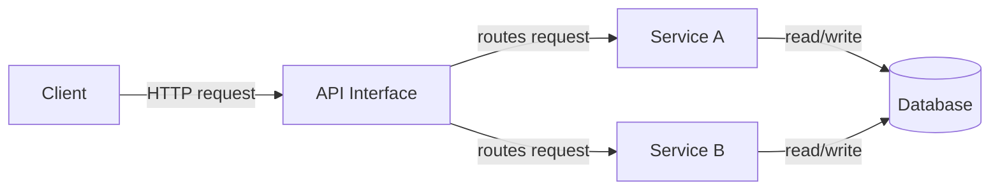

# APIs

## Why This Topic Matters

APIs are the foundation of modern backend systems. They define how applications communicate, enabling microservices, mobile apps, web front ends, and integrations.

## Simple Definition

An API is a contract between a client and a server that specifies how to request and receive data or services.

## Real-World Analogy

Think of an API as a restaurant menu. The customer orders from the menu without needing to know how the kitchen prepares the food.

## System Design Context

APIs expose business capabilities and serve as the interface layer in service-oriented architectures. They are essential for splitting responsibilities, aligning teams, and scaling traffic.

## Example Architecture

## Common Use Cases

- Public and internal service interfaces
- Mobile application backends
- Third-party integrations
- Microservices communication

## Common Mistakes

- Designing APIs without clear versioning
- Exposing implementation details in the interface
- Ignoring proper authentication and validation
- Allowing overly broad payloads or responses

## Related Topics

- [API Gateways](../02-api-gateways/concept.md)
- [REST vs GraphQL](../05-rest-vs-graphql/concept.md)
- [Webhooks](../04-webhooks/concept.md)

## References

According to RFC 9110, HTTP is the standard application-level protocol that APIs often use to exchange messages. [RFC9110]

## Navigation

- Home: [System Engineering Tutorials](../../index.md)
- Learning Path: [Full roadmap](../../learning-path.md)
- Topic Index: [All topics](../../topic-index.md)
- Previous Topic: [Home](../../index.md)
- Topic Pages: [Concept](concept.md) | [Foundation](foundation.md) | [Math Foundation](math-foundation.md) | [Lab](lab.md) | [Quiz](quiz.md)
- Next Topic: [REST vs GraphQL](../05-rest-vs-graphql/concept.md)

