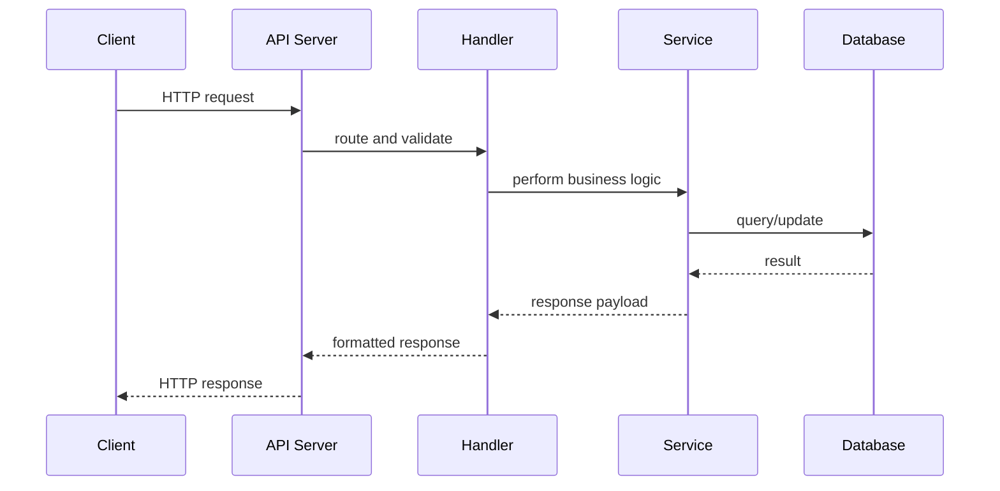

# Engineering Foundation

## Core Components

- API definition and contract
- Request routing layer
- Input validation and serialization
- Authentication and authorization
- Response formatting and error handling

## How It Works Internally

APIs receive HTTP requests, validate payloads, map requests to handlers, perform business logic, and return structured responses.

## Request or Data Flow

1. Client sends HTTP request.
2. API gateway or server routes request.
3. Payload is validated and transformed.
4. Service executes logic or queries data.
5. Server returns response.

## Sequence Diagram

## Design Tradeoffs

- Simple REST is easy to cache but may over-fetch.
- GraphQL is flexible but can be harder to secure.
- Strong typing improves safety but requires extra schema maintenance.

## Failure Modes

- Validation errors from malformed requests
- Timeout or latency from backend dependencies
- Inconsistent response schema
- Broken contracts after API changes

## Production Best Practices

- Use versioning conservatively
- Document with OpenAPI
- Apply request validation and schema checks
- Monitor latency, error rates, and traffic

## Observability Checklist

- Request rate
- Error rate
- P99 latency
- Request payload sizes
- Response codes by endpoint

## Security Checklist

- Authenticate requests
- Authorize with least privilege
- Validate input and output
- Prevent injection and data leaks

## Related Topics

- [API Gateways](../02-api-gateways/concept.md)
- [REST vs GraphQL](../05-rest-vs-graphql/concept.md)

## References

APIs are often described by the OpenAPI specification usage patterns and HTTP standards. [OpenAPI]

## Navigation

- Home: [System Engineering Tutorials](../../index.md)
- Learning Path: [Full roadmap](../../learning-path.md)
- Topic Index: [All topics](../../topic-index.md)
- Previous Topic: [Home](../../index.md)
- Topic Pages: [Concept](concept.md) | [Foundation](foundation.md) | [Math Foundation](math-foundation.md) | [Lab](lab.md) | [Quiz](quiz.md)
- Next Topic: [REST vs GraphQL](../05-rest-vs-graphql/concept.md)

