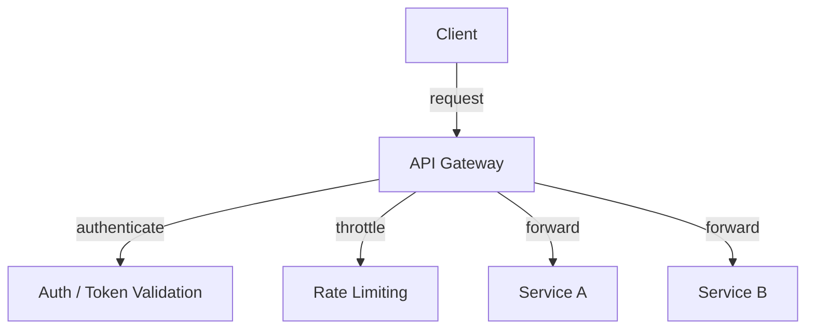

# API Gateways

## Why This Topic Matters

API Gateways are an entry point for client requests in modern microservice systems. They centralize traffic control, security, and routing logic.

## Simple Definition

An API Gateway is a proxy layer that accepts incoming API requests and forwards them to backend services.

## Real-World Analogy

An API Gateway is like a bank teller who receives customer requests and routes them to the right internal department.

## System Design Context

Use an API Gateway to implement authentication, monitoring, request transformation, rate limiting, and service discovery in a single boundary.

## Example Architecture

## Common Use Cases

- Centralized authorization and authentication
- Request aggregation for microservices
- Protocol translation between external and internal systems
- Throttling and rate limiting

## Common Mistakes

- Overloading the gateway with business logic
- Treating the gateway as a monolithic service
- Failing to design for resiliency and retries

## Related Topics

- [APIs](../01-apis/concept.md)
- [JWTs](../03-jwts/concept.md)
- [REST vs GraphQL](../05-rest-vs-graphql/concept.md)

## References

The OpenAPI Specification documents how gateways can validate requests and expose versions of APIs. [OpenAPI]

## Navigation

- Home: [System Engineering Tutorials](../../index.md)
- Learning Path: [Full roadmap](../../learning-path.md)
- Topic Index: [All topics](../../topic-index.md)
- Previous Topic: [JWTs](../03-jwts/concept.md)
- Topic Pages: [Concept](concept.md) | [Foundation](foundation.md) | [Math Foundation](math-foundation.md) | [Lab](lab.md) | [Quiz](quiz.md)
- Next Topic: [Rate Limiting](../07-rate-limiting/concept.md)

