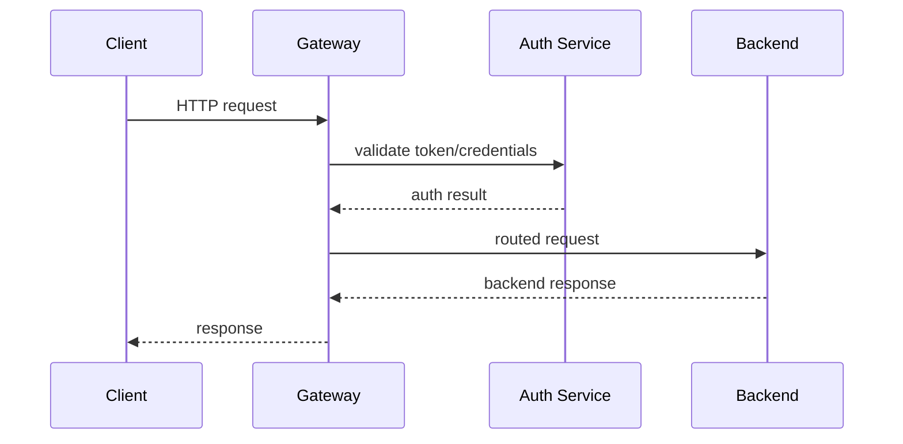

# Engineering Foundation

## Core Components

- Request routing and dispatch
- Authentication and authorization checks
- Rate limiting and throttling
- Response transformation
- Observability and logging

## How It Works Internally

A gateway accepts requests, applies policies, then forwards traffic to services based on rules and service registry data.

## Request or Data Flow

1. Client request arrives at gateway.
2. Gateway authenticates and authorizes.
3. Gateway applies routing rules.
4. Gateway forwards request to backend service.
5. Backend response returns through gateway.

## Sequence Diagram

## Design Tradeoffs

- Centralization simplifies control but adds a single point of failure.
- Offloading policies to the gateway reduces service complexity but can become a bottleneck.
- Edge-side caching improves performance but requires cache invalidation strategies.

## Failure Modes

- Gateway outage affecting all traffic
- Misconfigured routes sending requests to wrong services
- Overloaded gateway causing increased latency
- Inconsistent security enforcement across services

## Production Best Practices

- Use health checks and circuit breakers
- Keep the gateway lightweight
- Deploy in a highly available configuration
- Validate requests using schemas

## Observability Checklist

- Gateway request volume
- Response time metrics
- Authentication failures
- Backend service errors
- Cache hit rates if applicable

## Security Checklist

- Terminate TLS at the gateway
- Enforce authentication and authorization
- Protect against injection and malformed requests
- Limit request rates and payload sizes

## Related Topics

- [APIs](../01-apis/concept.md)
- [JWTs](../03-jwts/concept.md)

## References

OpenAPI and gateway patterns describe how request routing and API validation can be centralized at the edge. [OpenAPI]

## Navigation

- Home: [System Engineering Tutorials](../../index.md)
- Learning Path: [Full roadmap](../../learning-path.md)
- Topic Index: [All topics](../../topic-index.md)
- Previous Topic: [JWTs](../03-jwts/concept.md)
- Topic Pages: [Concept](concept.md) | [Foundation](foundation.md) | [Math Foundation](math-foundation.md) | [Lab](lab.md) | [Quiz](quiz.md)
- Next Topic: [Rate Limiting](../07-rate-limiting/concept.md)

