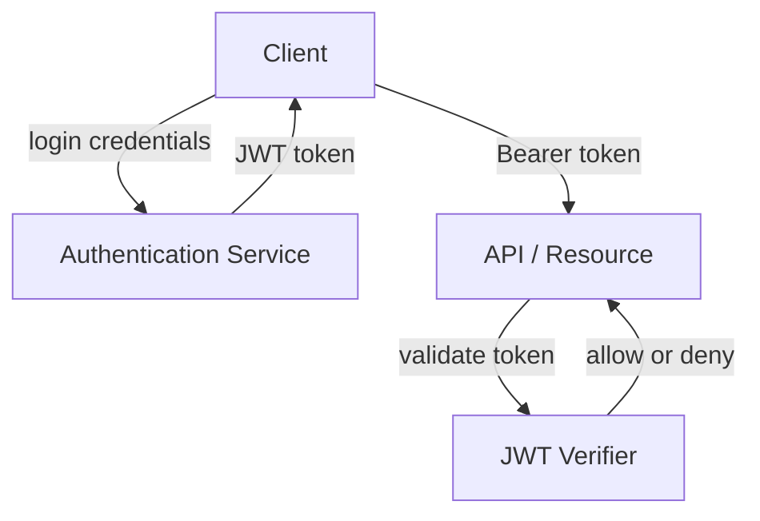

# JWTs

## Why This Topic Matters

JWTs enable stateless authorization across distributed systems. They are widely used in API security and session tokens.

## Simple Definition

A JSON Web Token (JWT) is a compact, URL-safe token format that securely transmits claims between parties.

## Real-World Analogy

A JWT is like a sealed envelope that proves identity and permission without checking with every office along the way.

## System Design Context

JWTs are often issued by an authentication service and then validated by API gateways or services without requiring centralized session storage.

## Example Architecture

## Common Use Cases

- Single sign-on and token-based authentication
- Authorization claims inside service-to-service requests
- Mobile and browser session management

## Common Mistakes

- Using weak signing algorithms
- Storing sensitive data in the JWT payload
- Failing to handle token expiration and revocation

## Related Topics

- [API Gateways](../02-api-gateways/concept.md)
- [APIs](../01-apis/concept.md)
- [Webhooks](../04-webhooks/concept.md)

## References

RFC 7519 defines the JSON Web Token structure and how claims are encoded. [JWT7519]

## Navigation

- Home: [System Engineering Tutorials](../../index.md)
- Learning Path: [Full roadmap](../../learning-path.md)
- Topic Index: [All topics](../../topic-index.md)
- Previous Topic: [Long Polling vs WebSockets](../06-long-polling-vs-websockets/concept.md)
- Topic Pages: [Concept](concept.md) | [Foundation](foundation.md) | [Math Foundation](math-foundation.md) | [Lab](lab.md) | [Quiz](quiz.md)
- Next Topic: [API Gateways](../02-api-gateways/concept.md)

