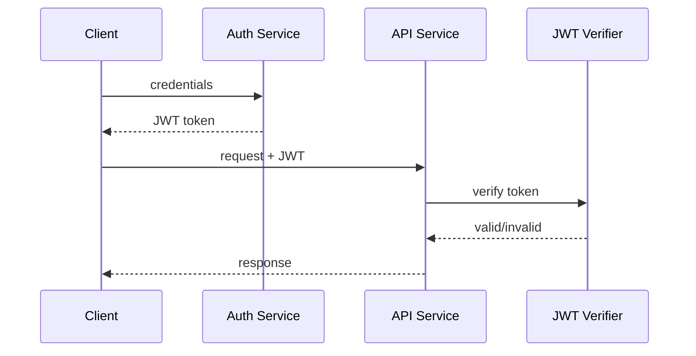

# Engineering Foundation

## Core Components

- Token issuer
- Signing algorithm
- JWT claims and payload
- Token verification logic
- Token expiration management

## How It Works Internally

A JWT is signed using a secret or asymmetric key. Services verify the signature and claims without contacting the issuer for each request.

## Request or Data Flow

1. Client authenticates with credentials.
2. Auth service issues a signed JWT.
3. Client sends JWT in API requests.
4. API verifies signature, expiration, and claims.
5. Access is granted or denied.

## Sequence Diagram

## Design Tradeoffs

- Stateless tokens scale better but make revocation harder.
- Short-lived tokens improve security but require refresh flow.
- More claims increase convenience but enlarge token size.

## Failure Modes

- Token signature mismatch
- Expired tokens
- Replay attacks if tokens are not rotated
- Incorrect claim validation

## Production Best Practices

- Use strong signing algorithms such as HS256 or RS256
- Keep secrets safe and rotate keys periodically
- Use short-lived access tokens with refresh mechanisms
- Validate both issuer and audience claims

## Observability Checklist

- Authentication failure rate
- Token expiration and refresh rate
- Invalid token attempts
- Unexpected claim values

## Security Checklist

- Use secure transport for token exchange
- Sanitize and validate JWT claims
- Avoid storing secrets in the payload
- Support token revocation where needed

## Related Topics

- [API Gateways](../02-api-gateways/concept.md)
- [APIs](../01-apis/concept.md)

## References

JWT structure and verification is defined by RFC 7519. [JWT7519]

## Navigation

- Home: [System Engineering Tutorials](../../index.md)
- Learning Path: [Full roadmap](../../learning-path.md)
- Topic Index: [All topics](../../topic-index.md)
- Previous Topic: [Long Polling vs WebSockets](../06-long-polling-vs-websockets/concept.md)
- Topic Pages: [Concept](concept.md) | [Foundation](foundation.md) | [Math Foundation](math-foundation.md) | [Lab](lab.md) | [Quiz](quiz.md)
- Next Topic: [API Gateways](../02-api-gateways/concept.md)

