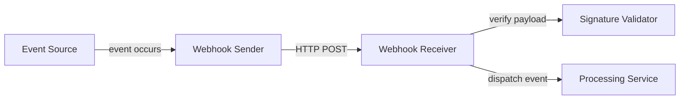

# Webhooks

## Why This Topic Matters

Webhooks provide event-driven integration by pushing updates to receivers when something changes.

## Simple Definition

A webhook is an HTTP callback that sends event data from one system to another automatically.

## Real-World Analogy

A webhook is like subscribing to a newsletter: a new message arrives when there's an update, without you having to check manually.

## System Design Context

Webhooks connect external systems and services in near real-time, making them useful for notifications, sync processes, and workflow automation.

## Example Architecture

## Common Use Cases

- Payment notifications
- CI/CD event delivery
- Third-party integration triggers
- Real-time synchronization

## Common Mistakes

- Not validating webhook signatures
- Assuming reliable delivery without retries
- Using synchronous processing inside webhook handlers

## Related Topics

- [APIs](../01-apis/concept.md)
- [JWTs](../03-jwts/concept.md)
- [REST vs GraphQL](../05-rest-vs-graphql/concept.md)

## References

GitHub webhooks documentation describes the webhook delivery model and security considerations. [WebhooksGitHub]

## Navigation

- Home: [System Engineering Tutorials](../../index.md)
- Learning Path: [Full roadmap](../../learning-path.md)
- Topic Index: [All topics](../../topic-index.md)
- Previous Topic: [REST vs GraphQL](../05-rest-vs-graphql/concept.md)
- Topic Pages: [Concept](concept.md) | [Foundation](foundation.md) | [Math Foundation](math-foundation.md) | [Lab](lab.md) | [Quiz](quiz.md)
- Next Topic: [Long Polling vs WebSockets](../06-long-polling-vs-websockets/concept.md)

