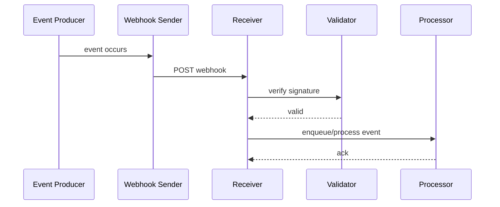

# Engineering Foundation

## Core Components

- Event producer
- Webhook sender
- Receiver endpoint
- Signature verification and retries
- Event processing workflow

## How It Works Internally

A webhook sender posts an HTTP payload to a receiver endpoint when an event occurs. The receiver verifies the event and processes it asynchronously.

## Request or Data Flow

1. Event happens in the producer system.
2. Webhook sender formats the payload.
3. HTTP POST request is delivered to the receiver.
4. Receiver verifies signature and event metadata.
5. The receiver processes the event.

## Sequence Diagram

## Design Tradeoffs

- Push delivery reduces polling cost but requires receiver availability.
- Synchronous processing is simple but can cause retries and timeouts.
- Storing events increases reliability but adds persistence complexity.

## Failure Modes

- Receiver downtime preventing delivery
- Invalid or tampered payloads
- Duplicate events
- Slow processing causing timeouts

## Production Best Practices

- Validate webhook signatures and sender metadata
- Use retries with exponential backoff
- Process events asynchronously whenever possible
- Return quick acknowledgment responses

## Observability Checklist

- Incoming webhook volume
- Failed verification attempts
- Processing latency
- Retry frequency

## Security Checklist

- Validate signatures and timestamps
- Authenticate sender requests
- Protect against replay attacks
- Do not execute data directly without sanitization

## Related Topics

- [APIs](../01-apis/concept.md)
- [JWTs](../03-jwts/concept.md)

## References

GitHub webhook documentation explains secure delivery and event handling. [WebhooksGitHub]

## Navigation

- Home: [System Engineering Tutorials](../../index.md)
- Learning Path: [Full roadmap](../../learning-path.md)
- Topic Index: [All topics](../../topic-index.md)
- Previous Topic: [REST vs GraphQL](../05-rest-vs-graphql/concept.md)
- Topic Pages: [Concept](concept.md) | [Foundation](foundation.md) | [Math Foundation](math-foundation.md) | [Lab](lab.md) | [Quiz](quiz.md)
- Next Topic: [Long Polling vs WebSockets](../06-long-polling-vs-websockets/concept.md)

