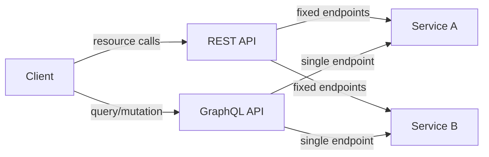

# REST vs GraphQL

## Why This Topic Matters

Understanding REST and GraphQL helps engineers choose the right API style for client needs, performance, and evolution.

## Simple Definition

REST is a style for building resource-based APIs over HTTP. GraphQL is a query language and runtime for APIs that returns exactly requested data.

## Real-World Analogy

REST is like ordering fixed menu items, while GraphQL is like customizing your own meal from a buffet.

## System Design Context

Use REST for simple CRUD services and GraphQL for flexible client-driven queries and aggregated data requirements.

## Example Architecture

## Common Use Cases

- REST: stable public APIs, simple services, caching
- GraphQL: mobile clients, composite views, flexible querying

## Common Mistakes

- Overusing GraphQL for very simple APIs
- Designing REST with confusing resource hierarchies
- Ignoring caching patterns for each style

## Related Topics

- [APIs](../01-apis/concept.md)
- [API Gateways](../02-api-gateways/concept.md)

## References

The GraphQL specification defines the query language and execution semantics for GraphQL APIs. [GraphQLSpec]

## Navigation

- Home: [System Engineering Tutorials](../../index.md)
- Learning Path: [Full roadmap](../../learning-path.md)
- Topic Index: [All topics](../../topic-index.md)
- Previous Topic: [APIs](../01-apis/concept.md)
- Topic Pages: [Concept](concept.md) | [Foundation](foundation.md) | [Math Foundation](math-foundation.md) | [Lab](lab.md) | [Quiz](quiz.md)
- Next Topic: [Webhooks](../04-webhooks/concept.md)

