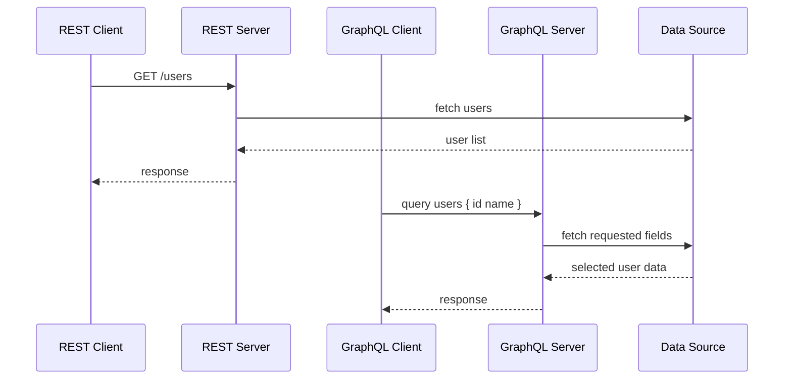

# Engineering Foundation

## Core Components

- REST resource endpoints
- GraphQL schema and resolvers
- Query execution engine
- Response shaping
- HTTP transport and caching

## How It Works Internally

REST services map HTTP verbs to resource actions. GraphQL routes client queries to resolvers that return data from one or more sources.

## Request or Data Flow

1. REST client sends a request to a resource endpoint.
2. Server performs the operation and returns a fixed response shape.
3. GraphQL client sends a query to the schema endpoint.
4. GraphQL engine matches fields to resolvers.
5. Response contains only requested fields.

## Sequence Diagram

## Design Tradeoffs

- REST is easy to cache and monitor.
- GraphQL reduces over-fetching but can be harder to secure and cache.
- REST is better for simple, resource-based APIs.
- GraphQL is better for flexible client-driven data access.

## Failure Modes

- REST endpoint proliferation and inconsistent conventions
- GraphQL queries with deep nested queries causing performance issues
- Inadequate caching for either approach
- Overly large responses

## Production Best Practices

- Use OpenAPI for REST contract documentation
- Use persistent queries or query depth limits in GraphQL
- Monitor query complexity and resource usage
- Choose the style that fits client needs

## Observability Checklist

- Endpoint traffic by route
- Response latency
- Query complexity for GraphQL
- Error patterns

## Security Checklist

- Validate input and query shape
- Restrict unsafe fields in GraphQL
- Use authentication and authorization consistently
- Cache invalidation and stale data controls

## Related Topics

- [APIs](../01-apis/concept.md)
- [API Gateways](../02-api-gateways/concept.md)

## References

The GraphQL specification describes the query language and runtime for API endpoints. [GraphQLSpec]

## Navigation

- Home: [System Engineering Tutorials](../../index.md)
- Learning Path: [Full roadmap](../../learning-path.md)
- Topic Index: [All topics](../../topic-index.md)
- Previous Topic: [APIs](../01-apis/concept.md)
- Topic Pages: [Concept](concept.md) | [Foundation](foundation.md) | [Math Foundation](math-foundation.md) | [Lab](lab.md) | [Quiz](quiz.md)
- Next Topic: [Webhooks](../04-webhooks/concept.md)

