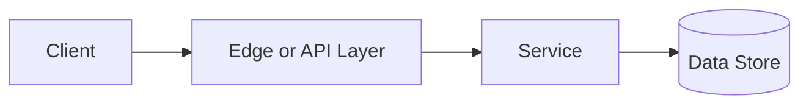

# Long Polling vs WebSockets

## Why This Topic Matters

Long Polling vs WebSockets belongs to Communication Fundamentals. It helps backend engineers make systems that are reliable, scalable, and easier to reason about under production load.

## Simple Definition

Long polling keeps an HTTP request open until new data is available, while WebSockets keep a persistent full-duplex connection open for real-time messages.

## Real-World Analogy

Think of this topic as a traffic-control decision: the goal is to move work through the system predictably without overwhelming one part of the route.

## System Design Context

Use Long Polling vs WebSockets when designing systems for chat, notifications, collaborative editing, live dashboards, and multiplayer coordination. The design should be evaluated with connection count, message rate, latency, reconnect rate, and server memory per connection.

## Example Architecture

## Common Use Cases

- chat, notifications, collaborative editing, live dashboards, and multiplayer coordination
- Production reliability planning
- Capacity and performance design
- Reducing operational risk

## Common Mistakes

- Choosing the pattern without defining the workload
- Ignoring failure modes and retry behavior
- Measuring only averages instead of tail behavior
- Forgetting operational limits and observability

## Related Topics

- Previous: [REST vs GraphQL](../05-rest-vs-graphql/concept.md)
- Next: [Rate Limiting](../07-rate-limiting/concept.md)

## References

This page is a practical system design summary. Add official and academic references as the topic receives deeper validation.

## Navigation

- Home: [System Engineering Tutorials](../../index.md)
- Learning Path: [Full roadmap](../../learning-path.md)
- Topic Index: [All topics](../../topic-index.md)
- Previous Topic: [Webhooks](../04-webhooks/concept.md)
- Topic Pages: [Concept](concept.md) | [Foundation](foundation.md) | [Math Foundation](math-foundation.md) | [Lab](lab.md) | [Quiz](quiz.md)
- Next Topic: [JWTs](../03-jwts/concept.md)

