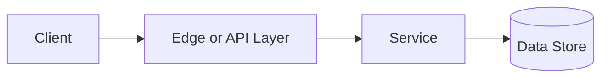

# Rate Limiting

## Why This Topic Matters

Rate Limiting belongs to Security and Access Control. It helps backend engineers make systems that are reliable, scalable, and easier to reason about under production load.

## Simple Definition

Rate limiting controls how many requests a client can make in a time window.

## Real-World Analogy

Think of this topic as a traffic-control decision: the goal is to move work through the system predictably without overwhelming one part of the route.

## System Design Context

Use Rate Limiting when designing systems for protecting APIs from abuse, smoothing traffic spikes, enforcing quotas, and preserving capacity. The design should be evaluated with requests per window, burst size, rejected request rate, and remaining quota.

## Example Architecture

## Common Use Cases

- protecting APIs from abuse, smoothing traffic spikes, enforcing quotas, and preserving capacity
- Production reliability planning
- Capacity and performance design
- Reducing operational risk

## Common Mistakes

- Choosing the pattern without defining the workload
- Ignoring failure modes and retry behavior
- Measuring only averages instead of tail behavior
- Forgetting operational limits and observability

## Related Topics

- Previous: [Long Polling vs WebSockets](../06-long-polling-vs-websockets/concept.md)
- Next: [Idempotency](../08-idempotency/concept.md)

## References

This page is a practical system design summary. Add official and academic references as the topic receives deeper validation.

## Navigation

- Home: [System Engineering Tutorials](../../index.md)
- Learning Path: [Full roadmap](../../learning-path.md)
- Topic Index: [All topics](../../topic-index.md)
- Previous Topic: [API Gateways](../02-api-gateways/concept.md)
- Topic Pages: [Concept](concept.md) | [Foundation](foundation.md) | [Math Foundation](math-foundation.md) | [Lab](lab.md) | [Quiz](quiz.md)
- Next Topic: [Idempotency](../08-idempotency/concept.md)

