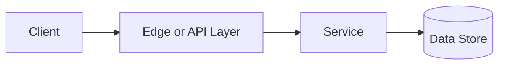

# Idempotency

## Why This Topic Matters

Idempotency belongs to Security and Access Control. It helps backend engineers make systems that are reliable, scalable, and easier to reason about under production load.

## Simple Definition

Idempotency means repeating the same operation produces the same final effect as performing it once.

## Real-World Analogy

Think of this topic as a traffic-control decision: the goal is to move work through the system predictably without overwhelming one part of the route.

## System Design Context

Use Idempotency when designing systems for safe retries, payment creation, order submission, message processing, and distributed workflows. The design should be evaluated with duplicate request rate, retry count, idempotency-key hit rate, and conflict rate.

## Example Architecture

## Common Use Cases

- safe retries, payment creation, order submission, message processing, and distributed workflows
- Production reliability planning
- Capacity and performance design
- Reducing operational risk

## Common Mistakes

- Choosing the pattern without defining the workload
- Ignoring failure modes and retry behavior
- Measuring only averages instead of tail behavior
- Forgetting operational limits and observability

## Related Topics

- Previous: [Rate Limiting](../07-rate-limiting/concept.md)
- Next: [Load Balancing](../09-load-balancing/concept.md)

## References

This page is a practical system design summary. Add official and academic references as the topic receives deeper validation.

## Navigation

- Home: [System Engineering Tutorials](../../index.md)
- Learning Path: [Full roadmap](../../learning-path.md)
- Topic Index: [All topics](../../topic-index.md)
- Previous Topic: [Rate Limiting](../07-rate-limiting/concept.md)
- Topic Pages: [Concept](concept.md) | [Foundation](foundation.md) | [Math Foundation](math-foundation.md) | [Lab](lab.md) | [Quiz](quiz.md)
- Next Topic: [Load Balancing](../09-load-balancing/concept.md)

