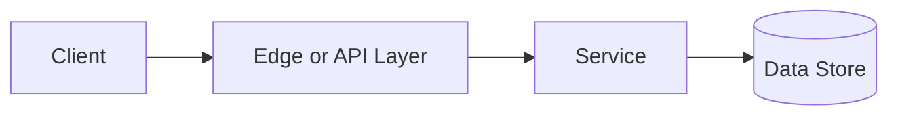

# Proxy vs Reverse Proxy

## Why This Topic Matters

Proxy vs Reverse Proxy belongs to Performance and Scalability. It helps backend engineers make systems that are reliable, scalable, and easier to reason about under production load.

## Simple Definition

A forward proxy represents clients, while a reverse proxy represents servers.

## Real-World Analogy

Think of this topic as a traffic-control decision: the goal is to move work through the system predictably without overwhelming one part of the route.

## System Design Context

Use Proxy vs Reverse Proxy when designing systems for gateway routing, TLS termination, caching, access control, and hiding internal services. The design should be evaluated with request latency, cache hit rate, upstream error rate, and connection reuse.

## Example Architecture

## Common Use Cases

- gateway routing, TLS termination, caching, access control, and hiding internal services
- Production reliability planning
- Capacity and performance design
- Reducing operational risk

## Common Mistakes

- Choosing the pattern without defining the workload
- Ignoring failure modes and retry behavior
- Measuring only averages instead of tail behavior
- Forgetting operational limits and observability

## Related Topics

- Previous: [Load Balancing](../09-load-balancing/concept.md)
- Next: [Scalability](../11-scalability/concept.md)

## References

This page is a practical system design summary. Add official and academic references as the topic receives deeper validation.

## Navigation

- Home: [System Engineering Tutorials](../../index.md)
- Learning Path: [Full roadmap](../../learning-path.md)
- Topic Index: [All topics](../../topic-index.md)
- Previous Topic: [Load Balancing](../09-load-balancing/concept.md)
- Topic Pages: [Concept](concept.md) | [Foundation](foundation.md) | [Math Foundation](math-foundation.md) | [Lab](lab.md) | [Quiz](quiz.md)
- Next Topic: [Scalability](../11-scalability/concept.md)

