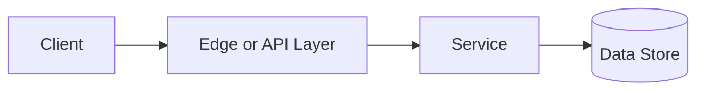

# Scalability

## Why This Topic Matters

Scalability belongs to Performance and Scalability. It helps backend engineers make systems that are reliable, scalable, and easier to reason about under production load.

## Simple Definition

Scalability is a system's ability to handle increased load by adding resources or improving efficiency.

## Real-World Analogy

Think of this topic as a traffic-control decision: the goal is to move work through the system predictably without overwhelming one part of the route.

## System Design Context

Use Scalability when designing systems for serving more users, larger datasets, higher throughput, and growth planning. The design should be evaluated with throughput, latency, saturation, queue depth, and cost per request.

## Example Architecture

## Common Use Cases

- serving more users, larger datasets, higher throughput, and growth planning
- Production reliability planning
- Capacity and performance design
- Reducing operational risk

## Common Mistakes

- Choosing the pattern without defining the workload
- Ignoring failure modes and retry behavior
- Measuring only averages instead of tail behavior
- Forgetting operational limits and observability

## Related Topics

- Previous: [Proxy vs Reverse Proxy](../10-proxy-vs-reverse-proxy/concept.md)
- Next: [Caching](../12-caching/concept.md)

## References

This page is a practical system design summary. Add official and academic references as the topic receives deeper validation.

## Navigation

- Home: [System Engineering Tutorials](../../index.md)
- Learning Path: [Full roadmap](../../learning-path.md)
- Topic Index: [All topics](../../topic-index.md)
- Previous Topic: [Proxy vs Reverse Proxy](../10-proxy-vs-reverse-proxy/concept.md)
- Topic Pages: [Concept](concept.md) | [Foundation](foundation.md) | [Math Foundation](math-foundation.md) | [Lab](lab.md) | [Quiz](quiz.md)
- Next Topic: [Caching](../12-caching/concept.md)

