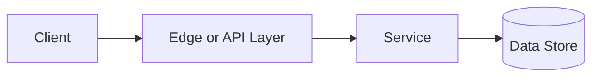

# Caching

## Why This Topic Matters

Caching belongs to Performance and Scalability. It helps backend engineers make systems that are reliable, scalable, and easier to reason about under production load.

## Simple Definition

Caching stores frequently used data closer to the requester so future reads are faster.

## Real-World Analogy

Think of this topic as a traffic-control decision: the goal is to move work through the system predictably without overwhelming one part of the route.

## System Design Context

Use Caching when designing systems for reducing database load, speeding reads, storing sessions, and improving API latency. The design should be evaluated with hit rate, miss rate, staleness, eviction count, and memory usage.

## Example Architecture

## Common Use Cases

- reducing database load, speeding reads, storing sessions, and improving API latency
- Production reliability planning
- Capacity and performance design
- Reducing operational risk

## Common Mistakes

- Choosing the pattern without defining the workload
- Ignoring failure modes and retry behavior
- Measuring only averages instead of tail behavior
- Forgetting operational limits and observability

## Related Topics

- Previous: [Scalability](../11-scalability/concept.md)
- Next: [Cache Eviction](../13-cache-eviction/concept.md)

## References

This page is a practical system design summary. Add official and academic references as the topic receives deeper validation.

## Navigation

- Home: [System Engineering Tutorials](../../index.md)
- Learning Path: [Full roadmap](../../learning-path.md)
- Topic Index: [All topics](../../topic-index.md)
- Previous Topic: [Scalability](../11-scalability/concept.md)
- Topic Pages: [Concept](concept.md) | [Foundation](foundation.md) | [Math Foundation](math-foundation.md) | [Lab](lab.md) | [Quiz](quiz.md)
- Next Topic: [Cache Eviction](../13-cache-eviction/concept.md)

