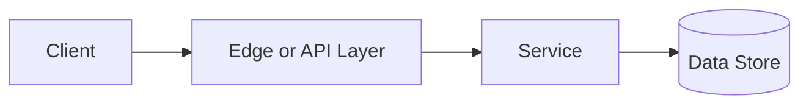

# Cache Eviction

## Why This Topic Matters

Cache Eviction belongs to Performance and Scalability. It helps backend engineers make systems that are reliable, scalable, and easier to reason about under production load.

## Simple Definition

Cache eviction decides what data to remove when cache capacity is limited.

## Real-World Analogy

Think of this topic as a traffic-control decision: the goal is to move work through the system predictably without overwhelming one part of the route.

## System Design Context

Use Cache Eviction when designing systems for bounded memory caches, CDN object storage, database page caches, and application-level caches. The design should be evaluated with eviction rate, hit rate after eviction, object age, and memory pressure.

## Example Architecture

## Common Use Cases

- bounded memory caches, CDN object storage, database page caches, and application-level caches
- Production reliability planning
- Capacity and performance design
- Reducing operational risk

## Common Mistakes

- Choosing the pattern without defining the workload
- Ignoring failure modes and retry behavior
- Measuring only averages instead of tail behavior
- Forgetting operational limits and observability

## Related Topics

- Previous: [Caching](../12-caching/concept.md)
- Next: [CDN](../14-cdn/concept.md)

## References

This page is a practical system design summary. Add official and academic references as the topic receives deeper validation.

## Navigation

- Home: [System Engineering Tutorials](../../index.md)
- Learning Path: [Full roadmap](../../learning-path.md)
- Topic Index: [All topics](../../topic-index.md)
- Previous Topic: [Caching](../12-caching/concept.md)
- Topic Pages: [Concept](concept.md) | [Foundation](foundation.md) | [Math Foundation](math-foundation.md) | [Lab](lab.md) | [Quiz](quiz.md)
- Next Topic: [CDN](../14-cdn/concept.md)

