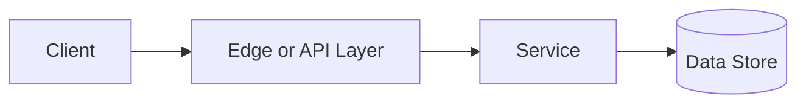

# CDN

## Why This Topic Matters

CDN belongs to Performance and Scalability. It helps backend engineers make systems that are reliable, scalable, and easier to reason about under production load.

## Simple Definition

A CDN is a distributed network that serves content from locations close to users.

## Real-World Analogy

Think of this topic as a traffic-control decision: the goal is to move work through the system predictably without overwhelming one part of the route.

## System Design Context

Use CDN when designing systems for static assets, video, downloads, edge caching, and global latency reduction. The design should be evaluated with edge hit rate, origin offload, time to first byte, and geographic latency.

## Example Architecture

## Common Use Cases

- static assets, video, downloads, edge caching, and global latency reduction
- Production reliability planning
- Capacity and performance design
- Reducing operational risk

## Common Mistakes

- Choosing the pattern without defining the workload
- Ignoring failure modes and retry behavior
- Measuring only averages instead of tail behavior
- Forgetting operational limits and observability

## Related Topics

- Previous: [Cache Eviction](../13-cache-eviction/concept.md)
- Next: [SQL vs NoSQL](../15-sql-vs-nosql/concept.md)

## References

This page is a practical system design summary. Add official and academic references as the topic receives deeper validation.

## Navigation

- Home: [System Engineering Tutorials](../../index.md)
- Learning Path: [Full roadmap](../../learning-path.md)
- Topic Index: [All topics](../../topic-index.md)
- Previous Topic: [Cache Eviction](../13-cache-eviction/concept.md)
- Topic Pages: [Concept](concept.md) | [Foundation](foundation.md) | [Math Foundation](math-foundation.md) | [Lab](lab.md) | [Quiz](quiz.md)
- Next Topic: [SQL vs NoSQL](../15-sql-vs-nosql/concept.md)

