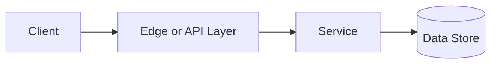

# SQL vs NoSQL

## Why This Topic Matters

SQL vs NoSQL belongs to Data and Databases. It helps backend engineers make systems that are reliable, scalable, and easier to reason about under production load.

## Simple Definition

SQL databases use relational schemas and declarative queries, while NoSQL databases use non-relational models such as documents, key-value pairs, wide columns, or graphs.

## Real-World Analogy

Think of this topic as a traffic-control decision: the goal is to move work through the system predictably without overwhelming one part of the route.

## System Design Context

Use SQL vs NoSQL when designing systems for choosing storage models for consistency, query flexibility, scale, and schema evolution. The design should be evaluated with query latency, consistency guarantees, write throughput, storage growth, and operational complexity.

## Example Architecture

## Common Use Cases

- choosing storage models for consistency, query flexibility, scale, and schema evolution
- Production reliability planning
- Capacity and performance design
- Reducing operational risk

## Common Mistakes

- Choosing the pattern without defining the workload
- Ignoring failure modes and retry behavior
- Measuring only averages instead of tail behavior
- Forgetting operational limits and observability

## Related Topics

- Previous: [CDN](../14-cdn/concept.md)
- Next: [ACID Transactions](../16-acid-transactions/concept.md)

## References

This page is a practical system design summary. Add official and academic references as the topic receives deeper validation.

## Navigation

- Home: [System Engineering Tutorials](../../index.md)
- Learning Path: [Full roadmap](../../learning-path.md)
- Topic Index: [All topics](../../topic-index.md)
- Previous Topic: [CDN](../14-cdn/concept.md)
- Topic Pages: [Concept](concept.md) | [Foundation](foundation.md) | [Math Foundation](math-foundation.md) | [Lab](lab.md) | [Quiz](quiz.md)
- Next Topic: [ACID Transactions](../16-acid-transactions/concept.md)

