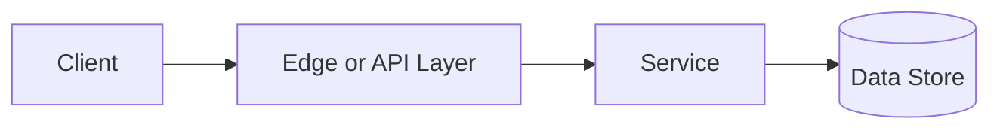

# ACID Transactions

## Why This Topic Matters

ACID Transactions belongs to Data and Databases. It helps backend engineers make systems that are reliable, scalable, and easier to reason about under production load.

## Simple Definition

ACID describes transaction guarantees: atomicity, consistency, isolation, and durability.

## Real-World Analogy

Think of this topic as a traffic-control decision: the goal is to move work through the system predictably without overwhelming one part of the route.

## System Design Context

Use ACID Transactions when designing systems for money movement, inventory updates, account changes, and any workflow requiring reliable state transitions. The design should be evaluated with commit latency, rollback count, lock wait time, deadlocks, and isolation anomalies.

## Example Architecture

## Common Use Cases

- money movement, inventory updates, account changes, and any workflow requiring reliable state transitions
- Production reliability planning
- Capacity and performance design
- Reducing operational risk

## Common Mistakes

- Choosing the pattern without defining the workload
- Ignoring failure modes and retry behavior
- Measuring only averages instead of tail behavior
- Forgetting operational limits and observability

## Related Topics

- Previous: [SQL vs NoSQL](../15-sql-vs-nosql/concept.md)
- Next: [Indexes](../17-indexes/concept.md)

## References

This page is a practical system design summary. Add official and academic references as the topic receives deeper validation.

## Navigation

- Home: [System Engineering Tutorials](../../index.md)
- Learning Path: [Full roadmap](../../learning-path.md)
- Topic Index: [All topics](../../topic-index.md)
- Previous Topic: [SQL vs NoSQL](../15-sql-vs-nosql/concept.md)
- Topic Pages: [Concept](concept.md) | [Foundation](foundation.md) | [Math Foundation](math-foundation.md) | [Lab](lab.md) | [Quiz](quiz.md)
- Next Topic: [Indexes](../17-indexes/concept.md)

