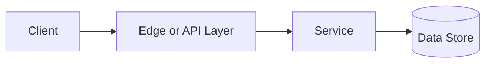

# Indexes

## Why This Topic Matters

Indexes belongs to Data and Databases. It helps backend engineers make systems that are reliable, scalable, and easier to reason about under production load.

## Simple Definition

Indexes are data structures that speed up reads by avoiding full scans.

## Real-World Analogy

Think of this topic as a traffic-control decision: the goal is to move work through the system predictably without overwhelming one part of the route.

## System Design Context

Use Indexes when designing systems for query optimization, sorting, filtering, uniqueness checks, and lookup-heavy workloads. The design should be evaluated with query plan cost, index hit rate, write amplification, and storage overhead.

## Example Architecture

## Common Use Cases

- query optimization, sorting, filtering, uniqueness checks, and lookup-heavy workloads
- Production reliability planning
- Capacity and performance design
- Reducing operational risk

## Common Mistakes

- Choosing the pattern without defining the workload
- Ignoring failure modes and retry behavior
- Measuring only averages instead of tail behavior
- Forgetting operational limits and observability

## Related Topics

- Previous: [ACID Transactions](../16-acid-transactions/concept.md)
- Next: [Sharding](../18-sharding/concept.md)

## References

This page is a practical system design summary. Add official and academic references as the topic receives deeper validation.

## Navigation

- Home: [System Engineering Tutorials](../../index.md)
- Learning Path: [Full roadmap](../../learning-path.md)
- Topic Index: [All topics](../../topic-index.md)
- Previous Topic: [ACID Transactions](../16-acid-transactions/concept.md)
- Topic Pages: [Concept](concept.md) | [Foundation](foundation.md) | [Math Foundation](math-foundation.md) | [Lab](lab.md) | [Quiz](quiz.md)
- Next Topic: [Sharding](../18-sharding/concept.md)

