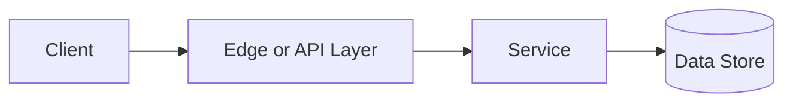

# Sharding

## Why This Topic Matters

Sharding belongs to Data and Databases. It helps backend engineers make systems that are reliable, scalable, and easier to reason about under production load.

## Simple Definition

Sharding splits data across multiple partitions or machines using a shard key.

## Real-World Analogy

Think of this topic as a traffic-control decision: the goal is to move work through the system predictably without overwhelming one part of the route.

## System Design Context

Use Sharding when designing systems for scaling large datasets, high write volume, tenant isolation, and geographic placement. The design should be evaluated with shard balance, hot shard rate, cross-shard query count, and rebalancing cost.

## Example Architecture

## Common Use Cases

- scaling large datasets, high write volume, tenant isolation, and geographic placement
- Production reliability planning
- Capacity and performance design
- Reducing operational risk

## Common Mistakes

- Choosing the pattern without defining the workload
- Ignoring failure modes and retry behavior
- Measuring only averages instead of tail behavior
- Forgetting operational limits and observability

## Related Topics

- Previous: [Indexes](../17-indexes/concept.md)
- Next: [Change Data Capture](../19-change-data-capture/concept.md)

## References

This page is a practical system design summary. Add official and academic references as the topic receives deeper validation.

## Navigation

- Home: [System Engineering Tutorials](../../index.md)
- Learning Path: [Full roadmap](../../learning-path.md)
- Topic Index: [All topics](../../topic-index.md)
- Previous Topic: [Indexes](../17-indexes/concept.md)
- Topic Pages: [Concept](concept.md) | [Foundation](foundation.md) | [Math Foundation](math-foundation.md) | [Lab](lab.md) | [Quiz](quiz.md)
- Next Topic: [Change Data Capture](../19-change-data-capture/concept.md)

