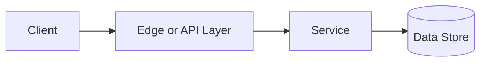

# Availability

## Why This Topic Matters

Availability belongs to Distributed Systems. It helps backend engineers make systems that are reliable, scalable, and easier to reason about under production load.

## Simple Definition

Availability is the percentage of time a system is operational and able to serve requests.

## Real-World Analogy

Think of this topic as a traffic-control decision: the goal is to move work through the system predictably without overwhelming one part of the route.

## System Design Context

Use Availability when designing systems for SLO design, redundancy planning, incident response, and reliability targets. The design should be evaluated with uptime percentage, error budget, mean time to recovery, and successful request rate.

## Example Architecture

## Common Use Cases

- SLO design, redundancy planning, incident response, and reliability targets
- Production reliability planning
- Capacity and performance design
- Reducing operational risk

## Common Mistakes

- Choosing the pattern without defining the workload
- Ignoring failure modes and retry behavior
- Measuring only averages instead of tail behavior
- Forgetting operational limits and observability

## Related Topics

- Previous: [Change Data Capture](../19-change-data-capture/concept.md)
- Next: [Single Point of Failure](../21-single-point-of-failure/concept.md)

## References

This page is a practical system design summary. Add official and academic references as the topic receives deeper validation.

## Navigation

- Home: [System Engineering Tutorials](../../index.md)
- Learning Path: [Full roadmap](../../learning-path.md)
- Topic Index: [All topics](../../topic-index.md)
- Previous Topic: [Change Data Capture](../19-change-data-capture/concept.md)
- Topic Pages: [Concept](concept.md) | [Foundation](foundation.md) | [Math Foundation](math-foundation.md) | [Lab](lab.md) | [Quiz](quiz.md)
- Next Topic: [Single Point of Failure](../21-single-point-of-failure/concept.md)

