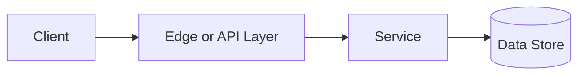

# Single Point of Failure

## Why This Topic Matters

Single Point of Failure belongs to Distributed Systems. It helps backend engineers make systems that are reliable, scalable, and easier to reason about under production load.

## Simple Definition

A single point of failure is one component whose failure can take down the whole system.

## Real-World Analogy

Think of this topic as a traffic-control decision: the goal is to move work through the system predictably without overwhelming one part of the route.

## System Design Context

Use Single Point of Failure when designing systems for architecture reviews, redundancy planning, failover design, and risk analysis. The design should be evaluated with dependency criticality, failover time, redundancy count, and blast radius.

## Example Architecture

## Common Use Cases

- architecture reviews, redundancy planning, failover design, and risk analysis
- Production reliability planning
- Capacity and performance design
- Reducing operational risk

## Common Mistakes

- Choosing the pattern without defining the workload
- Ignoring failure modes and retry behavior
- Measuring only averages instead of tail behavior
- Forgetting operational limits and observability

## Related Topics

- Previous: [Availability](../20-availability/concept.md)
- Next: [CAP Theorem](../22-cap-theorem/concept.md)

## References

This page is a practical system design summary. Add official and academic references as the topic receives deeper validation.

## Navigation

- Home: [System Engineering Tutorials](../../index.md)
- Learning Path: [Full roadmap](../../learning-path.md)
- Topic Index: [All topics](../../topic-index.md)
- Previous Topic: [Availability](../20-availability/concept.md)
- Topic Pages: [Concept](concept.md) | [Foundation](foundation.md) | [Math Foundation](math-foundation.md) | [Lab](lab.md) | [Quiz](quiz.md)
- Next Topic: [CAP Theorem](../22-cap-theorem/concept.md)

