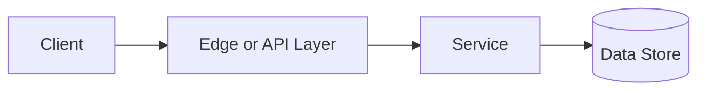

# CAP Theorem

## Why This Topic Matters

CAP Theorem belongs to Distributed Systems. It helps backend engineers make systems that are reliable, scalable, and easier to reason about under production load.

## Simple Definition

CAP theorem says a distributed data system facing a network partition must choose between consistency and availability.

## Real-World Analogy

Think of this topic as a traffic-control decision: the goal is to move work through the system predictably without overwhelming one part of the route.

## System Design Context

Use CAP Theorem when designing systems for reasoning about distributed databases, replication, quorum choices, and partition behavior. The design should be evaluated with stale read rate, write availability, quorum latency, and conflict rate.

## Example Architecture

## Common Use Cases

- reasoning about distributed databases, replication, quorum choices, and partition behavior
- Production reliability planning
- Capacity and performance design
- Reducing operational risk

## Common Mistakes

- Choosing the pattern without defining the workload
- Ignoring failure modes and retry behavior
- Measuring only averages instead of tail behavior
- Forgetting operational limits and observability

## Related Topics

- Previous: [Single Point of Failure](../21-single-point-of-failure/concept.md)
- Next: [Consistent Hashing](../23-consistent-hashing/concept.md)

## References

This page is a practical system design summary. Add official and academic references as the topic receives deeper validation.

## Navigation

- Home: [System Engineering Tutorials](../../index.md)
- Learning Path: [Full roadmap](../../learning-path.md)
- Topic Index: [All topics](../../topic-index.md)
- Previous Topic: [Single Point of Failure](../21-single-point-of-failure/concept.md)
- Topic Pages: [Concept](concept.md) | [Foundation](foundation.md) | [Math Foundation](math-foundation.md) | [Lab](lab.md) | [Quiz](quiz.md)
- Next Topic: [Consistent Hashing](../23-consistent-hashing/concept.md)

