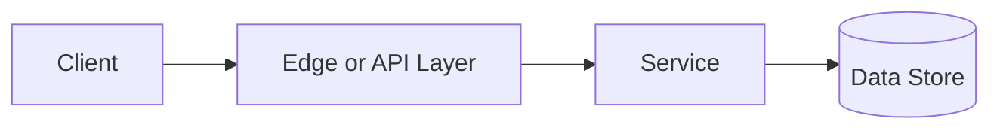

# Consistent Hashing

## Why This Topic Matters

Consistent Hashing belongs to Distributed Systems. It helps backend engineers make systems that are reliable, scalable, and easier to reason about under production load.

## Simple Definition

Consistent hashing maps keys to nodes so adding or removing nodes moves only a small portion of keys.

## Real-World Analogy

Think of this topic as a traffic-control decision: the goal is to move work through the system predictably without overwhelming one part of the route.

## System Design Context

Use Consistent Hashing when designing systems for distributed caches, sharded databases, routing rings, and storage clusters. The design should be evaluated with key movement percentage, node balance, hot key rate, and replica count.

## Example Architecture

## Common Use Cases

- distributed caches, sharded databases, routing rings, and storage clusters
- Production reliability planning
- Capacity and performance design
- Reducing operational risk

## Common Mistakes

- Choosing the pattern without defining the workload
- Ignoring failure modes and retry behavior
- Measuring only averages instead of tail behavior
- Forgetting operational limits and observability

## Related Topics

- Previous: [CAP Theorem](../22-cap-theorem/concept.md)
- Next: [Message Queues](../24-message-queues/concept.md)

## References

This page is a practical system design summary. Add official and academic references as the topic receives deeper validation.

## Navigation

- Home: [System Engineering Tutorials](../../index.md)
- Learning Path: [Full roadmap](../../learning-path.md)
- Topic Index: [All topics](../../topic-index.md)
- Previous Topic: [CAP Theorem](../22-cap-theorem/concept.md)
- Topic Pages: [Concept](concept.md) | [Foundation](foundation.md) | [Math Foundation](math-foundation.md) | [Lab](lab.md) | [Quiz](quiz.md)
- Next Topic: [Message Queues](../24-message-queues/concept.md)

