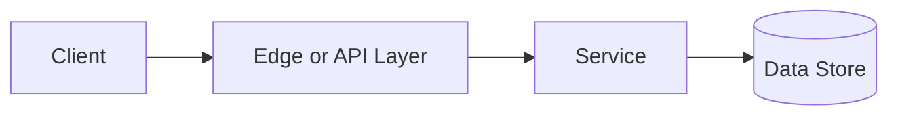

# Message Queues

## Why This Topic Matters

Message Queues belongs to Distributed Systems. It helps backend engineers make systems that are reliable, scalable, and easier to reason about under production load.

## Simple Definition

Message queues decouple producers and consumers by storing messages until workers process them.

## Real-World Analogy

Think of this topic as a traffic-control decision: the goal is to move work through the system predictably without overwhelming one part of the route.

## System Design Context

Use Message Queues when designing systems for async processing, retries, workload buffering, event delivery, and background jobs. The design should be evaluated with queue depth, consumer lag, throughput, retry rate, and dead-letter count.

## Example Architecture

## Common Use Cases

- async processing, retries, workload buffering, event delivery, and background jobs
- Production reliability planning
- Capacity and performance design
- Reducing operational risk

## Common Mistakes

- Choosing the pattern without defining the workload
- Ignoring failure modes and retry behavior
- Measuring only averages instead of tail behavior
- Forgetting operational limits and observability

## Related Topics

- Previous: [Consistent Hashing](../23-consistent-hashing/concept.md)
- Next: [Stateful vs Stateless](../25-stateful-vs-stateless/concept.md)

## References

This page is a practical system design summary. Add official and academic references as the topic receives deeper validation.

## Navigation

- Home: [System Engineering Tutorials](../../index.md)
- Learning Path: [Full roadmap](../../learning-path.md)
- Topic Index: [All topics](../../topic-index.md)
- Previous Topic: [Consistent Hashing](../23-consistent-hashing/concept.md)
- Topic Pages: [Concept](concept.md) | [Foundation](foundation.md) | [Math Foundation](math-foundation.md) | [Lab](lab.md) | [Quiz](quiz.md)
- Next Topic: [Stateful vs Stateless](../25-stateful-vs-stateless/concept.md)

