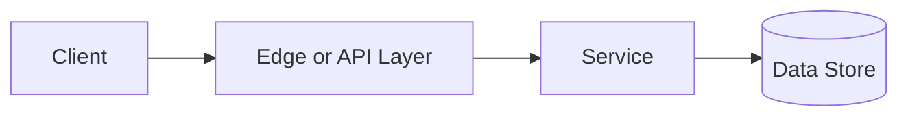

# Stateful vs Stateless

## Why This Topic Matters

Stateful vs Stateless belongs to Distributed Systems. It helps backend engineers make systems that are reliable, scalable, and easier to reason about under production load.

## Simple Definition

Stateful services keep client or workflow state locally, while stateless services externalize state and can handle requests independently.

## Real-World Analogy

Think of this topic as a traffic-control decision: the goal is to move work through the system predictably without overwhelming one part of the route.

## System Design Context

Use Stateful vs Stateless when designing systems for service design, scaling decisions, session management, and failover planning. The design should be evaluated with session count, state size, failover recovery, cache dependency, and instance replaceability.

## Example Architecture

## Common Use Cases

- service design, scaling decisions, session management, and failover planning
- Production reliability planning
- Capacity and performance design
- Reducing operational risk

## Common Mistakes

- Choosing the pattern without defining the workload
- Ignoring failure modes and retry behavior
- Measuring only averages instead of tail behavior
- Forgetting operational limits and observability

## Related Topics

- Previous: [Message Queues](../24-message-queues/concept.md)
- Next: [Concurrency vs Parallelism](../26-concurrency-vs-parallelism/concept.md)

## References

This page is a practical system design summary. Add official and academic references as the topic receives deeper validation.

## Navigation

- Home: [System Engineering Tutorials](../../index.md)
- Learning Path: [Full roadmap](../../learning-path.md)
- Topic Index: [All topics](../../topic-index.md)
- Previous Topic: [Message Queues](../24-message-queues/concept.md)
- Topic Pages: [Concept](concept.md) | [Foundation](foundation.md) | [Math Foundation](math-foundation.md) | [Lab](lab.md) | [Quiz](quiz.md)
- Next Topic: [Concurrency vs Parallelism](../26-concurrency-vs-parallelism/concept.md)

