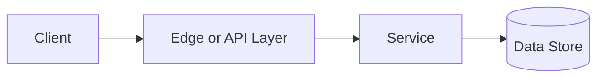

# Concurrency vs Parallelism

## Why This Topic Matters

Concurrency vs Parallelism belongs to Advanced Processing and Location Systems. It helps backend engineers make systems that are reliable, scalable, and easier to reason about under production load.

## Simple Definition

Concurrency is managing multiple tasks in overlapping time, while parallelism is executing multiple tasks at the same time.

## Real-World Analogy

Think of this topic as a traffic-control decision: the goal is to move work through the system predictably without overwhelming one part of the route.

## System Design Context

Use Concurrency vs Parallelism when designing systems for server request handling, worker pools, async IO, CPU-bound jobs, and throughput tuning. The design should be evaluated with task latency, CPU utilization, contention, context switches, and throughput.

## Example Architecture

## Common Use Cases

- server request handling, worker pools, async IO, CPU-bound jobs, and throughput tuning
- Production reliability planning
- Capacity and performance design
- Reducing operational risk

## Common Mistakes

- Choosing the pattern without defining the workload
- Ignoring failure modes and retry behavior
- Measuring only averages instead of tail behavior
- Forgetting operational limits and observability

## Related Topics

- Previous: [Stateful vs Stateless](../25-stateful-vs-stateless/concept.md)
- Next: [Batch vs Stream Processing](../27-batch-vs-stream-processing/concept.md)

## References

This page is a practical system design summary. Add official and academic references as the topic receives deeper validation.

## Navigation

- Home: [System Engineering Tutorials](../../index.md)
- Learning Path: [Full roadmap](../../learning-path.md)
- Topic Index: [All topics](../../topic-index.md)
- Previous Topic: [Stateful vs Stateless](../25-stateful-vs-stateless/concept.md)
- Topic Pages: [Concept](concept.md) | [Foundation](foundation.md) | [Math Foundation](math-foundation.md) | [Lab](lab.md) | [Quiz](quiz.md)
- Next Topic: [Batch vs Stream Processing](../27-batch-vs-stream-processing/concept.md)

