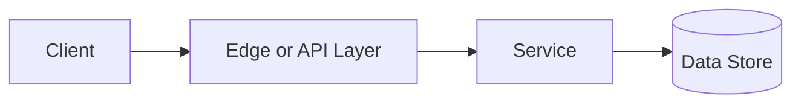

# Batch vs Stream Processing

## Why This Topic Matters

Batch vs Stream Processing belongs to Advanced Processing and Location Systems. It helps backend engineers make systems that are reliable, scalable, and easier to reason about under production load.

## Simple Definition

Batch processing handles bounded groups of data, while stream processing handles events continuously as they arrive.

## Real-World Analogy

Think of this topic as a traffic-control decision: the goal is to move work through the system predictably without overwhelming one part of the route.

## System Design Context

Use Batch vs Stream Processing when designing systems for analytics, ETL, fraud detection, monitoring, and real-time personalization. The design should be evaluated with processing lag, event throughput, freshness, checkpoint time, and reprocessing cost.

## Example Architecture

## Common Use Cases

- analytics, ETL, fraud detection, monitoring, and real-time personalization
- Production reliability planning
- Capacity and performance design
- Reducing operational risk

## Common Mistakes

- Choosing the pattern without defining the workload
- Ignoring failure modes and retry behavior
- Measuring only averages instead of tail behavior
- Forgetting operational limits and observability

## Related Topics

- Previous: [Concurrency vs Parallelism](../26-concurrency-vs-parallelism/concept.md)
- Next: [Bloom Filters](../28-bloom-filters/concept.md)

## References

This page is a practical system design summary. Add official and academic references as the topic receives deeper validation.

## Navigation

- Home: [System Engineering Tutorials](../../index.md)
- Learning Path: [Full roadmap](../../learning-path.md)
- Topic Index: [All topics](../../topic-index.md)
- Previous Topic: [Concurrency vs Parallelism](../26-concurrency-vs-parallelism/concept.md)
- Topic Pages: [Concept](concept.md) | [Foundation](foundation.md) | [Math Foundation](math-foundation.md) | [Lab](lab.md) | [Quiz](quiz.md)
- Next Topic: [Bloom Filters](../28-bloom-filters/concept.md)

