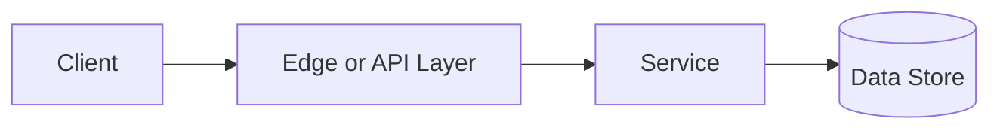

# Bloom Filters

## Why This Topic Matters

Bloom Filters belongs to Advanced Processing and Location Systems. It helps backend engineers make systems that are reliable, scalable, and easier to reason about under production load.

## Simple Definition

A Bloom filter is a probabilistic set structure that can say an item is definitely absent or possibly present.

## Real-World Analogy

Think of this topic as a traffic-control decision: the goal is to move work through the system predictably without overwhelming one part of the route.

## System Design Context

Use Bloom Filters when designing systems for cache admission, duplicate detection, database lookups, crawler URL checks, and prefiltering. The design should be evaluated with false positive probability, bit-array size, number of hash functions, and insert count.

## Example Architecture

## Common Use Cases

- cache admission, duplicate detection, database lookups, crawler URL checks, and prefiltering
- Production reliability planning
- Capacity and performance design
- Reducing operational risk

## Common Mistakes

- Choosing the pattern without defining the workload
- Ignoring failure modes and retry behavior
- Measuring only averages instead of tail behavior
- Forgetting operational limits and observability

## Related Topics

- Previous: [Batch vs Stream Processing](../27-batch-vs-stream-processing/concept.md)
- Next: [Geohashing](../29-geohashing/concept.md)

## References

This page is a practical system design summary. Add official and academic references as the topic receives deeper validation.

## Navigation

- Home: [System Engineering Tutorials](../../index.md)
- Learning Path: [Full roadmap](../../learning-path.md)
- Topic Index: [All topics](../../topic-index.md)
- Previous Topic: [Batch vs Stream Processing](../27-batch-vs-stream-processing/concept.md)
- Topic Pages: [Concept](concept.md) | [Foundation](foundation.md) | [Math Foundation](math-foundation.md) | [Lab](lab.md) | [Quiz](quiz.md)
- Next Topic: [Geohashing](../29-geohashing/concept.md)

