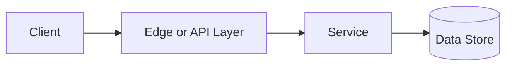

# Geohashing

## Why This Topic Matters

Geohashing belongs to Advanced Processing and Location Systems. It helps backend engineers make systems that are reliable, scalable, and easier to reason about under production load.

## Simple Definition

Geohashing encodes latitude and longitude into a string where nearby prefixes often represent nearby regions.

## Real-World Analogy

Think of this topic as a traffic-control decision: the goal is to move work through the system predictably without overwhelming one part of the route.

## System Design Context

Use Geohashing when designing systems for nearby search, map indexes, location bucketing, geofencing, and regional aggregation. The design should be evaluated with precision length, cell size, neighbor checks, query radius, and boundary misses.

## Example Architecture

## Common Use Cases

- nearby search, map indexes, location bucketing, geofencing, and regional aggregation
- Production reliability planning
- Capacity and performance design
- Reducing operational risk

## Common Mistakes

- Choosing the pattern without defining the workload
- Ignoring failure modes and retry behavior
- Measuring only averages instead of tail behavior
- Forgetting operational limits and observability

## Related Topics

- Previous: [Bloom Filters](../28-bloom-filters/concept.md)
- Next: [Home](../../index.md)

## References

This page is a practical system design summary. Add official and academic references as the topic receives deeper validation.

## Navigation

- Home: [System Engineering Tutorials](../../index.md)
- Learning Path: [Full roadmap](../../learning-path.md)
- Topic Index: [All topics](../../topic-index.md)
- Previous Topic: [Bloom Filters](../28-bloom-filters/concept.md)
- Topic Pages: [Concept](concept.md) | [Foundation](foundation.md) | [Math Foundation](math-foundation.md) | [Lab](lab.md) | [Quiz](quiz.md)
- Next Topic: [Home](../../index.md)

