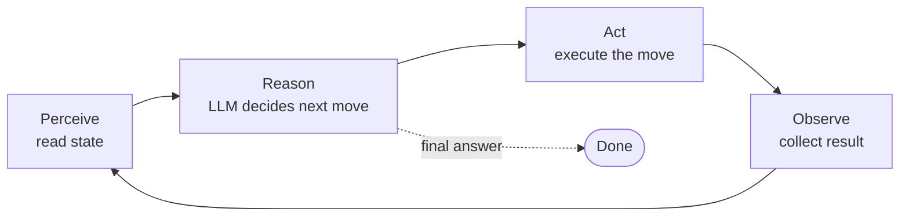

# The agent loop

> 🟢 Stable · ⏱ ~10 min read · 🏷 agents, foundations, control-flow

## TL;DR

Every agent — single, multi, simple, or hierarchical — runs the same four-step loop: **perceive, reason, act, observe**. Understanding this loop concretely makes every framework you'll see (LangGraph, ADK, CrewAI, AutoGen) feel like a thin layer on top of the same machinery. The decisions worth making are: how state is represented, what counts as an action, what stops the loop, and what happens when something fails.

---

## The four steps

### 1. Perceive

The agent reads its current **state**. In most LLM agents this state is just a list of messages — the system prompt, the user request, every prior tool call, every tool result. That list is what gets serialized into the next LLM call.

State is the most important design choice in an agent. Three things to nail down before you write a line of code:

- **What's in it?** Messages are the minimum. Some agents add a scratchpad, a plan, retrieved documents, or per-tool memory. Each addition costs tokens; each omission risks losing context the agent will need later.
- **How does it grow?** Naively it grows monotonically and you blow the context window in 10 steps. You'll eventually need summarization, retrieval, or windowing — see [Context Engineering](../context/context-budget.md).
- **Is it persisted?** A loop that lives in one Python process is fine for a demo. Production agents persist state so they can resume across crashes, be paused for human review, or run for hours. This is what LangGraph's "durable execution" is about and why frameworks generally win over hand-rolled loops at scale.

### 2. Reason

The LLM looks at the state and decides what to do next. In practice, "reason" means *one forward pass that produces structured output*. The output is either:

- **A tool call.** A function name and arguments, in a parseable format. The agent doesn't decide to "search the web" — it emits `{"tool": "web_search", "args": {"query": "..."}}`.
- **A final answer.** Free-form text that ends the loop.

This is where the model's prior (its training) meets the agent's posterior (what it has observed). The system prompt and tool descriptions shape *what tools exist*; the conversation so far shapes *which tool fits now*; the user's request shapes *what counts as done*.

In ReAct-style agents, the model also emits a **thought** — natural-language reasoning *before* the tool call. The thought isn't executed, just appended to state. It's free in compute terms (it's the same generation) and surprisingly useful for both reliability and debugging. We unpack this in [`react-pattern.md`](./react-pattern.md).

### 3. Act

The agent's runtime executes the chosen action. For a tool call this is just `tool_fn(**args)`. Three things bite engineers here:

- **Validation.** Use the tool's schema (e.g., Pydantic models, JSON Schema) to validate arguments before invoking. The model will eventually pass `"3"` where you expected `3`, or omit a required field. Catch it early and return a clean error the model can react to — don't crash.
- **Side effects.** "Act" can include emails, payments, deletions, and pull requests. For anything with real-world consequence, route through a [human-in-the-loop](../../patterns/10-human-in-the-loop.md) approval gate. Production agents should not be one prompt-injection away from a destructive API call.
- **Latency and concurrency.** Tools take time. Some tools are independent and can run in parallel. Recent LLM APIs (OpenAI, Anthropic, Gemini) support emitting multiple tool calls in one response so you can fan them out — covered later when we look at parallel tool calls.

### 4. Observe

The result of the action gets appended to state as an **observation**. From the model's perspective, observations are just more text in the conversation — but they're the only thing tying its decisions to reality.

Two principles for observation design:

- **Distinguish errors from data.** A 404, a timeout, and a successful empty result should look different in the observation. If the model sees `"None"` for all three, it has no signal to recover.
- **Compress aggressively.** Tools return JSON, HTML, PDFs, dataframes — most of which is noise. Insert a summarization or extraction step between the raw result and what goes into state. Otherwise context bloats fast.

Then the loop repeats: the agent perceives the updated state, reasons about it, picks the next action, observes again.

---

## What stops the loop?

This deserves its own section because it's where naive agents misbehave. A few common stopping conditions:

| Condition | Triggered by | Failure mode if missing |
|---|---|---|
| **Final answer emitted** | The LLM produces a non-tool response | The loop runs forever if the model never decides it's done |
| **Step limit** | A counter exceeds `max_steps` | A buggy loop runs until you hit the token budget — expensive |
| **Repeated identical action** | Hash of (tool, args) matches a recent step | Looping on the same failing search; wastes tokens |
| **Human interrupt** | An external signal pauses the run | Hard to debug long-running runs |
| **Budget exceeded** | Tokens or cost crosses a threshold | Surprise bill |

A robust loop has *all* of these as hard stops, not just the first. The single most common bug in homegrown agent code is "I forgot to cap step count and the model went off."

---

## State, observation, action: the vocabulary

The terms come from reinforcement learning, and using them keeps the engineering precise:

| Term | What it is in an LLM agent | Example |
|---|---|---|
| **State** $s_t$ | Everything the agent "knows" at step $t$ | The full conversation, the system prompt, the tool schemas |
| **Observation** $o_t$ | What the agent perceives this step | A new tool result, a user message |
| **Action** $a_t$ | What the agent chooses to do | A tool call, or a final response |
| **Policy** $\pi$ | The function mapping state to an action | The LLM, prompted with the state |

In a fully-observable setting, observation and state are the same thing. LLM agents typically operate in **partial observability** — the world has more in it than the agent's context, and the agent has to act on what it has seen so far. That's the POMDP framing, covered briefly in [`math-foundations/04-agents-as-policies.md`](../../math-foundations/04-agents-as-policies.md).

---

## When this mental model breaks

The four-step loop is the right starting model, but a few real-world patterns stretch it:

- **Parallel actions.** Modern LLM APIs let a single reason step emit several tool calls at once. The loop becomes: perceive → reason → *act in parallel* → observe (with results joined) → loop. Same shape, just wider.
- **Multi-agent.** When an agent's "action" is to hand off to another agent, the loop becomes a graph of loops. See [`patterns/03-supervisor-workers.md`](../../patterns/03-supervisor-workers.md).
- **Streaming.** Some agents stream tokens to the user *while* still reasoning. The loop's discrete steps blur into a continuous flow. The mental model still applies; it just runs concurrently with output emission.
- **Plan-then-execute.** The agent first produces a plan (one reason step with the action "emit a plan"), then executes steps from the plan one at a time. The loop runs twice at different granularities — once for planning, once per planned step.

When you find yourself reaching for one of these, it's usually because the basic loop hit a real limitation. Implement the basic loop first; reach for the variant when you can name what it's solving.

---

## See also

- 📖 [What is an agent?](./what-is-an-agent.md) — the conceptual prerequisite.
- 📖 [ReAct pattern](./react-pattern.md) — the most common way to structure the *reason* step.
- 🧪 [Lab 01: First agent from scratch](../../labs/01-first-agent-from-scratch/) — implement this loop in ~150 lines of Python.
- 🧮 [Agents as policies](../../math-foundations/04-agents-as-policies.md) — the formal version of this vocabulary.

---

## References

- Russell, S., & Norvig, P. (2020). *Artificial Intelligence: A Modern Approach* (4th ed.), Chapter 2 — "Intelligent Agents." The canonical definition of the perceive–reason–act loop in AI, well before LLMs.
- Yao, S., et al. (2023). [*ReAct: Synergizing Reasoning and Acting in Language Models*](https://arxiv.org/abs/2210.03629). The loop applied to LLMs with explicit thoughts.
- Sumers, T. R., et al. (2024). [*Cognitive Architectures for Language Agents*](https://arxiv.org/abs/2309.02427). TMLR 2024. A taxonomy of how state, action, and decision modules can be arranged in LLM agents.
