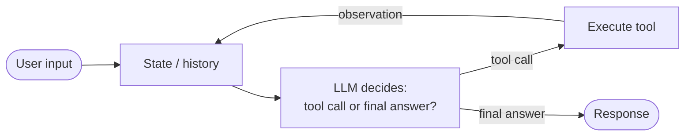

# What is an agent?

> 🟢 Stable · ⏱ ~10 min read · 🏷 agents, foundations, vocabulary

## TL;DR

An **agent** is a system that uses a language model to decide *what to do next* in a loop — perceive the situation, reason about it, take an action (call a tool, write a message, hand off to another agent), observe the result, and repeat until the task is done. The defining property isn't that it uses an LLM, it's that the LLM *picks the next action* instead of just producing text.

If a language model produces output and stops, that's a generation. If it produces output, looks at what happened, and decides whether to keep going, that's an agent.

---

## The problem this solves

Plain LLM calls are *one-shot*: you send a prompt, get text back, done. They work fine for summarization, translation, classification, and Q&A over a fixed context. They fall over the moment the task requires:

- **Multiple steps that depend on each other** ("research X, then write Y using what you found").
- **External information the model doesn't have** ("what's our Q3 revenue?", "is this URL still live?").
- **Side effects** ("send this email", "create this Jira ticket").
- **Decisions about when to stop** ("keep looking until you find a confident answer").

You *can* stuff all of this into a single prompt with elaborate instructions and hope the model produces a clean plan. It mostly won't. You'll get hallucinated tool calls, made-up data, and outputs that look right but aren't grounded in anything. The model has no way to *check* its work against reality without a way to observe reality.

An agent fixes this by closing the loop. The model emits an action; the surrounding system executes it; the result comes back; the model sees what actually happened and decides what to do next. The model's job stops being "produce a final answer in one shot" and becomes "produce the *next reasonable step* given everything observed so far."

This is a small architectural shift with a large consequence: the model gets to *interact with the world* instead of just describing it.

---

## How it works

The simplest agent is four things wired together:

1. **A language model** that, given the current context, outputs either a tool call or a final response.
2. **A set of tools** the model is allowed to invoke — functions with names, typed arguments, and documented behavior.
3. **A loop** that runs until the model decides it's done (or hits a step limit).
4. **A state** — usually just the running history of messages, tool calls, and observations.

In Python, the minimal version is about thirty lines. We build it in [Lab 01](../../labs/01-first-agent-from-scratch/) without any framework so the loop is visible.

That's it. Everything else — supervisor topologies, retrieval-augmented agents, MCP-based tool federation, A2A delegation — is a variation on this loop. Once you can see the four components clearly, you can locate any agent design in terms of where it extends or constrains them.

Frameworks like LangGraph, Google ADK, CrewAI, and AutoGen are mostly ways to express this loop with less boilerplate, add persistence, support concurrent branches, or compose multiple loops. They don't change the underlying shape.

---

## Why the loop matters

The single most useful intuition to carry around: **agentic behavior emerges from the loop, not from the model.** A bigger model with no loop is still one-shot. A small model with a clean loop and good tools can solve problems no one-shot model can. This is why a $0.10-per-call agent built around a mid-tier model often beats a $5-per-call single-shot of a frontier model on tasks like "browse, find, summarize."

The loop gives the system three things one-shot generation lacks:

- **Grounding.** Every tool call returns real data the model can see. Errors surface as observations the model can react to.
- **Recovery.** When something fails — a malformed JSON, a 503, an empty search result — the model gets the failure in its context and can try a different approach. One-shot prompts have no equivalent.
- **Budgeting.** You can cap steps, log per-step cost, and inspect what happened. A traced agent run is fundamentally more debuggable than a single opaque generation.

---

## When to use it (and when not to)

**Use an agent when**:

- The task requires more than one step, and the steps depend on each other.
- You need to consult external systems (databases, APIs, files, the web).
- You need side effects (writing, sending, deploying).
- You can't predict in advance which sub-task will be needed.

**Don't use an agent when**:

- The task fits in a single prompt with no external data. Just call the model.
- Latency or determinism matters more than flexibility. A workflow with hand-coded steps beats an agent on both.
- You can express the logic as a fixed pipeline. If the diagram has no decision diamond, you don't need an agent — you need a pipeline.
- Cost is the binding constraint and the task is well-defined. Agents amplify cost; every step is a forward pass.

A useful litmus test from production: *if your control flow is a fixed sequence of LLM calls and code, that's a pipeline. The moment the LLM's output determines what runs next, it's an agent.* The latter is more powerful and harder to make reliable.

---

## Common failure modes

Most agent failures fall into a small set of categories. Recognizing them on sight is more useful than reading a paper on each:

- **Looping without progress.** The agent keeps calling the same tool with slight variations because it's not making real headway. Fix: step limits, observation-based progress checks, prompting the model to summarize what it has and decide whether to give up.
- **Hallucinated tool calls.** The agent invokes a tool that doesn't exist, or passes arguments that don't match the schema. Fix: structured-output constraints, schema-validated tool wrappers that return clean error messages.
- **Lost in the observations.** Tool results pile up in context until the actual task is buried. Fix: summarization, retrieval, or [context engineering](../context/context-budget.md) — covered in its own learning path.
- **Tool selection confusion.** Two tools have overlapping descriptions and the agent picks the wrong one. Fix: tighter tool descriptions, examples, or a routing pattern that picks the tool family before delegating.
- **Silent failures.** A tool returns an error string in plain text and the agent treats it as data. Fix: distinguish errors from data at the tool layer; raise structured errors.

We come back to each of these with code in [Lab 01](../../labs/01-first-agent-from-scratch/) and in the [Tool Selection](../tools/tool-selection.md) concept page.

---

## 🧮 Math behind it

An agent can be formalized as a **policy** — a function $\pi_\theta(a_t \mid s_t)$ that maps the current state $s_t$ to a distribution over actions $a_t$. The LLM is the policy; the prompt and history are the state; tool calls and responses are the actions. This framing connects agentic AI to decades of reinforcement-learning theory without requiring any actual RL training (we're not gradient-updating the LLM; we're just using it as a fixed policy).

→ Full treatment: [`math-foundations/04-agents-as-policies.md`](../../math-foundations/04-agents-as-policies.md)

---

## See also

- 📖 [Agent loop](./agent-loop.md) — the perceive–reason–act–observe cycle in detail.
- 📖 [ReAct pattern](./react-pattern.md) — the specific reasoning-and-acting interleaving that most modern agents use.
- 🧪 [Lab 01: First agent from scratch](../../labs/01-first-agent-from-scratch/) — build the four components above in ~150 lines of Python, no framework.
- 🏛 [Single-agent tool-use pattern](../../patterns/01-single-agent-tool-use.md) — the architectural perspective.
- 🧮 [Agents as policies](../../math-foundations/04-agents-as-policies.md) — the mathematical framing.

---

## References

- Yao, S., Zhao, J., Yu, D., Du, N., Shafran, I., Narasimhan, K., & Cao, Y. (2023). [*ReAct: Synergizing Reasoning and Acting in Language Models*](https://arxiv.org/abs/2210.03629). ICLR 2023. The paper that establishes the loop most modern LLM agents use.
- Schick, T., Dwivedi-Yu, J., Dessì, R., Raileanu, R., Lomeli, M., Zettlemoyer, L., Cancedda, N., & Scialom, T. (2023). [*Toolformer: Language Models Can Teach Themselves to Use Tools*](https://arxiv.org/abs/2302.04761). NeurIPS 2023. Foundational work on tool use as a primitive.
- Sumers, T. R., Yao, S., Narasimhan, K., & Griffiths, T. L. (2024). [*Cognitive Architectures for Language Agents*](https://arxiv.org/abs/2309.02427). TMLR 2024. A useful taxonomy of what counts as an "agent" beyond ReAct.
- UC Berkeley CS294/194-196 *Large Language Model Agents*, Fall 2024 — lecture by Shunyu Yao, *LLM agents: brief history and overview*. [Course page](https://rdi.berkeley.edu/llm-agents/f24). Useful for the broader academic context.
