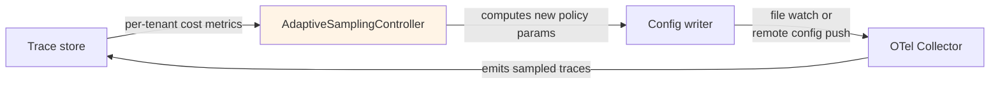
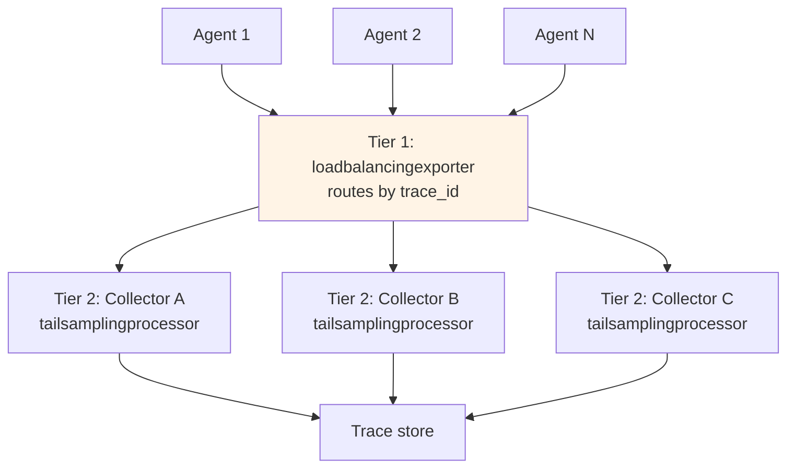

# Adaptive sampling at production scale

> ⏱ ~12 min · 🔴 Advanced · Prerequisites: [Tail-based sampling](./tail-based-sampling.md) (the foundation this extends), [Cost attribution](./cost-attribution.md) (the cost signals that drive adaptation). Helpful: Lab 19 (the tail-sampling pattern).

Module 4 introduced tail-based sampling as a fixed-policy decision: errors get kept, slow traces get kept, the rest get probabilistically sampled at some configured rate. That works until volume or budget changes. This page covers what happens next: tying sampling decisions to the cost signals from Module 6's attribution layer, and the external control loop that adjusts policies dynamically.

The framing is operational, not theoretical. Fixed-rate sampling has two failure modes — over-sampling when traffic spikes (you blow your observability budget) and under-sampling when high-value traces are rare (you miss the failures that matter). Cost-driven adaptive sampling matches retention to value continuously.

## Cost-driven policies in the tail sampling processor

The `tailsamplingprocessor` supports six policy types (Module 4 covered the first five). The two that matter for cost-driven decisions:

**`numeric_attribute` on cost** — keep every trace whose total cost exceeds a threshold:

```yaml
- name: high-cost-trace
  type: numeric_attribute
  numeric_attribute:
    key: gen_ai.cost.total_usd
    min_value: 0.10  # keep all traces above 10 cents
```

This is the policy that catches the expensive runs — multi-tool fan-out, long reasoning chains, big retrieval batches — exactly the ones you want full visibility on for cost engineering.

**`string_attribute` on tenant.tier** — keep more enterprise traces than free-tier traces:

```yaml
- name: enterprise-tenants
  type: string_attribute
  string_attribute:
    key: tenant.tier
    values: [enterprise, premium]
```

Combine these with the error and latency policies from Module 4 and you have a production-realistic priority stack:

```yaml
processors:
  tail_sampling:
    decision_wait: 30s              # agents have long tool calls
    num_traces: 360000              # 10K traces/sec × 30s × 1.2 safety margin
    expected_new_traces_per_sec: 10000
    policies:
      # Priority 1: errors (debugging signal)
      - name: errors
        type: status_code
        status_code: {status_codes: [ERROR]}

      # Priority 2: latency outliers (perf signal)
      - name: slow-traces
        type: latency
        latency: {threshold_ms: 5000}

      # Priority 3: high-cost traces (cost-eng signal)
      - name: high-cost
        type: numeric_attribute
        numeric_attribute:
          key: gen_ai.cost.total_usd
          min_value: 0.10

      # Priority 4: enterprise tenants (business value)
      - name: enterprise
        type: string_attribute
        string_attribute:
          key: tenant.tier
          values: [enterprise]

      # Priority 5: probabilistic baseline (statistical floor)
      - name: probabilistic-baseline
        type: probabilistic
        probabilistic: {sampling_percentage: 5}
```

Evaluation is first-match-wins. The probabilistic baseline at priority 5 catches everything else at 5%, which gives you statistical coverage of normal traffic without inflating ingestion volume.

## The probabilistic-within-tail pattern

Worth calling out explicitly: when you already run the tail sampling processor, add the probabilistic policy *inside* it rather than running a separate probabilistic processor upstream. From the OpenTelemetry tailsamplingprocessor README:

> Running the probabilistic sampling processor is more efficient than the tail sampling processor. But if you are already using the tail sampling processor, add the probabilistic sampling policy inside it. You are already incurring the cost of running the tail sampling processor; adding the probabilistic policy will be negligible.

The key reason: a separate upstream probabilistic processor would *drop* traces before the tail processor sees them. The error and high-cost traces you want to keep would be dropped randomly before getting a chance to match. Probabilistic-within-tail ensures the priority policies see every trace and only fall back to probabilistic if nothing else matches.

## The external control loop

The Collector itself doesn't auto-tune. Sampling policies are static configuration. Adaptive sampling means an external controller watches per-tenant burn rates and pushes updated configs:



The controller's job is to translate cost signals into sampling parameters. Two control-loop strategies:

**Strategy 1 — sampling rate inversely proportional to remaining budget.** Tenants with budget headroom get the configured rate; tenants approaching their cap get reduced rates so the remaining observability budget stretches further. Implementation:

```python
def compute_sampling_rate(tenant_id, monthly_cap_usd, current_spend_usd):
    remaining_pct = max(0, (monthly_cap_usd - current_spend_usd) / monthly_cap_usd)
    # Quadratic falloff: at 50% remaining still full rate; at 10% remaining 1%
    rate = max(0.01, min(0.10, remaining_pct ** 2))
    return rate
```

**Strategy 2 — adaptive thresholds on policy triggers.** Don't change the probabilistic rate; change what counts as "high cost" or "slow." When global traffic spikes, raise the cost threshold from $0.10 to $0.30 so only the most expensive 1% gets the priority bucket. From the OneUptime 2026 adaptive sampling guide:

```python
def update_sampling_threshold(latency_p95):
    if latency_p95 > 500:
        config = {"tail_sampling": {"latency": {"threshold_ms": 300}}}
    else:
        config = {"tail_sampling": {"latency": {"threshold_ms": 800}}}
    requests.post("http://otel-collector:55681/config", json=config)
```

Push mechanisms in production: file watching (write the new YAML; Collector reloads), OPAMP (the OTel control plane protocol, GA in 2026 for remote config), or a sidecar that re-renders config from a template every N minutes. File watching is the simplest; OPAMP is the right answer at fleet scale.

## The two-tier Collector topology

A constraint that becomes operationally important at scale: **all spans of a trace must reach the same Collector instance for tail sampling to make correct decisions.** Tail policies inspect attributes across all spans in a trace; if half the spans went to Collector A and half to Collector B, neither has the complete view.

The fix is the two-tier topology:



The first tier runs `loadbalancingexporter`, which hashes the trace_id and routes all spans of the same trace to the same second-tier Collector. The second tier runs `tailsamplingprocessor` on its sticky subset.

This is the canonical pattern in the upstream OTel docs and is the failure mode behind the most common "tail sampling isn't catching everything" production incidents. If you scale to multiple Collector instances and skip this, you'll see traces with only half their spans, which leads to subtle policy-evaluation bugs (errors don't fire because the error span landed on a different Collector than the latency span).

## Sizing the buffer

The `num_traces` parameter is how many traces the Collector holds in memory waiting for `decision_wait` to elapse before evaluating sampling policies. Get this wrong and you'll see the `sampling_trace_dropped_too_early` metric climb — traces are flushed before policies could match them.

The formula:

```
num_traces ≥ expected_new_traces_per_sec × decision_wait × safety_margin

where:
  safety_margin = 1.2 (20% headroom for traffic spikes)
```

At 10,000 traces/sec with 30-second decision_wait:
```
num_traces = 10000 × 30 × 1.2 = 360000
```

Memory cost: roughly 10KB per trace held in memory, so 360K traces ≈ 3.6 GB. CPU cost is light (the heavy work is `decision_wait` of waiting, not active processing). The bottleneck at scale is memory.

**Why decision_wait of 30s for agent traces specifically.** Agent traces are long. A trace with three sequential tool calls of 5-10 seconds each runs 15-30 seconds. If `decision_wait` is shorter than your longest expected trace, the processor decides on incomplete data and your priority policies miss the late-arriving error span. The default 10s in most examples is wrong for agents.

## The cost-control runbook

The operational discipline that keeps adaptive sampling principled:

1. **Dashboard the sampling rate.** Per-tenant and global. The rate is what every other downstream metric is implicitly conditioned on; teams that don't dashboard the rate end up arguing about data-quality issues that are actually sampling-rate artifacts.
2. **Monitor `sampling_trace_dropped_too_early`.** Any non-zero rate means undersized `num_traces` or too-short `decision_wait`. Page on sustained nonzero.
3. **Alert on retention SLO violations.** If your business contract requires "all error traces from enterprise tenants are retained 30 days," your sampling policies must guarantee that. Specific assertions; tested in CI against a fixture-trace stream.
4. **Replay before changing policies.** Run new policy configs against the last week of traces in a sandbox; verify the retention shape before deploying. The cost of getting this wrong is dropping the trace that explains tomorrow's outage.

## What this misses

- **SDK-level head sampling.** Cheaper than Collector-side tail sampling but loses the ability to prioritize by attributes that only become available mid-trace (error status, completion-token count, cost). Mention only; tail is the focus.
- **Prompt-pricing-aware sampling.** Choosing sampling rates per-request based on the cost of the underlying model call. Research-frontier; not yet a stable production pattern.
- **Stream processing for cost signals.** The control-loop strategies in this page poll the trace store. At extreme scale you'd want streaming signals (Kafka, Flink) feeding the controller. Same idea, different infrastructure.
- **Tail-sampling on logs.** This page covers traces. Log sampling is a separate discipline with its own trade-offs.

## Related concepts

- [Cost attribution](./cost-attribution.md) — the per-tenant cost signals that drive adaptive policies.
- [Tail-based sampling](./tail-based-sampling.md) — the foundation this page extends.
- [Lab 21 — cost attribution and adaptive sampling](../../labs/21-cost-attribution-and-adaptive-sampling/) — applies these patterns end-to-end.

## References

- OpenTelemetry tailsamplingprocessor README (April 2026) — the canonical policy types reference; the two-tier topology recommendation; the probabilistic-within-tail guidance. [github.com/open-telemetry](https://github.com/open-telemetry/opentelemetry-collector-contrib/blob/main/processor/tailsamplingprocessor/README.md).
- OneUptime (February 2026), *Configure the Tail Sampling Processor* — the priority-policy stack with errors / latency / numeric-attribute / string-attribute / probabilistic; sizing formulas. [oneuptime.com/blog](https://oneuptime.com/blog/post/2026-02-06-tail-sampling-processor-opentelemetry-collector/view).
- OneUptime (February 2026), *Probabilistic Sampling for Cost Control* — the external `AdaptiveSamplingController` pattern; remote config push mechanics. [oneuptime.com/blog](https://oneuptime.com/blog/post/2026-02-06-probabilistic-sampling-opentelemetry-cost-control/view).
- OneUptime (February 2026), *Reduce Observability Costs by 80%* — the 5-policy stack with health-check drops via invert_match; the ~10x cost reduction case study. [oneuptime.com/blog](https://oneuptime.com/blog/post/2026-02-06-reduce-observability-costs-intelligent-sampling/view).
- Chaos To Clarity / Medium (August 2025), *Adaptive Tail-Based Sampling with Dynamic Trace Enrichment* — the dynamic-threshold pattern tied to SLO breaches. [medium.com](https://medium.com/@sonal.sadafal/adaptive-tail-based-sampling-with-dynamic-trace-enrichment-in-opentelemetry-7c3b407dbf6b).
- Digital Applied (April 2026), *Agent Observability 2026* — the convergent stack: three-layer evals + OpenTelemetry + tail-based sampling + multi-dimensional cost attribution. [digitalapplied.com](https://www.digitalapplied.com/blog/agent-observability-2026-evals-traces-cost-guide).
