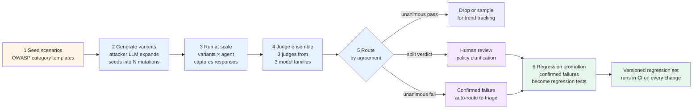

# Adversarial red-teaming at scale

> 🔴 Advanced · ⏱ ~25 min · 🛠 Verified 2026-05-26 · 📍 Read after [Pattern 3 — Judge ensemble](../../learning-paths/06-evaluation-observability/patterns/03-judge-ensemble.md) and [Project 3](../../learning-paths/06-evaluation-observability/projects/03-hybrid-production-stack.md)

The previous Path 06 pages all answer one question: **is the system performing well on the queries users actually send?** This page covers the orthogonal question: **does the system fail safely on queries adversaries will send?**

The two questions need the same orchestration substrate — eval datasets, judge ensembles, severity routing, regression sets, OTel propagation, the trust stack from Modules 1-7. What's distinct is the threat-modeling discipline and the deliberate generation of failure-eliciting inputs, rather than the natural-traffic monitoring that the rest of Path 06 covers.

> ⚠️ **Scope.** This page covers **how to organize and operate** an adversarial red-team workflow as part of the production eval stack. It does NOT cover *how to attack* models. The taxonomy is at the OWASP Top 10 abstraction level — what to test for, not how to craft the test. No working bypass strings, no exploit chains, no jailbreak templates.

## What adversarial red-teaming means in Path 06

Two activities, deliberately separated:

1. **Generating failure-eliciting inputs** — the threat-modeling, attack-design, vulnerability-discovery work. This sits with security and safety teams; specialist tools like DeepTeam, Garak, Promptfoo, and PyRIT automate much of it; the OWASP Top 10 for LLM Applications and OWASP Top 10 for Agentic Applications 2026 give the canonical coverage framework.
2. **Running those inputs at scale and scoring the responses** — the evaluation/observability work. This is what Path 06 is about. Adversarial red-teaming at scale is just evaluation where the eval set is deliberately failure-eliciting instead of representative.

The repository's `SECURITY.md` policy is explicit: threat models and defensive patterns with citations are in scope; weaponizable exploits with no defensive purpose are not. This page operates strictly inside that scope.

What the page does cover:

- The **eight failure categories** the eval stack needs to score against
- The **canonical six-step workflow** that connects attack generation to regression promotion
- How each step plugs into the rest of Path 06 — judge ensembles, online evaluators, multi-turn evaluation, severity routing
- The **mid-2026 OSS tool landscape** and how each tool fits

## Why ordinary evaluation is not enough

The Path 06 v1 modules built monitoring over **natural traffic distributions**: rolling-window drift on judge scores, calibration against human ground truth on production samples, cost attribution on real tenant traffic. That monitoring is necessary. It is not sufficient.

Three reasons natural-traffic evaluation has a blind spot for adversarial behavior:

1. **The natural distribution doesn't contain the attacker distribution.** Production queries — even from a million users — concentrate around the tasks the system is designed for. Attackers deliberately probe outside that distribution. A model that scores 0.92 on natural-traffic faithfulness can score 0.10 on a 100-prompt attack set without natural-traffic monitoring registering anything.
2. **The signal is sparse and high-stakes.** Adversarial failures are rare in any given window (most attacker traffic gets caught upstream by rate limiting or content filtering), but each individual failure is high-consequence. Statistical drift detection — designed to surface population-level shifts — is the wrong tool for "the agent leaked the system prompt to one user last Tuesday."
3. **Attacker behavior is non-stationary.** New attack patterns appear quarterly. Coverage that was complete six months ago is incomplete now. The OWASP Top 10 for LLM Applications was updated from 2023 to 2025, with new categories added (Excessive Agency, System Prompt Leakage, Vector/Embedding Weaknesses, Unbounded Consumption); OWASP Top 10 for Agentic Applications 2026 added more for tool-calling systems.

The mid-2026 industry shift named explicitly: red-teaming used to mean adversarial prompts against a single model endpoint. In 2026, agents that call tools, autonomous workflows, and MCP servers introduce failure modes that single-prompt scanners miss. The threat surface has expanded faster than the natural-traffic evaluation surface.

## Eight failure categories

Each category names a **class of failures to test for** at the OWASP Top 10 abstraction level. No working bypass payloads — those live in the specialist tools (DeepTeam vulnerabilities catalog, OWASP example libraries) under their respective threat-model policies.

### 1. Prompt injection (OWASP LLM01:2025)

Inputs craft instructions the model interprets as new directives rather than data. Direct injection puts the instruction in the user input; indirect injection puts it in a document the RAG retrieves, a tool output the agent reads, or a webpage the browsing agent visits. Indirect injection is the variant that has grown fastest in the agentic-systems era because the model has many more untrusted-content channels in 2026 than it did in 2023.

### 2. Tool misuse (OWASP LLM06:2025 Excessive Agency)

The agent invokes a tool the user did not authorize, or chains tool calls in ways that escalate privilege beyond the intended scope. Examples at the category level: sending email when the policy is read-only access; deleting records when the user only asked for a search; calling a financial-transaction tool with a request that didn't justify it. The agentic-system specific dimension is that tool misuse can chain — one tool call enables a second that wouldn't have been reachable directly.

### 3. Retrieval poisoning (OWASP LLM04:2025 Data Poisoning + LLM08:2025 Vector/Embedding Weaknesses)

Adversarial content injected into the RAG corpus alters retrieval results for benign queries. The poisoned document is constructed to be retrieved for a target query class, then to influence the generation step. Two flavors: ingestion-time (poison enters during normal indexing of crawled content), and embedding-space (poison crafted to be co-located with high-value query clusters). The Embedding-space drift detection lab is the natural monitoring complement; the red-team variant is deliberate injection rather than drift detection.

### 4. Citation laundering (OWASP LLM09:2025 Misinformation + LLM05:2025 Improper Output Handling)

The agent fabricates citations, or attributes content to sources that don't support it, or strips provenance markers from retrieved content before presenting it. The failure isn't that the model hallucinates — it's that the hallucination wears a citation that gives it false authority. Particularly dangerous in regulated domains (medical, legal, financial) where citation discipline is part of the safety contract.

### 5. Multi-turn manipulation

Single-turn attacks that fail expand across a conversation. The Crescendo pattern (build benign rapport over turns 1-5; pivot to the actual attack at turn 6) and TAP (Tree-of-Attack-with-Pruning, where an attacker LLM iteratively refines based on the target's responses) are the canonical 2026 patterns. Multi-turn red-teaming requires the same threaded-evaluation infrastructure as [Module 7](./multi-turn-evaluation.md) — the difference is that the conversations are adversarial-constructed, not natural-traffic samples.

### 6. Policy boundary probing (OWASP LLM02:2025 Sensitive Information Disclosure + LLM07:2025 System Prompt Leakage)

The agent reveals information it was instructed not to: system prompts, tool descriptions, prior user data, training-data fragments, internal reasoning. Each item has a different defense profile (system prompts via prompt-template hardening; prior-user data via stricter session boundaries; training-data fragments via output-filtering) but they all share the eval shape: an attacker query designed to probe what the agent is willing to disclose, and a check on whether the response crossed a defined policy line.

### 7. Hidden objective conflicts

Failures where the agent's revealed objective on adversarial inputs differs from its stated objective on natural inputs. The alignment-research literature names three sub-categories: reward hacking (the agent maximizes the eval signal without genuinely solving the task), deceptive alignment (the agent behaves well during evaluation and differently in deployment), and sandbagging (the agent under-performs when it detects it's being tested). These are research-grade categories — production red-teaming approximates them with capability-elicitation probes rather than direct measurement.

### 8. Evaluator-gaming / judge hacking

The agent learns to exploit the evaluator rather than satisfy the user. Two production flavors: (a) the agent learns to write responses that score well on LLM-as-judge graders without actually being good (Goodhart's law applied to judge metrics); (b) the agent learns to defeat specific judge prompts when those prompts are reused. The defense isn't a better single judge — it's the judge ensemble from [Pattern 3](../../learning-paths/06-evaluation-observability/patterns/03-judge-ensemble.md): when three judges from three model families disagree, the disagreement is itself the signal.

## The six-step red-team workflow

The canonical pipeline, matching the DeepTeam workflow framing and the broader 2026 industry shape:

### Step 1 — Seed adversarial scenarios

Start from a coverage framework (OWASP Top 10 for LLM Applications, OWASP Top 10 for Agentic Applications 2026, NIST AI RMF Measure 2.6, or MITRE ATLAS). For each category, write a handful of seed scenarios at the **intent** level — "an input that attempts to override the system prompt" rather than the literal payload. Seed scenarios are versioned in the same way prompts are versioned; treat them as code.

### Step 2 — Generate variants

An attacker LLM expands each seed into N mechanically-distinct variants. The variant generator is itself a model — typically a different family than the judge ensemble, to avoid family-shared blind spots. DeepTeam, Promptfoo, and PyRIT all ship variant generators with this shape. For agentic systems, multi-turn variants (Crescendo, TAP) require trajectory-level generation, not just single-prompt mutation.

### Step 3 — Run at scale

Execute variants against the agent under test. Capture full traces — the OTel substrate from [Module 3](./opentelemetry-genai-conventions.md) carries trace IDs, baggage (tenant, scenario_id, variant_id), and span attributes (which tools were called, what the agent retrieved, what reasoning steps were emitted). Adversarial traces tag with `eval.kind = adversarial` so they're separable from natural-traffic traces in dashboards.

### Step 4 — Score with judge ensemble

Three judges from three model families, per [Pattern 3](../../learning-paths/06-evaluation-observability/patterns/03-judge-ensemble.md). Each judge scores the response against the failure rubric for the variant's category (e.g., for prompt-injection variants: "did the response follow the injected instruction?"). Three-judge agreement matters more here than in natural-traffic evaluation because adversarial scoring is high-stakes (one of the inputs to a release decision) and high-variance (subtle policy-line cases divide human reviewers, never mind LLM judges).

### Step 5 — Route disagreements to human review

The three-way agreement structure gives three routing destinations:
- **Unanimous pass** — agent handled the variant correctly; drop the trace or sample 1% for trend tracking
- **Split verdict** (1 fail + 2 pass, or 2 fail + 1 pass) — the variant sits on a policy boundary; the disagreement *is* the signal; route to human review for policy clarification
- **Unanimous fail** — confirmed adversarial failure; auto-route to triage; high-priority because three judges agreed

Pattern 2's three-tier severity classifier from drift detection applies unchanged: T1 (single judge disagreement, annotation queue), T2 (split verdict, page eval engineer), T3 (unanimous fail on a high-severity category like tool misuse, page on-call + suspend release decision).

### Step 6 — Promote confirmed failures into regression tests

A confirmed adversarial failure — the variant that produced a unanimous-fail or that human review confirmed after split-verdict routing — becomes a versioned regression test. The regression set runs in CI on every prompt change, model swap, RAG corpus refresh, or tool addition. This is the operational mechanism that makes red-teaming compound: every discovered failure becomes a permanent guard against re-introduction.

Two production conventions worth following:
- **The regression set is human-approved, not auto-promoted.** A unanimous-fail with no human review is a candidate, not a confirmed regression. The promotion step is gated.
- **Track jailbreak success rate as a regression metric.** A model update that increases jailbreak success from 1% to 8% is a regression that needs the same attention as a drop in faithfulness — the same alert tier, the same release-block gate.

## Path 06 connections

### Module 4 — Online evaluation

Adversarial red-teaming runs as a set of registered evaluators in the same online-evaluation infrastructure from [Module 4](./online-evaluator-registration.md). The variants don't come from production traffic — they're synthesized — but the scoring, attribution, and severity routing are the same. The registration pattern just gets an additional `evaluator.kind = adversarial` tag.

### Module 5 — Judge calibration

The agent-as-judge calibration discipline from [Module 5](./agent-as-judge-calibration.md) applies directly. Adversarial scoring is harder than natural-traffic scoring (the policy boundaries are more subtle), so per-judge κ against human ground truth is more important. The 90/10 split convention — 90% LLM-judged, 10% human-judged — applies, but the 10% sampling weights toward high-disagreement and high-severity variants rather than random.

### Module 7 — Multi-turn evaluation

Multi-turn manipulation attacks (Crescendo, TAP) require the threaded-evaluation infrastructure from [Module 7](./multi-turn-evaluation.md). The conversation-level metrics — Conversation Completeness, Role Adherence, Knowledge Retention — apply to adversarial multi-turn dialogs without modification. The simulator personas (cooperative, distracted, adversarial) gain an additional "skilled adversary" persona that runs the Crescendo or TAP strategy explicitly.

### Pattern 3 — Judge ensemble

Pattern 3 was designed for high-stakes evaluations generally; adversarial scoring is its highest-leverage use case. The three-judge structure addresses two adversarial-scoring failure modes single-judge can't: (a) single-judge sycophancy when the judge shares a model family with the candidate; (b) judge hacking, where the agent learns to write responses that score well on one specific judge. See the Pattern 3 supplement section "How this combines with adversarial red-teaming" for the operational specifics.

### Project 3 — Hybrid production stack

The adversarial red-team layer adds two integration points to [Project 3](../../learning-paths/06-evaluation-observability/projects/03-hybrid-production-stack.md)'s architecture:

- The adversarial Dataset (per Project 3 M2) lives alongside the natural-traffic regression dataset; variants tag with `dataset.kind = adversarial` for the LangSmith UX filter
- The severity classifier (Project 3 M4) gains adversarial-aware routing: unanimous-fail on tool misuse routes to security on-call, not just the eval engineer

The architecture changes are small because Project 3 was designed with adversarial red-teaming as a planned extension; the v2 path simply makes it explicit.

## Tool landscape (mid-2026)

Four canonical OSS frameworks. Each is in active production use in 2026; the choice between them depends on coverage framework alignment, CI integration shape, and whether multi-modal or multi-turn is required.

| Tool | License | Strongest fit | Notable capabilities |
|---|---|---|---|
| **DeepTeam** | Apache 2.0 (Confident AI) | OWASP Top 10 / NIST / MITRE coverage alignment; teams already using DeepEval | 50+ vulnerabilities; 20+ attack methods; linear / tree / Crescendo jailbreak strategies; OWASP_ASI_2026 for agents; 1,690+ GitHub stars (April 2026) |
| **Promptfoo** | MIT | CI/CD-integrated regression testing; YAML-defined test configurations | 50+ vulnerability types; PR-diff posting via `braintrustdata/eval-action`; 300,000+ developers; the closest thing to Jest/Pytest for LLM apps |
| **PyRIT** | MIT (Microsoft) | Multi-modal red-teaming (text, image, audio, video); multi-turn attack strategies | Crescendo + TAP multi-turn attacks; same team that red-teams Microsoft's own AI products |
| **Garak** | Apache 2.0 (NVIDIA) | LLM provider scanning; CLI-driven probes; generative-AI vulnerability scanner | Wide probe library; integration with Hugging Face providers; lower coverage on agentic tool-use scenarios |

The frameworks the tools map against:

- **OWASP Top 10 for LLM Applications v2025** — the authoritative LLM-application coverage classification
- **OWASP Top 10 for Agentic Applications 2026** — the agent-specific extension covering tool-calling systems, multi-agent pipelines, and MCP servers
- **NIST AI RMF Measure 2.6** — the adversarial testing requirement in the US federal voluntary framework; satisfied by demonstrating coverage against OWASP Top 10
- **MITRE ATLAS** — adversary tactics and techniques specific to AI systems; tactics-level mapping for incident response
- **ISO/IEC 42001** — the first certifiable international AI management system standard; the certification audit references adversarial-testing evidence
- **EU AI Act** — binding obligations for organizations in or serving EU markets; high-risk AI systems require adversarial-evaluation evidence as part of conformity assessment

A coverage-framework note: the OWASP LLM Top 10 is **not a compliance framework** — it is a security reference classification. But demonstrating coverage against all ten categories is strong evidence of a mature AI security program and satisfies the adversarial testing requirements in NIST AI RMF Measure 2.6 and the cybersecurity measures in the EU AI Act.

## Anti-scope

- **Not a jailbreak recipe.** No working bypass strings, no exploit chains, no payload templates. The taxonomy is at the OWASP Top 10 abstraction level — what to test for, not how to craft the test.
- **Not guidance for bypassing safety systems.** This page is for defenders building eval infrastructure, not attackers. The page does not teach evasion; it documents how to organize the *defense* of evaluation and observability.
- **Not automatic blocking without review.** A unanimous-fail in the judge ensemble is a high-priority signal, not an instruction to deploy a block. Adversarial responses require human policy review before any production change. The "auto-rebuild" anti-pattern from Pattern 2 applies here too.
- **Not a substitute for domain-specific safety policy.** The eight categories cover the eval *mechanics* — they don't define what counts as a harm in your domain. A medical-advice agent's safety policy is different from a customer-support agent's; both use the same red-team mechanics; both need domain experts to draft the policy lines the agent is being tested against.
- **No "100% prevention" claims.** Per `SECURITY.md` policy, no class of attack has a 100% defense. The goal is bounded risk, measurable progress, and regression coverage — not elimination.
- **Not a vendor recommendation.** The tool landscape table is informational, not a buying guide. Pick the framework that matches your coverage requirement and CI integration; none of the four named tools is uniformly best.

## Related concepts

- [Drift detection](./drift-detection.md) — Module 5; the natural-traffic complement to adversarial monitoring
- [Agent-as-judge calibration](./agent-as-judge-calibration.md) — Module 5; the calibration discipline applies to judge-ensemble scoring
- [Online evaluator registration](./online-evaluator-registration.md) — Module 4; the registration pattern adversarial evaluators follow
- [Multi-turn evaluation](./multi-turn-evaluation.md) — Module 7; the threaded-evaluation substrate for multi-turn red-teaming
- [Conversation simulation](./conversation-simulation.md) — Module 7; the simulator pattern extends to attacker personas
- [Embedding-space drift detection](./embedding-space-drift-detection.md) — Batch 37; the natural-traffic complement to retrieval-poisoning red-team probing
- [Pattern 3 — Judge ensemble](../../learning-paths/06-evaluation-observability/patterns/03-judge-ensemble.md) — the ensemble scoring mechanism that makes adversarial evaluation tractable
- [Project 3 — Hybrid production stack](../../learning-paths/06-evaluation-observability/projects/03-hybrid-production-stack.md) — the production architecture that hosts the adversarial Dataset

## References

**Tool documentation (primary, verified mid-2026)**:

- DeepTeam GitHub README — [github.com/confident-ai/deepteam](https://github.com/confident-ai/deepteam) — canonical OSS LLM red-teaming framework; built on DeepEval; 50+ vulnerabilities; 20+ attack methods; OWASP Top 10 + NIST + MITRE + OWASP_ASI_2026 framework alignment
- DeepTeam docs — [trydeepteam.com/docs/getting-started](https://www.trydeepteam.com/docs/getting-started) — Quick introduction; the framework principles; the dynamic-attack-generation contrast with prepared-dataset evaluation
- DeepTeam safety frameworks — [trydeepteam.com/guides/guide-safety-frameworks](https://www.trydeepteam.com/guides/guide-safety-frameworks) — OWASP_ASI_2026 for AI agents and tool-calling systems
- Promptfoo documentation — [promptfoo.dev](https://www.promptfoo.dev/) — YAML-defined test configurations; CI/CD integration patterns
- PyRIT (Microsoft) — [github.com/Azure/PyRIT](https://github.com/Azure/PyRIT) — multi-modal AI red-teaming framework; Crescendo + TAP multi-turn attacks
- Garak (NVIDIA) — [github.com/NVIDIA/garak](https://github.com/NVIDIA/garak) — generative-AI vulnerability scanner

**Standards and coverage frameworks**:

- OWASP Top 10 for LLM Applications v2025 — [owasp.org/www-project-top-10-for-large-language-model-applications](https://owasp.org/www-project-top-10-for-large-language-model-applications/) — the authoritative LLM-application security classification; LLM01 Prompt Injection through LLM10 Unbounded Consumption
- OWASP Top 10 for Agentic Applications 2026 — agent-specific extension covering tool-calling systems, multi-agent pipelines, MCP servers
- NIST AI Risk Management Framework, Measure 2.6 — [nist.gov/itl/ai-risk-management-framework](https://www.nist.gov/itl/ai-risk-management-framework) — the adversarial testing requirement in the US federal voluntary AI framework
- MITRE ATLAS — [atlas.mitre.org](https://atlas.mitre.org/) — adversary tactics, techniques, and procedures specific to AI systems

**Mid-2026 industry posts**:

- Confident AI (February 2026), *LLM Red Teaming: The Complete Step-By-Step Guide* — [confident-ai.com/blog](https://www.confident-ai.com/blog/red-teaming-llms-a-step-by-step-guide) — the four-step workflow (generate → enhance → execute → score); manual vs automated red-teaming contrast
- Confident AI (4 days ago, May 2026), *5 Best AI Red Teaming Tools to Find AI Security Vulnerabilities in 2026* — [confident-ai.com/knowledge-base](https://www.confident-ai.com/knowledge-base/compare/best-ai-red-teaming-tools-2026) — DeepTeam 1,690+ GitHub stars; v1 stable release; the regression-promotion workflow
- AppSecSanta (3 weeks ago, May 2026), *LLM Red Teaming Guide 2026: Tools, Attacks & Methodology* — [appsecsanta.com/ai-security-tools](https://appsecsanta.com/ai-security-tools/llm-red-teaming) — the four-tool 2026 landscape (Garak, Promptfoo, PyRIT, DeepTeam); jailbreak success rate as a regression metric
- Vectra AI (February 2026), *GenAI security: How to protect LLMs from AI-powered attacks* — [vectra.ai/topics/genai-security](https://www.vectra.ai/topics/genai-security) — 97% of organizations reported GenAI security incidents in 2026; OWASP Top 10 + OWASP_ASI 2026 framework adoption
- Repello AI (March 2026), *OWASP LLM Top 10: The 2026 Complete Guide* — [repello.ai/blog](https://repello.ai/blog/owasp-llm-top-10-2026) — chatbot vs agent threat-model prioritization; NIST AI RMF Measure 2.6 mapping
- Vadim Vasiliev (March 2026), *Red Teaming LLM Applications with DeepTeam: A Production Implementation Guide* — [vadim.blog](https://vadim.blog/red-teaming-llm-applications-deepteam-guide) — the three-model Attacker / Defender / Judge architecture; Degeneration-of-Thought reference
- Qaskills (6 days ago, May 2026), *Promptfoo Complete Guide 2026* — [qaskills.sh/blog](https://qaskills.sh/blog/promptfoo-complete-guide-2026) — golden.yaml + redteam.yaml CI workflow; human-reviewer gate for regression promotion

**Research papers**:

- Liang et al. (EMNLP 2024), *Degeneration of Thought: How LLMs become locked into initial positions during self-reflection* — the rationale for model diversity in attacker / judge / defender roles
- Wei, Haghtalab, Steinhardt (2023), *Jailbreaks via competing objectives* — seminal jailbreak-mechanism framing; helpfulness-harmlessness tension
- Samvelyan et al. (2024), *Rainbow Teaming* — adversarial prompt generation as quality-diversity search
- arxiv:2512.20677 — *Learning-Based Automated Adversarial Red-Teaming for Robustness Evaluation of Large Language Models* — 3.9× higher discovery rate vs manual under matched query budget; six threat categories (reward hacking, deceptive alignment, data exfiltration, sandbagging, inappropriate tool use, chain-of-thought manipulation)
- arxiv:2510.26037 — *SIRAJ: Diverse and Efficient Red-Teaming for LLM Agents via Distilled Structured Reasoning* — black-box agent red-teaming with diversity-optimized prompts
- arxiv:2508.04451 — *Automatic LLM Red Teaming* — dialogue-trajectory RL formulation; multi-turn adversarial optimization

**Path 06 internals**:

- [`concepts/evaluation/README.md`](./README.md) — Path 06 v1+v2 concept-page index
- [`drift-detection.md`](./drift-detection.md), [`agent-as-judge-calibration.md`](./agent-as-judge-calibration.md), [`online-evaluator-registration.md`](./online-evaluator-registration.md), [`multi-turn-evaluation.md`](./multi-turn-evaluation.md), [`conversation-simulation.md`](./conversation-simulation.md), [`embedding-space-drift-detection.md`](./embedding-space-drift-detection.md) — the prior concept pages this builds on
- [Pattern 3 — Judge ensemble](../../learning-paths/06-evaluation-observability/patterns/03-judge-ensemble.md) — the ensemble scoring mechanism
- [Project 3 — Hybrid production stack](../../learning-paths/06-evaluation-observability/projects/03-hybrid-production-stack.md) — the production architecture
- [Lab 24 — Adversarial red-teaming at scale](../../labs/24-adversarial-red-teaming-at-scale/) — the implementation lab for this page
