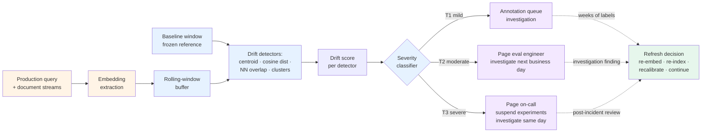

# Embedding-space drift detection

> 🔴 Advanced · ⏱ ~22 min · 🛠 Verified 2026-05-26 · 📍 Read after [Drift detection](./drift-detection.md) (Module 5)

Module 5 detects drift in **evaluation scores** — KS / PSI / Wasserstein on faithfulness or relevance distributions. That's the output side. This page covers the input side: drift in **embeddings, query distributions, retrieved documents, topic mix, and semantic clusters**. The signal you usually see *before* score-side drift surfaces.

The two compose. When score-side drift fires, you don't yet know whether the cause is the model, the prompt, the retriever, the corpus, or the query distribution. Embedding-space drift narrows the diagnosis.

## What embedding-space drift is

Embedding-space drift is when the statistical properties of the vectors flowing through your RAG pipeline shift over time. The same text starts producing different vectors; query distributions move into corners of the embedding space your corpus doesn't cover; retrieval pulls a measurably different mix of documents; topic clusters that were stable last month have different populations now.

The failure mode is what makes it dangerous: **embedding drift doesn't throw errors**. Vector search still returns results. The pipeline still runs. Latency is unchanged. The system just slowly gets worse. Recall drops from 0.92 to 0.74, and there's nothing in the logs to explain why — until a user complaint surfaces weeks later, by which point the diagnostic trail has cooled.

A canonical production data point from a 2025 production review of RAG systems: on identical text, stable systems produce cosine distances of 0.0001-0.005 between embeddings generated weeks apart; unstable systems produce distances of 0.05 or even 0.10+. The same input, the same model identifier, the same code — but the vectors have moved. Two orders of magnitude. Silently.

## Why score-side drift is not enough

[Module 5](./drift-detection.md) treats the eval pipeline as a black box: scores come out, statistical tests check whether the distribution has shifted. That's necessary. It's not sufficient.

Score-side drift is a **lagging indicator**. By the time KS-test fires on faithfulness scores, three things have already happened:

1. Embeddings drifted upstream (probably weeks ago)
2. Retrieval started returning a different chunk mix
3. The LLM started producing answers based on the different chunks
4. Eval judges scored those answers slightly differently
5. Finally — the rolling-mean drops past the alert threshold

The score-side detector catches step 5. By step 5, the drift is in production. Catching it at step 1 — the embedding space — gives you weeks of lead time, and tells you what to investigate: not "the eval scores are drifting" but "the query distribution has moved" or "the corpus refresh changed cluster populations" or "the embedding provider silently updated the model."

This is the same upstream-vs-downstream relationship Module 5 has with raw eval-score monitoring: by the time a score moves, the corpus has already moved. Embedding-space drift detection moves the observation point one step earlier in the causal chain.

## Five types of embedding drift

Each has a different production cause and a different detection strategy. Mapping the cause to the right detector is the whole point of typing these out.

### 1. Query distribution drift

What it is: the **questions your users ask** have shifted. New product launch, new tenant onboarded, seasonal traffic, geographic expansion, marketing campaign — any of these shift the query distribution.

What it looks like in embedding space: the centroid of recent query embeddings is measurably different from the historical baseline. The cloud of query vectors has moved.

Causes worth distinguishing: legitimate (new tenants, holiday traffic) vs problematic (a new use case the corpus doesn't cover, prompt injection patterns, scraping traffic).

### 2. Document corpus drift

What it is: the **content you're indexing** has changed. New documents added, old documents removed, large refresh, gradual ingestion of a different content type.

What it looks like: the centroid of document embeddings has moved; cluster populations have changed; recall on the existing eval set drops because chunks you used to retrieve are no longer where queries land.

The most pernicious sub-case is **partial corpus refresh**. A team re-embeds 20% of their corpus — maybe some updated docs or a new data source — using a different version of the embedding model than the 80% that's already indexed. The two halves now occupy slightly different regions of the embedding space. Cross-half retrieval degrades silently because cosine similarity is meaningful only between vectors produced under the same conditions.

### 3. Retrieval-result drift

What it is: **which documents are being retrieved** has shifted. The same queries (or statistically equivalent queries) now pull a different mix of chunks.

What it looks like: nearest-neighbor overlap drops. Run the same probe query a week apart; stable systems show 85-95% of neighbors persisting; drifting systems show 25-40% drop-off, often silently.

This is what users actually feel — the answer quality moves because the chunks behind it moved.

### 4. Topic / cluster drift

What it is: the **semantic mix** of queries or documents has changed. One cluster grows, another shrinks. A new cluster appears that didn't exist before.

What it looks like: KMeans (or any clustering algorithm) on a rolling window of embeddings produces cluster populations that have measurably shifted from baseline. Chi-square test on the population vector flags the shift.

Why this matters beyond the centroid signal: centroid drift catches average movement; cluster drift catches **redistribution without movement**. Two clusters can swap populations and the centroid stays put — only cluster-population testing catches that case.

### 5. Embedding model / version drift

What it is: the **embedding function itself** changed. Provider silently updated the model. Your team upgraded `sentence-transformers`. Tokenizer behavior changed across a library bump.

What it looks like: the canonical detection pattern is **Reference Dataset Probing** — maintain a small static set of probe documents and queries; periodically re-embed them; if the new embeddings drift measurably from the original embeddings on the same input, the embedding function has changed.

This is the easiest type to catch (probe set is static; any movement is signal) and the hardest type to recover from once it's happened (you have to re-embed your entire corpus to restore alignment).

## Six detection methods

Map the type of drift to the right method. No single method covers all five types; production deployments run two or three in parallel.

| Method | Best for | Cost | Production fit |
|---|---|---|---|
| Centroid shift | Query distribution drift, gradual corpus drift | Cheap (one centroid per window) | Default first detector; the L2-norm of `mean(baseline) - mean(current)` |
| Cosine-distance distribution shift | All five types as a coarse signal | Cheap (pairwise distances) | Apply KS or Wasserstein to the cosine-distance distribution, not to embeddings directly |
| Nearest-neighbor overlap | Retrieval-result drift specifically | Medium (top-k retrieval per probe query) | Jaccard overlap of top-k neighbors between baseline and current; the metric closest to what users feel |
| Cluster population shift | Topic / cluster drift | Medium (clustering + chi-square) | Catches redistribution that the centroid misses |
| UMAP / t-SNE visualization | Diagnostic only, not detection | Expensive | Useful for human review and root-cause analysis; **not a proof of drift** by itself — dimensionality reduction can fabricate apparent clusters |
| Domain classifier | Cross-type signal (a "is this drift?" binary) | Medium (train a small classifier) | A good default — comparably fast, PCA-agnostic, embedding-model agnostic, easy to interpret. Trains a binary classifier on `baseline vs current`; classifier accuracy ≫ 0.5 means the two distributions are distinguishable |

A note on UMAP / t-SNE: they are **diagnostics, not proofs**. UMAP visualizations are notoriously sensitive to hyperparameter choices; drift patterns existing only in the discarded dimensions might be missed, and the choice of reduction technique and target dimensionality can influence sensitivity. Use them to communicate findings to humans, not as the alert signal. UMAP is often preferred over t-SNE for density-based drift detection as it better preserves global structure, but neither replaces the statistical tests above.

### Adapting PSI / KS / Wasserstein to embeddings

Module 5's statistical tests work on **scalar distributions**. Embeddings are vectors. You can't apply KS directly to a 384-dimensional vector.

The bridge: derive scalar features from the embeddings, then apply Module 5's tests to those scalars. Three useful scalar projections:

- **Cosine distance to baseline centroid** — one scalar per embedding; KS-test the distribution
- **Distance to nearest neighbor in the baseline index** — measures how "in-distribution" each new vector is
- **Norm (`np.linalg.norm`)** — sudden shifts in mean norm indicate preprocessing or model changes

Each scalar projection loses information. Running two or three projections in parallel and alerting on any of them catches a wider range of drift than any single projection.

## Production workflow

The mechanics: baseline window → rolling comparison window → drift score → alert threshold → human review → retriever/index refresh decision. Same shape as Module 5's rolling-window detector; different inputs.

Production parameters that earn their tuning:

- **Baseline window**: 7-14 days of clean production data. Long enough to smooth daily seasonality; short enough that the baseline doesn't include drift it's supposed to detect.
- **Rolling window**: 24-72 hours. Shorter windows surface drift faster but produce more false positives.
- **Probe set**: 50-100 query-document pairs maintained as a static reference. Periodically (daily or weekly) run a hand-crafted probe set of 50-100 query-context pairs through your retrieval pipeline. The probe set is what catches embedding-model drift specifically (per type 5 above).
- **Alert thresholds**:
  - Centroid shift: 2σ above rolling-mean baseline
  - Cosine-distance distribution: KS p < 0.001 sustained ≥ 24h
  - Nearest-neighbor overlap: < 70% (NN drop-off in the silently-degrading range)
  - Cluster population: chi-square p < 0.001 with effect-size ≥ 0.2
- **Production alarm shape**: A 2-to-5 point Recall@10 drop in rolling-mean over 30 to 90 minutes is the closest user-facing equivalent — the rule of thumb for tuning the embedding-side thresholds is that they should fire before the Recall@10 signal would.

The output of detection is a **drift event**, not a remediation decision. The severity classifier routes it to the right human; the human decides whether to re-embed the corpus, re-index, recalibrate the eval set, or do nothing (legitimate distribution shift is a real outcome — new tenants legitimately bring new query distributions).

## Path 06 connections

Embedding-space drift integrates with the rest of the path at four explicit points.

### Module 3 — OpenTelemetry portable layer

Embedding extractions emit as spans with attributes for the embedding model name + version, the input text length, and the resulting norm. Drift detectors subscribe to the trace stream the same way the Pattern A streaming evaluator worker does in [Recipe 2](../../learning-paths/06-evaluation-observability/recipes/02-opentelemetry-native.md). The OTel substrate is shared across score-side and embedding-side drift detection.

### Module 5 — Drift detection (the sibling page)

Score-side drift and embedding-side drift compose. The production rule is **prefer the upstream signal when both fire** — embedding drift identifies the cause class; score drift identifies the user-visible symptom. When only score-side fires, run the embedding-side detectors retroactively to identify which input dimension shifted.

### Module 6 — Cost attribution

Embedding extraction is non-trivial cost at scale. Module 6's baggage propagation (`tenant.id`, `tenant.tier`) lets you slice embedding-drift signals by tenant — a single enterprise tenant onboarding can fully account for a "drift" signal that's actually a legitimate distribution shift specific to that tenant.

### Pattern 1 — Cost-aware retrieval

A drift signal that affects only the lower-tier free tenants (perhaps because they share a noisy query distribution) can route to cheaper detection cadence. Embedding-space drift detection runs at the per-tier cost ladder Pattern 1 documents.

### Pattern 2 — Drift-triggered review

The severity classifier shape is identical to [Pattern 2](../../learning-paths/06-evaluation-observability/patterns/02-drift-triggered-review.md). Embedding-space drift events feed into the same T1/T2/T3 routing infrastructure: T1 (mild) → annotation queue; T2 (moderate) → eval engineer page; T3 (severe) → on-call. Pattern 2 was designed for evaluator-score drift, but the workflow generalizes to any drift signal that needs human-on-the-loop review before remediation.

### Project 2 — OpenTelemetry observability stack

Embedding-drift detection slots into [Project 2](../../learning-paths/06-evaluation-observability/projects/02-otel-observability-stack.md)'s M4 streaming evaluator worker as a parallel detection path. The Lab 20 rolling-window detector and the Lab 23 detectors share the same worker process; they emit scores as APM metrics tagged by detector type.

### Project 3 — Hybrid production stack

In [Project 3](../../learning-paths/06-evaluation-observability/projects/03-hybrid-production-stack.md), embedding-drift events fit cleanly into M4's drift detection (APM) + annotation queue (LangSmith) + three-tier routing architecture. The same severity classifier handles both score-side and embedding-side signals; LangSmith's annotation queue gets a `drift-type: embedding | score` tag so reviewers can filter.

## Anti-scope

- **Not automatic retraining or re-embedding.** A drift signal is an investigation trigger, not an instruction to rebuild the index. Auto-rebuild on drift suffers the same anti-pattern Pattern 2 documents for auto-retraining: the rebuild covers up the diagnostic signal, and the next failure mode appears without anyone having investigated the first.
- **Not proof of answer-quality degradation by itself.** Embedding drift can fire on legitimate distribution shifts (new tenants, holiday traffic, geographic expansion) that don't degrade quality. The signal is "investigate"; the signal is not "broken."
- **Not a replacement for evaluation datasets.** You still need a golden eval set scored by humans periodically. Embedding-space drift is upstream of evaluation; it doesn't replace it.
- **Not a substitute for domain review.** A clustering algorithm doesn't know which clusters represent your business. When cluster populations shift, a human needs to read examples from the moved clusters to know whether the shift is legitimate or a sign of corpus contamination.
- **Not a vector database tutorial.** The detection methods are math operations on `np.array` objects of shape `(n_samples, n_dim)`. They work the same against vectors from `sentence-transformers`, OpenAI `text-embedding-3-small`, Cohere `embed-v4`, or any vector source. Vector DBs are storage; this page is monitoring.
- **Not a UMAP / t-SNE tutorial.** Those visualizations are useful diagnostics but unreliable as alert signals. The lab uses PCA-2D for visualization; the production workflow uses the four statistical detectors above as the alert sources.

## Related concepts

- [Drift detection](./drift-detection.md) — Module 5; the score-side complement to this page
- [Agent-as-judge calibration](./agent-as-judge-calibration.md) — Module 5; calibration discipline that downstream of both drift detectors
- [Cost attribution](./cost-attribution.md) — Module 6; the baggage propagation that lets you slice drift signals by tenant
- [Adaptive sampling](./adaptive-sampling.md) — Module 6; the sampling strategy that controls embedding-drift detection cost
- [Online evaluator registration](./online-evaluator-registration.md) — Module 4; the registration pattern this drift detector follows

## References

**Production drift literature (verified mid-2026)**:

- Decompressed.io (March 2026), *Detecting Embedding Drift: The Silent Killer of RAG Accuracy* — [decompressed.io/learn/embedding-drift](https://decompressed.io/learn/embedding-drift) — the silent-degradation framing; recall drops 0.92 → 0.74; partial re-embedding as the most common production cause
- Anindya Singh Obi (December 2025), *Embedding Drift: The Quiet Killer of Retrieval Quality in RAG Systems* — [medium.com/@anindyasinghobi](https://medium.com/@anindyasinghobi/embedding-drift-the-quiet-killer-of-retrieval-quality-in-rag-systems-b5d46bee3bba) — stable cosine 0.0001-0.005 vs unstable ≥ 0.05+; NN stability 85-95% stable vs 25-40% drop-off drifting
- Stack Pulsar (April 2026), *LLM Model Drift Detection 2026: Monitoring AI Behavior Degradation* — [stackpulsar.com/blog](https://stackpulsar.com/blog/llm-model-drift-detection/) — the 2σ rolling-average alert threshold; 50-100 query probe set daily/weekly
- FutureAGI (1 week ago, May 2026), *Evaluating Embedding Models in 2026* — [futureagi.com/blog](https://futureagi.com/blog/evaluating-embedding-models-2026/) — the 2-to-5 point Recall@10 drop in rolling-mean over 30-90 minutes production alarm pattern
- Digital Applied (May 2026), *RAG System to Production: A 30/60/90-Day Plan for 2026* — [digitalapplied.com/blog](https://www.digitalapplied.com/blog/rag-system-production-30-60-90-day-plan-2026) — the week-11 refresh cadence as the highest-leverage operational lever

**Detection methodology**:

- Evidently AI, *Monitoring embeddings drift* — [learn.evidentlyai.com](https://learn.evidentlyai.com/ml-observability-course/module-3-ml-monitoring-for-unstructured-data/monitoring-embeddings-drift) — Euclidean / cosine centroid distance; domain classifier as a "good default"; share-of-drifted-components method; MMD comparison
- ApXml, *Monitoring Drift in Embeddings and Unstructured Data* — [apxml.com/courses](https://apxml.com/courses/monitoring-managing-ml-models-production/chapter-2-advanced-drift-detection/embedding-drift-monitoring) — centroid shift L2 formula; variance change via covariance trace; UMAP vs t-SNE comparison
- ApXml, *Monitoring Drift in Retrieval Components* — [apxml.com/courses](https://apxml.com/courses/optimizing-rag-for-production/chapter-6-advanced-rag-evaluation-monitoring/monitoring-retrieval-drift-rag) — Reference Dataset Probing pattern for embedding-model drift specifically; embedding norm + variance monitoring
- Aparna Dhinakaran (Towards Data Science, 2023), *Measuring Embedding Drift* — [medium.com/data-science](https://medium.com/data-science/measuring-embedding-drift-aa9b7ddb84ae) — the canonical centroid-shift formulation that the rest of the literature builds on

**Platform context**:

- Galileo (March 2026), *9 Best LLM Drift Monitoring Platforms in 2026* — [galileo.ai/blog](https://galileo.ai/blog/best-llm-output-drift-monitoring-platforms) — Arize AI's centroid-distance-across-time-windows; Galileo Luna-2's K Core-Distance algorithm; <250ms runtime intervention
