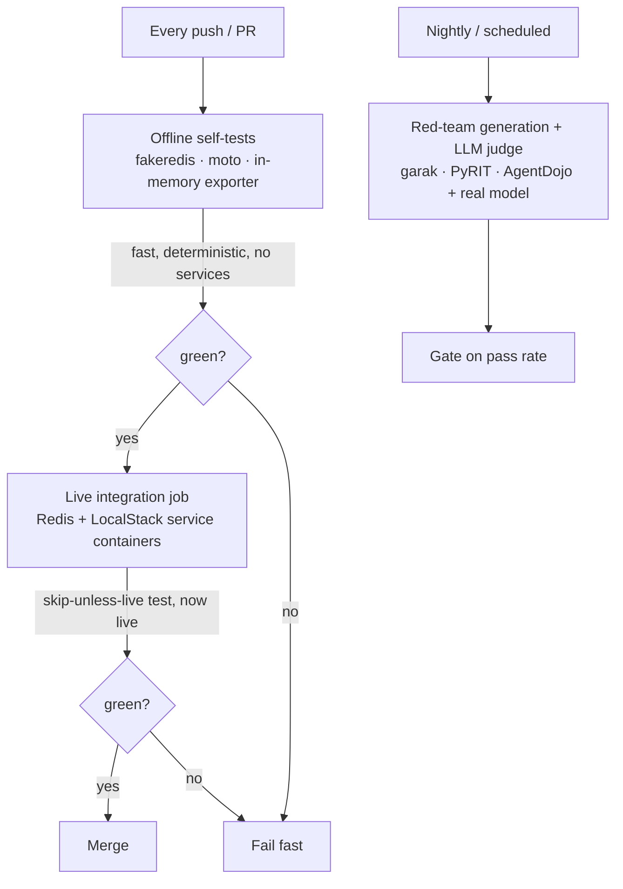
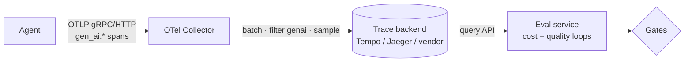

# From offline mocks to live CI

> Concept note. About 9 minutes to read. Companion to [`from-stand-ins-to-production.md`](./from-stand-ins-to-production.md) and Module 27 of the [Agentic RAG path](../../learning-paths/02-agentic-rag/).

Module 26 made the durable backends, the trace pipeline, and the red-team scorer use the *real* client libraries, verified offline against `fakeredis` / `moto` / an in-memory exporter. This note is about the last gap: those offline mocks mirror documented behavior, not every server edge case, so the same code has to also run against live infrastructure - in CI, on a schedule, and against a real collector and a real model. The principle is a test pyramid for systems with external dependencies: fast offline tests on every change, slower live tests where the mocks stop being faithful.

## The test pyramid for real backends

The bottom of the pyramid is the offline self-test: `backends.py --self-test` runs the real `redis-py` and `boto3` code through `fakeredis` and `moto` in milliseconds, on every push, with no services to stand up. The middle is the live integration job: the *same* `test_integration.py` that skips locally now runs against Redis and LocalStack service containers (see [`.github/workflows/backend-integration.yml`](../../.github/workflows/backend-integration.yml)), catching what the mocks can't - real consumer-group lag, real visibility-timeout timing, real redrive. The top is expensive and adversarial: red-team generation with a real model judge, run on a schedule rather than per-commit because it costs tokens and time.

The reason to keep all three, rather than only the live tests, is feedback speed. A broken contract should fail in seconds on the developer's machine; a server-specific bug can wait for the CI job. Pushing everything to live tests makes the suite slow, flaky (services time out), and expensive.

## Item 1: backend integration in CI

The skip-unless-live design from [Lab 57](../../labs/57-real-backends-integration/) is what makes this clean. The test reads `REDIS_URL` / `AWS_ENDPOINT_URL`; locally they're unset and it skips, so `pytest` is safe to run anywhere. In CI, service containers set those variables and the identical test runs live. Nothing in the test branches on "am I in CI" - the environment supplies the endpoint or it doesn't. Use unique stream/queue names per run and tear them down, so reruns don't collide.

## Item 3: a real collector and trace backend

[Lab 56](../../labs/56-production-traces-routing/)'s `eval_service.py` reads spans from a JSONL stand-in. The [`ops/otel-collector/`](../../ops/otel-collector/) bundle replaces it with a real pipeline: the agent swaps its in-memory exporter for an OTLP exporter pointed at the collector, the collector batches and filters to `gen_ai.chat` spans and forwards to a backend, and the eval service queries that backend. The span shape - the `gen_ai.*` semantic-convention attributes - never changes, so the reconstruction logic in `eval_service.py` is untouched; only its *source* moves from a file to a backend query. The collector is what decouples the agent from the backend: batching, filtering, sampling, and fan-out to multiple backends live in collector config, changeable without redeploying the agent.

## Item 4: red-team generation and the judge in CI

[Lab 52](../../labs/52-red-teaming-trajectories/)'s `redteam_adapters.py` turns garak / PyRIT / AgentDojo output into the trajectory schema, and `AnthropicJudge` backs the LLM-judge hook with a real (injectable) model. In CI this is a scheduled job, not a per-commit one: generate trajectories from the tools, score them with the keyword detectors plus the LLM judge, and gate on the per-category pass rate. The judge call needs an API key (a CI secret) and costs tokens, which is why it runs nightly rather than on every push - and why the keyword detectors, which are free and deterministic, run in the fast offline tier and the judge only re-grades the cases they flag as ambiguous.

## What does not change

- **The code under test.** The offline self-test and the live integration test run the *same* backend code; the only difference is the injected client. That is the whole point of coding to the contract.
- **The span shape.** Moving from an in-memory exporter to a collector changes the transport, not the `gen_ai.*` attributes, so the eval loop is portable.
- **The discipline.** Fast deterministic tests on every change; slow, costly, or flaky tests (live services, real models) on a schedule or behind a path filter. Match the tier to the cost and the failure mode.

## See also

- 📖 [From stand-ins to production](./from-stand-ins-to-production.md) — the swaps this puts under CI.
- 🧪 [Lab 57](../../labs/57-real-backends-integration/) (integration test), [Lab 56](../../labs/56-production-traces-routing/) (traces), [Lab 52](../../labs/52-red-teaming-trajectories/) (red-team adapters + judge).
- ⚙️ [`.github/workflows/backend-integration.yml`](../../.github/workflows/backend-integration.yml) and [`ops/otel-collector/`](../../ops/otel-collector/).
