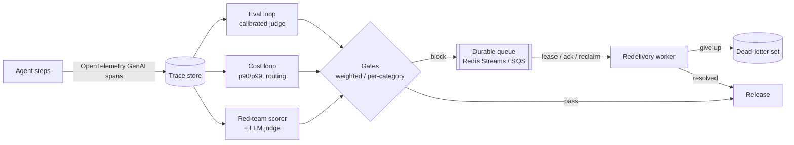

# From stand-ins to production

> Concept note. About 9 minutes to read. Companion to [`observability-for-agent-pms.md`](./observability-for-agent-pms.md) and Module 25 of the [Agentic RAG path](../../learning-paths/02-agentic-rag/).

The observability labs (37–53) were built with stand-ins: a file-backed queue, a bag-of-words fingerprint with a guessed threshold, a single additive judge correction, hand-set cost data, and a keyword leak detector. Stand-ins are the right call while you're learning the shape of a system — they're deterministic, offline, and force you to understand the contract before the dependency. This note is about the move from each stand-in to the thing you actually run, and the one rule that survives every swap: **code to the contract, calibrate on held-out data, and keep a human in the loop where the automated grade is only a floor.**

## The pipeline

In production the pieces stop being separate scripts and become one pipeline: the agent emits traces, the eval and cost loops read those traces, gates decide on the results, and failures flow into a durable queue that redelivers until they resolve or give up.

Every box on that diagram has a stand-in earlier in the path and a production form in Module 25.

## The four swaps

**File queue → Redis Streams or SQS** ([Lab 54](../../labs/54-production-durable-backends/)). Lab 50's dead-letter queue was a file with a lock; the contract is enqueue / lease / ack / reclaim-expired / give-up. Redis Streams implements it with a consumer group (the Pending Entries List tracks delivery; `XAUTOCLAIM` reclaims idle entries); SQS implements it with a visibility timeout and a redrive policy to a dead-letter queue. The redelivery worker calls the contract and never learns which backend it's on. Both give at-least-once delivery, so the consumer must be idempotent — an ack can race a reclaim.

**Bag-of-words fingerprint + fixed threshold → embeddings + tuned threshold** ([Lab 55](../../labs/55-calibrated-detection-judgment/), Part A). The semantic fingerprint used a fixed cosine cutoff of 0.98. Real embeddings put reflows and meaning-changes on overlapping cosine ranges, so a guessed cutoff sits in the overlap and cries wolf on reflows. Tuning the threshold on labeled reflow/edit pairs by maximizing Youden's J moves it into the gap — here cutting the false-alarm rate from 0.33 to 0.08. The cost of getting this wrong is a noisy alert channel, which trains people to ignore alerts.

**Additive judge shift + all-dims gate → isotonic calibration + weighted gate** ([Lab 55](../../labs/55-calibrated-detection-judgment/), Part B). A real judge bias is monotone but not a constant offset, so a single additive shift can't fix it. Isotonic regression (pool-adjacent-violators) fits a free monotone map and recovers more ordinal agreement. And the all-dimensions-pass gate becomes a weighted gate, so the product owner can say a strong dimension offsets a weaker one. The math is in [math-foundations/15](../../math-foundations/15-calibration-threshold-selection.md).

**Hand-built data + keyword detector → OTel traces + LLM judge** ([Lab 56](../../labs/56-production-traces-routing/) and the [Lab 52](../../labs/52-red-teaming-trajectories/) upgrade). The eval and cost loops should run on the spans the agent already emits, following the GenAI semantic conventions, so any tool can read them and the loop is decoupled from the agent process. The routing decision that was hand-set becomes a learned classifier with its own eval — because a misroute either overspends or risks quality. And the red-team keyword detector, which misses paraphrased leaks, gains a pluggable LLM judge that catches the meaning the markers miss; the automated grade was a floor, and the judge raises it.

## What does not change

- **The contract.** Every swap above keeps the interface the stand-in defined. That's what makes the swap safe: the worker, the loop, and the gate don't change.
- **Calibration on held-out data.** A threshold or a calibration map is a fitted quantity, refit when the model behind it changes — the same discipline as retraining.
- **A human where the automated grade is a floor.** The tuned threshold, the calibrated judge, and the LLM red-team judge all *raise* the floor; none removes the need for human review on the cases that matter. The gate thresholds and the dimension weights are product decisions, not statistics.

## See also

- 📖 [Observability for AI Agent PMs](./observability-for-agent-pms.md) — the four pillars these labs implement.
- 📐 [math-foundations/15](../../math-foundations/15-calibration-threshold-selection.md) — threshold selection and isotonic calibration.
- 🧪 Module 25 labs: [54](../../labs/54-production-durable-backends/), [55](../../labs/55-calibrated-detection-judgment/), [56](../../labs/56-production-traces-routing/), and the [52](../../labs/52-red-teaming-trajectories/) upgrade.
