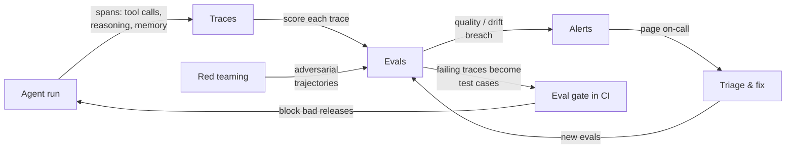

# Observability for AI Agent PMs

> 📖 Guide · ~18 min · For PMs and eng leads shipping agents to production

Last year, observability was a backend concern most product teams delegated and forgot. In 2026 it is the first thing a serious agent team sets up, because the failure modes changed. A chatbot returns one answer you can read; an agent runs for minutes to hours, makes dozens of tool calls, spends real money per session, and fails in ways that *look like success* — a well-formed answer built on a wrong retrieval, a redundant tool loop that quietly burns budget, or a hijacked goal that does the wrong thing competently. Traditional monitoring was built to answer "did the request succeed and how slow was it." Agent observability has to answer a harder question: **why did the agent do that, at that step?**

This guide is for the PM (or eng lead acting as one) who has to make ship/no-ship calls on an agent. It covers three things: why this became the priority, what you actually set up and how the pieces fit, and where your job ends and engineering's begins.

---

## a. Why observability became the priority

Three forces converged in 2026.

**Agents run long and cost real money — across new dimensions.** Hosted runtimes for long-running agents arrived this year (Anthropic's Managed Agents launched in public beta in April 2026 at $0.08 per session-hour on top of token costs, with sessions designed to run autonomously for hours and recover from an append-only event log). The bill is no longer just tokens: it is tokens **plus** runtime **plus** tool calls, billed simultaneously inside a single session — dimensions that don't map to any existing cloud-cost construct. The numbers are not hypothetical: published accounts describe a single autonomous refactoring session looping through ~$4,200 in a weekend, and analysts have attributed hundreds of millions in unbudgeted 2026 cloud spend largely to agents. A frequently cited estimate puts re-sent context at roughly 62% of agent inference bills — most of the cost is the model re-reading what it already knew. Cost is now a product metric, not a finance afterthought.

**Failures are silent and causal.** An agent failure rarely throws an exception. It returns something plausible. The only way to catch "plausible but wrong" is to capture the *chain of decisions* — which tool was chosen, with what arguments, what came back, how the next step changed in response — as a structured trace, then score it. Infrastructure monitors (latency, error rate, span counts) can't see this; they were never meant to.

**The discipline professionalized.** 2026 brought a vendor-neutral standard (OpenTelemetry's GenAI semantic conventions), a fast-consolidating tool market (LangSmith, Langfuse, Arize/Phoenix, Braintrust, Maxim, and others), and a regulatory floor: the EU AI Act's adversarial-testing obligations for general-purpose models with systemic risk are already in effect, with robustness-testing requirements for high-risk systems landing in August 2026. Observability stopped being optional tooling and became a compliance and procurement requirement.

The blunt test teams now use: *if you can't answer "why did the agent fail on step 6?", you don't yet have agent observability* — you have a log viewer.

---

## b. What you set up, and how it fits

Four pillars, wired into one loop. The point is not the individual tools; it is the **trace → eval → fix loop** that turns a demo into infrastructure.

**Traces** — the causal record. Every model call, tool selection, tool argument, return value, memory read/write, and state transition captured as nested spans, so you can reconstruct what the agent did and why. This is the layer above traditional APM: not "the request took 3.2s" but "it called search twice with the same query, then answered from the weaker result." In this repo, the operating loop ([Lab 41](../../labs/41-operating-the-loop/)) is the trace-bearing run.

**Evals** — the score on top of the trace. Offline evals on a curated set gate releases; online evals score real production traffic at the session, trace, or step level. The strongest setups close the loop: a failing production trace becomes a new eval case, so the suite grows from real behavior and the same regression can't ship twice. This repo's evaluation arc is exactly this — the judge and its ceiling ([Lab 40](../../labs/40-annotation-quality/)), the CI gate ([Lab 37](../../labs/37-rag-eval-gates/)) and its calibration ([Lab 38](../../labs/38-calibrating-the-eval-gate/)), multi-expert and graded gold ([Labs 47](../../labs/47-trustworthy-gold/) and [49](../../labs/49-graded-gold/)).

**Alerts** — the signal when quality or cost drifts. Threshold breaches on faithfulness, drift, latency, or spend, routed to Slack/PagerDuty — but deduplicated and rate-limited so a regression becomes one page, not a storm, and never silently dropped. This repo builds the alerting path end to end: severity and provider adapters, dedup/cooldown, retries, a shared store, and a dead-letter queue ([Labs 42](../../labs/42-hardening-operations/), [44](../../labs/44-hardening-the-signals/), [46](../../labs/46-scaling-the-signals/), [48](../../labs/48-distributed-and-graded/)).

**Red teaming** — adversarial testing before attackers do it. For agents this is not single-turn jailbreak prompts; it is whether an agent preserves trust boundaries across a multi-step trajectory. The agentic risks that matter — captured in OWASP's first Agentic Top 10 (December 2025) — are prompt injection (still #1 on the LLM Top 10), goal hijacking, tool misuse, and *excessive agency* (an agent granted more permission than the task needs). Evaluating these needs labeled multi-step trajectories graded for tool-selection appropriateness, recovery, and information leakage — the same shape as the eval work above, pointed at an adversary. Tooling here includes NVIDIA's garak, Microsoft's PyRIT, and the AgentDojo / AgentHarm benchmarks. [Lab 52](../../labs/52-red-teaming-trajectories/) builds this hands-on: grading adversarial trajectories on tool-selection, recovery, and leakage, and gating releases on the per-category pass rate.

The four are one system: **red teaming and production both produce traces; evals score them; failing scores raise alerts and become gate cases; the gate blocks the next bad release.** A team that has traces but no evals is debugging one run at a time. A team with evals but no gate learns about regressions from users.

---

## c. Where the PM's job ends and engineering's begins

The instrumentation is engineering's. The *definition of good* is the PM's. The most common failure on agent teams is leaving the quality bar implicit, so engineering encodes a threshold nobody signed off on and the gate either blocks every release or nothing.

| Decision | Owner | Why |
|---|---|---|
| Span schema, trace pipeline, OTel wiring | Engineering | Implementation detail of capture |
| Eval harness, gate plumbing, alert routing | Engineering | Plumbing; should be invisible when working |
| Red-team tooling and attack execution | Engineering / Security | Specialized adversarial work |
| **What "good" means** (rubric dimensions, the quality bar) | **PM** | A product judgment, not a technical one |
| **Which failures matter** (severity, triage priority) | **PM** | Trades user harm against shipping speed |
| **The gate threshold** (what blocks a release) | **PM** (with eng) | A risk decision the business owns |
| **Per-session cost and latency budgets** | **PM** | A product constraint with a real bill |
| **Escalation / human-in-the-loop policy** | **PM** | When the agent must hand off |

A clean division: engineering guarantees you *can* answer "why did step 6 fail," and that a failing eval *can* block a release. The PM decides *what counts as failing* and *whether it should block*.

### The metrics a PM should own

Not the infra dashboards (CPU, span counts) — those are engineering's. The product-level signals:

- **Task success rate** — did the agent achieve the user's goal end to end, not just return without erroring.
- **Quality score vs gold** — faithfulness/relevance/completeness against an adjudicated gold set, on the graded scale you defined (see [Lab 49](../../labs/49-graded-gold/)). Track it against the *human ceiling*, not against 100%.
- **Cost per session** — mean **and** p90/p99. The tail is where the runaway loops live; the mean hides them ([Lab 53](../../labs/53-cost-latency-observability/) makes this measurable per session).
- **Latency per session** — same: own the tail.
- **Escalation / intervention rate** — how often the agent hands off or a human has to step in. Rising intervention is a quality regression even when success rate looks flat.
- **Drift** — quality, cost, and escalation tracked over time against a held-out baseline, not just a point-in-time number (see [Lab 44](../../labs/44-hardening-the-signals/)).
- **Red-team pass rate** — the fraction of known adversarial trajectories the agent resists, tracked per release like any other gate.

A PM who owns these can make a defensible ship/no-ship call from the dashboard. A PM who owns none of them is approving releases on vibes.

---

## Further reading

- OpenTelemetry — [GenAI semantic conventions](https://opentelemetry.io/docs/specs/semconv/gen-ai/) (the vendor-neutral trace standard).
- OWASP — [Top 10 for LLM Applications](https://owasp.org/www-project-top-10-for-large-language-model-applications/) and the Agentic Top 10 (2025) for the agent-specific risk taxonomy.
- NIST — [AI Risk Management Framework](https://www.nist.gov/itl/ai-risk-management-framework) and the Generative AI Profile (AI 600-1).
- Microsoft — [PyRIT](https://github.com/Azure/PyRIT) and NVIDIA — [garak](https://github.com/NVIDIA/garak) for adversarial testing; AgentDojo / AgentHarm for agentic benchmarks.
- In this repo: the production tail of [Path 02](../../learning-paths/02-agentic-rag/) (Modules 16–23) builds the traces / evals / alerts pillars hands-on; [Lab 52](../../labs/52-red-teaming-trajectories/) (red teaming) and [Lab 53](../../labs/53-cost-latency-observability/) (cost and latency) are the latest additions, so every pillar now has a hands-on lab.

*The landscape (tools, prices, regulatory dates) moves fast — verify current specifics against primary sources before quoting them in a plan.*
