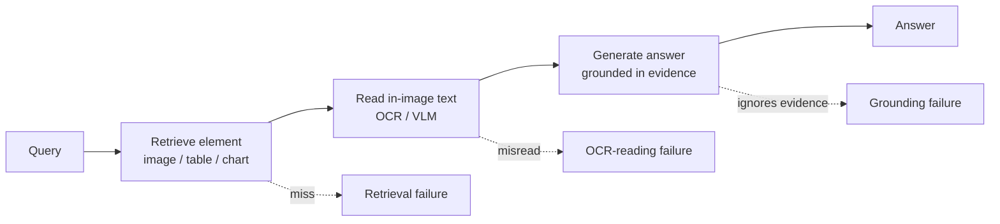
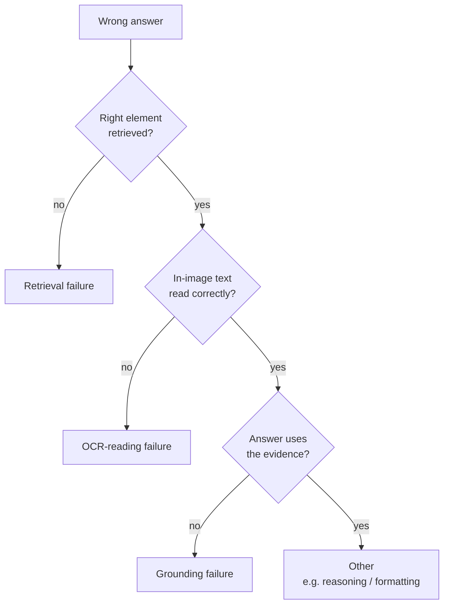

# Grounding and OCR-reading

> Concept note. About 11 minutes to read. Runnable companions: [`labs/61-grading-multimodal-rag/`](../../labs/61-grading-multimodal-rag/) and [`labs/62-ocr-reading-quality/`](../../labs/62-ocr-reading-quality/). Math: [`math-foundations/17`](../../math-foundations/17-multimodal-eval-metrics.md).

When the answer to a question lives inside an image — a number in a chart, a cell in a table, a line in a scanned form — a multimodal RAG system can be wrong in three different places, and they need three different fixes. This note pulls apart **retrieval**, **OCR-reading**, and **grounding**, explains why they must be measured separately, and shows how to build an eval set that can actually tell them apart.

## The pipeline, and where it breaks

Each arrow is a place the right answer can be lost:

- **Retrieval** brings back the element that contains the answer. It fails when the embedder can't match the query to the element — most often the [shared-space "CLIP can't read" failure](./multimodal-rag.md), where a visual-only embedder never encoded the text the query is asking about.
- **OCR-reading** turns the pixels of that element into text. It fails when the number is misread — a decimal point dropped, a digit transposed — which is common on dense tables, low-resolution scans, and handwriting.
- **Grounding** is the generator using the read evidence rather than its parametric memory. It fails when the model answers from what it "knows" instead of what was retrieved — a hallucination, even with the right evidence in front of it.

## Grounding is not correctness, and not faithfulness either

The distinction that trips people up: **an answer can be perfectly grounded and still wrong.** If OCR misreads "4.2 million" as "42 million" and the generator faithfully reports "42 million," the answer is fully grounded in the evidence it was given — and off by 10×. The bug is in reading, not grounding. Conversely, a model that retrieves and reads correctly but answers "about half" from memory has clean OCR and is *un*grounded. Same wrong answer on the surface; opposite causes.

This is why grounding and faithfulness, often used interchangeably, are worth separating in the multimodal setting:

- **Grounding** asks whether the answer is *derived from* the retrieved evidence at all (vs parametric memory).
- **Faithfulness** asks whether the answer is *consistent with* that evidence (no contradiction or fabrication beyond it).
- **Correctness** asks whether the answer matches the truth — which can fail even when grounding and faithfulness both pass, because the evidence itself was misread upstream.

A single end-to-end accuracy number collapses all three. Two runs can score identically and need completely different work, which is the whole argument for per-stage measurement.

## Attributing a failure to the stage that caused it

Because the stages are ordered, a wrong answer should be charged to the *first* stage that failed — you can't fairly grade reading if nothing was retrieved, or grounding if the read text was already wrong.

[Lab 61](../../labs/61-grading-multimodal-rag/) implements exactly this and shows two runs that both score 0.75 end-to-end: one attributes its failure to OCR (grounding still perfect — a faithfully repeated misread), the other to grounding (OCR clean — a hallucination). The attribution is the actionable output; the accuracy number is not.

## Measuring each axis

- **Retrieval**: recall@k over a gold set where the gold label is the element (image/table/chart) that contains the answer.
- **OCR-reading**: Character Error Rate (CER) and Word Error Rate (WER) on the read text, after a normalizer that removes cosmetic differences. But CER is the wrong score for numeric answers — a misread digit is a tiny CER and a huge value error, while a reformat is a large CER and the same value — so the *answer span* also gets a value-aware match (numeric tolerance, structured-cell equality). This trap is the subject of [Lab 62](../../labs/62-ocr-reading-quality/).
- **Grounding**: the rate at which the answer is entailed by the retrieved/read evidence. Cheaply, check whether the answer span appears in the evidence; more rigorously, use an entailment model or an LLM judge — the same machinery as text faithfulness, pointed at the read evidence.

## Building an eval set that can separate them

The metrics only work if the data lets them. The non-negotiable: include questions whose answer is present **only in the image** — not in any caption, surrounding paragraph, or the model's general knowledge. If the answer leaks into the text, a model that ignores the image entirely can still score well, and you can no longer distinguish reading from parametric recall. Pair each such item with the gold element id (for retrieval), the gold in-image text (for CER), and the gold answer value (for correctness and numeric match). Keep a few items whose answer is *wrong* in the image on purpose, to confirm a grounded model reports the wrong-but-present value rather than silently correcting it — that is grounding working as intended, and it tells you the upstream OCR/source is what to fix.

## See also

- 🧪 [Lab 61: Grading multimodal RAG](../../labs/61-grading-multimodal-rag/) and [Lab 62: OCR-reading quality](../../labs/62-ocr-reading-quality/).
- 📖 [Multimodal RAG](./multimodal-rag.md) — the architectures whose failures these metrics catch.
- 📐 [math-foundations/17: Multimodal evaluation metrics](../../math-foundations/17-multimodal-eval-metrics.md).
- 📖 [RAG evaluation framework](../evaluation/rag-evaluation-framework.md) — where these sit among the text-RAG metrics.
